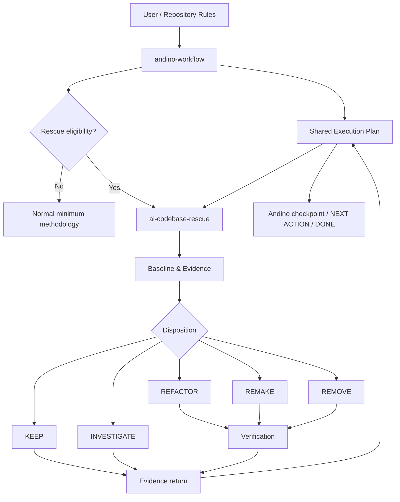

# AI-CODEBASE-RESCUE — GRAND-PLAN

**Project Name:** `ai-codebase-rescue`  
**Document Type:** GRAND-PLAN  
**Planning Status:** READY FOR IMPLEMENTATION — WITH CONDITIONS  
**Implementation Status:** NOT STARTED  
**Primary Goal:** Menambahkan skill engineering evidence-first untuk menstabilkan dan memulihkan bounded codebase/subsystem yang rapuh tanpa mengambil alih lifecycle milik `andino-workflow`.  
**Repository:** `andinoferdi/AI-RULES`  
**Planning Baseline:** remote branch `skills` at `f3210ca5d85c95306e2e7601519e1946752ac07f`  
**Last Updated:** 2026-09-19  
**Research Verification Date:** 2026-09-19

---

## 1. Executive Summary

`ai-codebase-rescue` dirancang sebagai **specialist engineering methodology**, bukan lifecycle orchestrator baru.

`andino-workflow` tetap menjadi pemilik lifecycle pekerjaan, execution plan, checkpoint, `NEXT ACTION`, dan keputusan kapan sebuah specialist dibutuhkan. `ai-codebase-rescue` masuk ketika evidence menunjukkan bahwa sebuah area codebase membutuhkan stabilisasi atau technical-debt recovery yang lebih sistematis daripada ordinary bug fix atau refactor lokal.

North star skill ini:

> **Judge the engineering condition, not suspected authorship. Identify concrete risks, preserve verified behavior, repair the smallest justified surface, and prove the result against a baseline.**

Untuk strategi REMAKE:

> **Preserve verified product and behavioral contracts; do not preserve accidental implementation complexity.**

Skill tidak berangkat dari asumsi bahwa AI-generated code buruk. AI provenance diperlakukan sebagai konteks historis yang terpisah dari engineering condition. Kode yang diketahui dibuat AI tetapi sehat dapat berakhir dengan keputusan `KEEP`. Kode buatan manusia yang memiliki risiko nyata diperlakukan dengan standar evidence yang sama.

Remediation model utama terdiri dari:

- `KEEP`
- `REFACTOR`
- `REMAKE`
- `REMOVE`
- `INVESTIGATE`

`REMAKE` menjadi strategi first-class tetapi **bounded**. Ia hanya boleh dipilih ketika boundary, contract/invariant, integration points, baseline, dan regression protection cukup diketahui. Full repository rewrite bukan perluasan otomatis dari REMAKE; itu program modernisasi/migrasi yang berbeda dan memerlukan threshold serta authorization yang jauh lebih tinggi.

Arsitektur skill mengikuti progressive disclosure. Core `SKILL.md` harus menjadi operational playbook yang kecil. Detail taxonomy, finding schema, bounded remake, verification, security, dan frontend runtime stability ditempatkan di `references/` dan dibaca hanya saat relevan. Tidak ada `scripts/` atau `assets/` di dalam skill pada v1 kecuali implementasi membuktikan kebutuhan deterministik yang berulang.

Repository saat ini sudah memiliki kontrak yang mendukung desain ini: `andino-workflow` adalah satu lifecycle owner, execution plan adalah durable state, supporting skills bersifat phase-local, dan specialist tidak boleh memulai lifecycle kompetitor. Karena itu integrasi `ai-codebase-rescue` harus memperluas routing Andino, bukan membuat plan format, checkpoint system, atau router kedua.

Verdict perencanaan akhir: **READY WITH CONDITIONS**. Tidak ada product/design blocker yang membutuhkan jawaban user sebelum implementation. Kondisi utama adalah Codex harus memverifikasi local Git state sebelum mutasi karena remote GitHub tidak dapat menunjukkan current local branch, dirty working tree, uncommitted changes, atau worktree collision.

---

## 2. Problem Statement

Rapid AI-assisted development dapat menghasilkan siklus:

`feature → patch → fix → workaround → regression → patch lagi`

Masalahnya bukan asal-usul kode. Masalahnya adalah codebase dapat tetap “berjalan” sambil kehilangan kualitas engineering yang dibutuhkan untuk perubahan selanjutnya.

Gejala material dapat berupa:

- duplicated or divergent logic;
- accidental complexity;
- unclear state/data ownership;
- inconsistent contracts;
- dead or obsolete paths;
- lifecycle/resource cleanup yang salah;
- authentication/authorization inconsistency;
- data integrity risk;
- fragile error handling;
- dependency drift;
- unreliable tests;
- performance or memory regression;
- race/concurrency defects;
- architecture drift;
- out-of-scope agent edits;
- implementation yang sulit dipahami dan diverifikasi.

Ordinary linting, formatting, code review, atau bug fixing tidak cukup untuk kasus tertentu karena masalahnya dapat berada pada **cara subsystem dibentuk**, bukan hanya pada satu defect lokal.

Di sisi lain, “rewrite karena terlihat AI-generated” juga bukan solusi. Rewrite tanpa contract capture, baseline, regression protection, boundary, dan integration strategy dapat menghilangkan behavior penting atau memindahkan technical debt ke bentuk baru.

Skill ini dibutuhkan untuk mengisi ruang di antara dua ekstrem:

1. **Patch forever**, walaupun struktur lama sendiri menjadi sumber masalah.
2. **Rewrite everything**, tanpa bukti bahwa blast radius tersebut diperlukan.

---

## 3. Evidence & Source Summary

### 3.1 Classification legend

Dokumen ini menggunakan klasifikasi berikut:

| Label | Arti |
|---|---|
| **FACT / EXISTING** | Kondisi yang diverifikasi dari repository, file yang diberikan user, atau dokumentasi primer. |
| **LOCKED BY USER** | Keputusan eksplisit user yang tidak boleh diubah tanpa persetujuan. |
| **DECIDED** | Keputusan planning yang dipilih berdasarkan requirement + evidence. |
| **INFERENCE** | Kesimpulan logis dari evidence, tetapi bukan fakta literal sumber. |
| **ASSUMPTION** | Asumsi kerja sementara yang diperlukan agar planning dapat maju. |
| **UNKNOWN** | Belum diketahui dan tidak aman dipresentasikan sebagai fakta. |
| **OPEN QUESTION** | Pilihan yang masih memiliki trade-off atau membutuhkan evidence implementation berikutnya. |

### 3.2 Repository evidence

**FACT / EXISTING**

- Repository: `andinoferdi/AI-RULES`.
- Default remote branch: `main`.
- Branch yang diberikan user dan diinspeksi: `skills`.
- Remote `skills` HEAD saat planning: `f3210ca5d85c95306e2e7601519e1946752ac07f`.
- Remote `skills` berada 6 commits di depan `main` dan 0 di belakang pada snapshot planning.
- Remote branch `skills` tidak protected pada snapshot GitHub.
- Tidak ada remote branch bernama `ai-codebase-rescue`.
- Tidak ada directory `skills/ai-codebase-rescue` pada branch `skills`.
- Root repository memiliki `AGENTS.md`.
- Repository memiliki satu canonical `skills/andino-workflow`.
- `andino-workflow` mendefinisikan satu lifecycle owner dan minimum useful specialist routing.
- Execution plan disimpan sebagai durable state; plan depth `LITE / STANDARD / DEEP` bukan workflow baru.
- `skills/andino-workflow/references/routing.md` melarang competing lifecycle owner.
- `skills/andino-workflow/references/handoff.md` mendefinisikan PM/review handoff sebagai projection dari plan, bukan state store baru.
- `docs/exec-plans/active/ANDINO-002.md` adalah plan aktif yang scope-nya khusus acceptance/documentation hardening lama dan secara eksplisit tidak mengotorisasi new skills pada ticket tersebut.
- `scripts/sync-workflow.py` saat ini hard-coded ke `skills/andino-workflow` dan empat destination host.
- `scripts/validate.py` sudah memvalidasi plan structure, Markdown links, generated install behavior, idempotence, dan drift protection.
- `scripts/harden-runtime.py` mengatur invocation policy worker tertentu, bukan `ai-codebase-rescue`.
- Tidak ditemukan PR existing untuk repository melalui GitHub connector.
- Tidak ditemukan branch remote berprefix `feat`, `fix`, atau `docs` yang cukup untuk menetapkan naming convention yang lebih spesifik.

**UNKNOWN**

Remote GitHub tidak dapat memberi bukti tentang:

- current local branch di workstation Codex;
- `git status` lokal;
- dirty working tree;
- untracked files;
- local-only commits;
- worktree aktif;
- stash;
- remote tracking drift yang belum di-fetch.

Hal-hal tersebut harus diperiksa sebelum branch/edit pada fase implementation.

### 3.3 User-supplied engineering material

Material yang dipelajari:

- `flickering-tips(1).md`
- `kejang-tips(1).md`
- `lag-tips(1).md`
- `trampolin-tips(1).md`
- `template-remake-code(1).md`
- `remake-techstack-&-certificate-section(1).md`

Temuan yang dipertahankan:

1. `template-remake-code` menekankan root cause sebelum implementation, preservation terhadap contract/behavior yang benar, mengikuti repository convention, menghindari out-of-scope change, dan verification sebelum claim selesai.
2. Kasus `techstack-&-certificate-section` adalah contoh bounded multi-file remake yang bertujuan mempertahankan product behavior/UI sambil mengganti accidental implementation.
3. Empat frontend diagnosis files berisi pola observasi dan verification yang bernilai, tetapi juga memiliki detail project-specific seperti Lenis, GSAP, fixed hero, dan specific component paths.

**DECIDED**

Knowledge tersebut tidak akan dicopy mentah ke core skill. Ia dinormalisasi menjadi transferable engineering categories:

| Vocabulary lapangan | Canonical engineering category |
|---|---|
| flickering / kedip | rendering & compositing instability |
| kejang / guncang | scroll/input contention |
| lag / 30 FPS | runtime/animation performance contention |
| trampolin / mantul | layout/scroll synchronization instability |

Istilah manusia boleh dipertahankan sebagai alias agar knowledge mudah ditemukan, tetapi causal claim project-specific tidak boleh dipresentasikan sebagai hukum universal.

### 3.4 Web research that affects planning

**Agent Skills / Codex**

OpenAI dan Agent Skills specification mendukung:

- skill sebagai directory dengan required `SKILL.md`;
- `name` dan `description` sebagai metadata utama;
- implicit matching yang bergantung pada `description`;
- progressive disclosure;
- optional `references/`, `scripts/`, `assets/`;
- instruction-only sebagai default yang wajar;
- menjaga `SKILL.md` fokus dan memindahkan detail ke references;
- menguji trigger behavior terhadap description.

**Planning impact:** core skill dibuat kecil, description dibuat sempit dan eksplisit tentang trigger/non-trigger, references dibaca berdasarkan risiko, scripts tidak ditambahkan sebelum ada deterministic need.

**AI-generated code review**

GitHub merekomendasikan functional tests/static analysis, verifikasi context dan intent, review dependency, serta mewaspadai test deletion/skipping dan hallucinated dependencies.

**Planning impact:** provenance tidak menjadi defect. Remediation harus berdiri di atas evidence seperti behavior, contracts, tests, source paths, traces, permissions, dependency facts, dan verification.

**Incremental modernization**

Martin Fowler serta AWS Prescriptive Guidance menekankan gradual replacement, seams, coexistence, controlled switching, dan penghapusan implementation lama setelah replacement terbukti.

**Planning impact:** bounded remake menjadi controlled replacement strategy. Full rewrite bukan default. Transitional seam/parallel implementation hanya digunakan bila boundary membutuhkan, bukan sebagai ceremony universal.

**Secure software development**

NIST SSDF 1.1 dan OpenSSF guidance mendukung integrasi security ke development lifecycle dan concise security-focused instructions.

**Planning impact:** correctness/data/security risk diprioritaskan di atas cleanup kosmetik, tetapi taxonomy security tetap risk-based dan tidak menjadi checklist raksasa pada project yang attack surface-nya tidak relevan.

---

## 4. Current Repository Context

### 4.1 Observed architecture

```text
User / repository instructions
        ↓
andino-workflow
        ↓
task classification + shared execution plan
        ↓
minimum relevant specialist / methodology
        ↓
implementation + verification
        ↓
checkpoint / NEXT ACTION / DONE
```

`andino-workflow` saat ini sudah memiliki:

- task complexity classification;
- adaptive plan depth;
- durable execution plan;
- anti-loop rules;
- phase-local skill routing;
- verification-before-DONE semantics;
- cross-session handoff;
- user authorization boundaries untuk Git/remote/deploy.

### 4.2 Proposed extension

```text
User / repository instructions
        ↓
andino-workflow
        ↓
detects rescue/stabilization need
        ↓
shared Andino execution plan remains lifecycle state
        ↓
ai-codebase-rescue
        ↓
evidence-first diagnosis
        ↓
KEEP / REFACTOR / REMAKE / REMOVE / INVESTIGATE
        ↓
authorized remediation + verification
        ↓
findings/evidence returned into the same Andino plan
        ↓
Andino checkpoint / NEXT ACTION / DONE
```

### 4.3 Active plan handling

**FACT:** `ANDINO-002` adalah ticket lama dengan scope yang berbeda.

**DECIDED:** implementation `ai-codebase-rescue` tidak boleh mengambil alih atau mengubah `ANDINO-002` menjadi ticket baru. Codex harus membuat execution plan terpisah mengikuti repository convention saat implementation dimulai.

**PROPOSED PATH:** `docs/exec-plans/active/AI-RESCUE-001.md`

Nama ticket final dapat disesuaikan dengan convention yang ditemukan dari local repository/history pada saat implementation, tetapi tidak boleh memalsukan issue ID.

---

## 5. Goals

### 5.1 Primary Goals

1. Menyediakan metodologi evidence-first untuk rescue dan stabilization bounded codebase/subsystem.
2. Membedakan engineering condition dari AI provenance.
3. Menetapkan decision model yang membuat `KEEP` sama validnya dengan `REFACTOR`, `REMAKE`, `REMOVE`, atau `INVESTIGATE`.
4. Membuat `bounded remake` dapat dipilih secara aman ketika implementation lama sendiri menjadi sumber fragility.
5. Mempertahankan verified behavior, product contract, data invariants, dan integration contract yang masih benar.
6. Mengintegrasikan skill dengan `andino-workflow` tanpa membuat lifecycle, plan, checkpoint, atau `NEXT ACTION` kedua.
7. Membuat skill general-purpose untuk frontend, backend, API, data layer, automation, CLI, library, monorepo, dan software system lain.
8. Menyediakan progressive risk-based audit, bukan fixed giant checklist.
9. Memastikan setiap claim remediation dapat ditautkan ke evidence dan verification.
10. Membuat skill cukup kecil untuk routing yang efisien dan mudah dipakai lintas host.

### 5.2 Secondary Goals

- Menormalisasi pengalaman debugging frontend user menjadi reusable reference.
- Menyediakan finding format yang konsisten untuk Codex dan reviewer.
- Menjaga compatibility dengan generated-install strategy repository.
- Menyediakan scenario validation untuk trigger behavior dan methodology behavior.
- Membuat handoff GPT Web ↔ Codex tetap berbasis shared execution plan.

---

## 6. Non-Goals

Skill ini bukan:

- AI authorship detector;
- classifier untuk menebak apakah sebuah file dibuat LLM;
- beautifier atau style cleanup engine;
- formatter;
- generic linter replacement;
- generic code review untuk setiap diff;
- automatic whole-repository audit untuk setiap bug;
- full rewrite engine;
- alasan mengganti kode hanya karena naming/structure terlihat “AI-ish”;
- React/Next.js/Lenis/GSAP-specific skill;
- security scanner pengganti CodeQL/SAST/DAST;
- package vulnerability database;
- second project planner;
- second execution-plan owner;
- second checkpoint or `NEXT ACTION` system;
- replacement untuk `andino-workflow`;
- authorization mechanism untuk branch/commit/push/deploy.

Plugin packaging atau public distribution melalui plugin directory juga bukan scope v1. Itu dapat dilakukan setelah skill stabil dan dogfooding membuktikan nilainya.

---

## 7. Success Criteria

Skill dinilai berhasil ketika:

1. Small/local issue tidak otomatis berubah menjadi “codebase rescue”.
2. AI provenance yang diketahui tidak cukup untuk memicu remediation.
3. Setiap finding memiliki evidence, expected behavior/invariant, impact, confidence, disposition, remediation scope, dan verification method.
4. `REMAKE` hanya dipilih setelah bounded-remake gates terpenuhi.
5. Full repository rewrite tidak pernah muncul sebagai default output skill.
6. Existing Andino plan tetap menjadi satu-satunya durable lifecycle state.
7. `NEXT ACTION` tetap dimiliki dan dipelihara melalui execution plan Andino.
8. Core skill tidak membawa framework-specific assumptions ke backend/CLI/library task.
9. Relevant references dibaca on-demand; unrelated references tidak diwajibkan.
10. Security/correctness/data integrity finding dengan severity lebih tinggi mengalahkan cosmetic cleanup dalam ordering.
11. Performance improvement tidak diklaim tanpa baseline dan post-change measurement yang relevan.
12. Tests tidak dihapus, di-skip, atau dilemahkan hanya agar validation hijau.
13. Removal tidak dilakukan tanpa evidence bahwa path/dependency memang obsolete dan tidak dibutuhkan consumer yang relevan.
14. Bounded remake menjaga verified product/behavior contract.
15. Repository/user changes di luar approved scope tidak dibuang.
16. Repo validation tetap lulus dan existing `andino-workflow` behavior tidak regresi.
17. Cross-host behavior hanya diklaim sejauh ada actual evidence; unavailable host checks dilaporkan sebagai limitation, bukan PASS.
18. Fresh developer/agent dapat membaca plan + repository dan memahami WHY, WHAT, HOW, WHEN, dan PROOF tanpa chat brainstorming ini.

---

## 8. Requirements and Constraints

### 8.1 LOCKED BY USER

- Nama skill: `ai-codebase-rescue`.
- Planning stage ini tidak boleh mengubah repository.
- `andino-workflow` tetap lifecycle orchestrator.
- `ai-codebase-rescue` adalah specialist methodology.
- Remediation berdasarkan engineering evidence, bukan “looks AI-generated”.
- Decision model minimal: `KEEP / REFACTOR / REMAKE / REMOVE / INVESTIGATE`.
- Bounded remake adalah first-class strategy.
- Full repository rewrite bukan default.
- Skill general-purpose.
- Frontend knowledge dipindah ke conditional references.
- Shared execution plan default tetap milik Andino.
- GPT Web = PM/reviewer; Codex = executor; user = final decision owner.
- Skill harus memiliki trigger dan non-trigger yang jelas.
- Skill harus divalidasi dengan scenario-based testing, bukan Markdown lint saja.

### 8.2 Repository constraints

- Canonical Andino source berada di `skills/andino-workflow`.
- Generated installs tidak boleh menjadi editable source.
- Existing sync protects against unmanaged/local drift.
- Existing plan lifecycle dan handoff semantics harus tetap konsisten.
- Existing project validation harus tetap dapat dijalankan.
- No remote mutation, commit, push, merge, publish, atau deploy tanpa authorization.

### 8.3 Implementation constraints

- Jangan membuat framework dependency baru untuk metodologi ini.
- Jangan menambah MCP hanya agar skill tampak “lebih pintar”.
- Jangan menambah script di dalam skill tanpa deterministic repeated task.
- Jangan mengubah execution-plan schema hanya agar rescue mendapat format khusus jika existing fields sudah cukup.
- Jangan menambahkan host-specific behavior ke core methodology kecuali benar-benar diperlukan.

---

## 9. Assumptions and Unknowns

### 9.1 Assumptions

**ASSUMPTION A-001:** `skills` adalah baseline implementation yang dimaksud user karena URL user menunjuk langsung ke branch tersebut dan architecture Andino yang akan diperluas berada di sana.

**ASSUMPTION A-002:** Skill akan digunakan lintas host yang sama dengan Andino: Codex, Claude Code, OpenCode, dan Antigravity.

Kedua asumsi cukup kuat untuk planning tetapi tetap harus diverifikasi pada local implementation environment.

### 9.2 Unknowns

**UNKNOWN U-001:** Local current branch.

**UNKNOWN U-002:** Dirty/untracked working tree state.

**UNKNOWN U-003:** Apakah local `skills` sudah sama dengan remote SHA planning.

**UNKNOWN U-004:** Apakah ada local worktree lain yang memakai branch candidate.

**UNKNOWN U-005:** Apakah ada local-only repository instruction yang tidak tersimpan di remote.

**UNKNOWN U-006:** Exact live routing behavior `ai-codebase-rescue` belum dapat diketahui sebelum skill dibuat dan diuji.

UNKNOWN ini tidak menghalangi planning. U-001 sampai U-005 adalah implementation-entry checks.

---

## 10. Design Principles

### 10.1 Evidence before intervention

Agent harus bisa menunjukkan defect/risk atau uncertainty sebelum mengubah implementation.

### 10.2 Provenance is context, not verdict

AI provenance dapat menjelaskan sejarah perubahan atau membantu mencari evidence, tetapi tidak menentukan severity atau disposition.

### 10.3 Smallest justified surface

Mulai dari surface terkecil yang dapat memecahkan root cause. Jangan memperbesar scope hanya karena area tetangga terlihat kurang rapi.

### 10.4 Preserve verified contracts, not accidental structure

Behavior, API, data invariants, UX, CLI contract, protocol, atau integration behavior yang terbukti benar harus dipertahankan. Helper layering, duplicated workaround, atau incidental file structure tidak mendapat status “contract” hanya karena sudah lama ada.

### 10.5 Risk before aesthetics

Urutan prioritas default:

`critical correctness/data/security → reliability → contract integrity → lifecycle/performance → maintainability → cosmetic cleanup`

Urutan dapat berubah jika task memiliki requirement yang lebih spesifik.

### 10.6 Investigation is a valid outcome

`INVESTIGATE` bukan kegagalan. Ia adalah keputusan yang benar ketika evidence belum cukup.

### 10.7 Verification is part of remediation

“Fixed” atau “faster” bukan output yang sah tanpa relevant verification.

### 10.8 One lifecycle owner

Rescue tidak membuat execution plan kedua, tidak mengelola parallel checkpoint, dan tidak mendefinisikan DONE di luar acceptance criteria Andino.

### 10.9 Progressive disclosure

Core skill berisi operational rules. Domain-specific details hanya dimuat bila task membutuhkan.

### 10.10 Repository reality wins for factual state

Plan mengatur intent dan accepted decisions. Current repository/test/config evidence mengatur factual implementation state.

---

## 11. Skill Position in Architecture



### Ownership boundary

**Andino owns:**

- ticket lifecycle;
- task classification;
- plan depth;
- shared execution plan;
- phase status;
- `NEXT ACTION`;
- cross-session resume;
- authorization gates;
- final DONE semantics.

**Rescue owns:**

- rescue eligibility methodology;
- engineering baseline method;
- risk-directed diagnosis;
- finding schema;
- disposition logic;
- bounded remake gates;
- regression protection strategy;
- remediation verification;
- evidence packet returned to Andino.

**Rescue does not own:**

- independent roadmap;
- second execution plan;
- global project prioritization;
- product scope changes;
- remote Git side effects;
- deployment authorization.

---

## 12. Skill Contract

### 12.1 Name

```yaml
name: ai-codebase-rescue
```

This name conforms to Agent Skills lowercase-hyphen constraints and matches the proposed parent directory.

### 12.2 Recommended description

```yaml
description: Stabilize and remediate fragile, patch-heavy, inconsistent, or hard-to-verify codebases and bounded subsystems using evidence-first diagnosis, regression protection, and KEEP/REFACTOR/REMAKE/REMOVE/INVESTIGATE decisions. Use for codebase rescue, production hardening after rapid AI-assisted iteration, repeated regressions, architecture drift, accumulated technical debt, or bounded remake requests. Do not use for routine local bugs, formatting, cosmetic cleanup, or ordinary feature work.
```

### 12.3 Invocation policy

**DECIDED:** v1 tetap **implicit-eligible** pada host yang mendukung implicit skill selection.

Alasan:

1. User menginginkan Andino dapat mendeteksi rescue work dan memilih specialist.
2. Official skill routing sangat bergantung pada description.
3. Description di atas memiliki positive triggers dan explicit non-triggers.
4. Rescue tidak mengambil alih lifecycle meskipun terpilih langsung.
5. Membuatnya manual-only dari awal akan menambah host-specific policy dan mengurangi kemampuan Andino untuk merutekan secara natural.
6. Over-trigger dapat diukur lewat scenario tests. Jika hasil actual menunjukkan routing terlalu agresif, invocation policy dapat diperketat berdasarkan evidence.

`agents/openai.yaml` dengan `allow_implicit_invocation: false` **tidak direkomendasikan untuk v1**. Itu hanya menjadi fallback jika live trigger validation membuktikan over-trigger yang tidak dapat diperbaiki melalui description/eligibility gate.

### 12.4 Trigger semantics

Trigger kuat:

- user secara eksplisit meminta `codebase rescue`;
- user meminta stabilization serius pada codebase/subsystem patch-heavy;
- repeated regressions setelah serangkaian AI-assisted edits;
- bounded subsystem sulit diperbaiki karena structure lama sendiri menjadi sumber defect;
- production-hardening prototype yang berkembang cepat;
- architecture/ownership/contract inconsistency yang material;
- test suite tidak dipercaya sementara perubahan berisiko;
- patch-on-patch implementation;
- user meminta bounded remake sambil mempertahankan behavior;
- inherited project dengan serious technical-debt recovery dan requirement verifiability.

Trigger lemah yang membutuhkan eligibility check:

- “cleanup codebase”;
- “refactor legacy code”;
- “make this clean”;
- “technical debt” tanpa concrete scope;
- “AI wrote most of this”.

Trigger lemah tidak boleh langsung berarti REMAKE.

### 12.5 Non-trigger

- typo;
- formatting;
- rename biasa;
- satu fungsi kecil dengan local refactor jelas;
- ordinary bug dengan root cause lokal dan bounded fix;
- generic feature implementation;
- normal code review;
- usage of Copilot/Claude/Codex sebagai satu-satunya alasan;
- lint issue;
- dependency update biasa;
- purely aesthetic naming preference;
- greenfield architecture planning tanpa existing fragile implementation.

### 12.6 Inputs

Skill menerima context dari Andino/user/repository:

- objective;
- approved scope;
- execution plan path jika ada;
- current phase / `NEXT ACTION`;
- acceptance criteria;
- locked decisions;
- repository instructions;
- current Git facts yang sudah diverifikasi;
- target boundary;
- known symptoms;
- baseline evidence;
- permitted actions;
- stop condition;
- relevant constraints/security/privacy requirements.

Tidak semua input wajib tersedia sebelum invocation. Missing material facts menghasilkan `INVESTIGATE`, bukan invention.

### 12.7 Outputs

Skill mengembalikan:

- eligibility result;
- scoped baseline;
- findings;
- finding severity + confidence;
- disposition per finding/area;
- preserved contracts/invariants;
- recommended remediation boundary;
- regression protection plan;
- bounded remake gate result jika relevan;
- implementation evidence jika implementation authorized;
- verification result;
- remaining risk/unknown;
- concise evidence packet untuk update execution plan;
- recommended next action, tetapi **Andino tetap menyimpan authoritative `NEXT ACTION`**.

---

## 13. Core Rescue Workflow

Workflow ini merupakan methodology di dalam lifecycle Andino, bukan phase system paralel.

| Stage | Objective | Inputs | Evidence sought | Permitted actions | Prohibited actions | Output | Exit criteria | Stop condition |
|---|---|---|---|---|---|---|---|---|
| **R0 — Eligibility & lifecycle alignment** | Memastikan task benar-benar rescue dan lifecycle owner jelas. | User request, active plan, Andino classification. | Rescue signals, scope, existing plan, permissions. | Read plan/instructions, classify. | Membuat competing plan, auto-rewrite. | Eligibility + plan binding. | Rescue scope justified atau task dikembalikan ke normal workflow. | Non-trigger terbukti; authorization/scope conflict. |
| **R1 — Repository & Git baseline** | Menentukan factual starting state. | Repo, Git state, instructions. | Branch/status/diff, relevant rules, test/build commands, existing changes. | Read-only inspection. | Reset/stash/discard/switch/branch tanpa authorization. | Baseline snapshot + protected user changes. | Current state cukup untuk inspect target. | Unknown user changes collide dengan target; wrong repo/base. |
| **R2 — Intended behavior & invariants** | Memisahkan product contract dari accidental implementation. | Requirements, tests, docs, call sites, runtime behavior. | APIs, behavior, UX, data invariants, permission rules, side effects. | Inspect targeted source/docs/tests, reproduce if safe. | Menganggap existing behavior selalu benar; mengarang contract. | Preserved contract set + unknowns. | Critical invariants cukup diketahui. | Material contract ambiguity tidak dapat diselesaikan. |
| **R3 — Verification baseline** | Membuat kondisi sebelum-remediation yang dapat dibandingkan. | Contract set, existing tests, repro. | Passing/failing tests, traces, metrics, screenshots, request/response, logs. | Run targeted safe verification/instrumentation. | Mengubah code untuk membuat baseline hijau; menghapus failing tests. | Baseline evidence + trust assessment. | Key behavior measurable atau uncertainty explicitly recorded. | Test environment unreliable dan tidak ada substitute evidence. |
| **R4 — Boundary & system map** | Mengetahui target, consumers, dependencies, state/data flow. | Source references, runtime paths. | Callers, interfaces, persistence, external integrations, ownership, lifecycle. | Targeted search/reference mapping. | Full repo graph by habit; speculative architecture. | Bounded map + blast radius. | Integration points cukup dipahami. | Boundary tidak dapat ditentukan dengan aman. |
| **R5 — Risk-directed discovery** | Menemukan defect/risk nyata berdasarkan signals. | Baseline + boundary map. | Correctness, data, auth, lifecycle, performance, dependency, tests, etc. | Load only relevant taxonomy extensions, inspect evidence. | Giant checklist tanpa relevansi; cosmetic-first cleanup. | Candidate findings. | Material risks cukup diselidiki untuk disposition. | Evidence conflicts or expands beyond approved scope. |
| **R6 — Finding classification & disposition** | Menetapkan severity, confidence, dan KEEP/REFACTOR/REMAKE/REMOVE/INVESTIGATE. | Candidate findings. | Repro/source/test/trace evidence. | Classify, aggregate related findings, propose bounded scopes. | Severity based on ugliness/provenance; REMAKE from intuition alone. | Structured findings + strategy. | Each material finding has defensible disposition. | Confidence too low for safe mutation → INVESTIGATE. |
| **R7 — Regression protection & remediation design** | Menentukan safety net dan sequence sebelum mutation. | Contracts, findings, disposition. | Missing regression coverage, seams, rollback/recovery path. | Add planned tests/characterization strategy; define swap plan. | Implement replacement before preserving critical behavior. | Remediation contract + verification matrix. | Safety strategy sufficient for approved change. | No viable regression protection for high-risk surface. |
| **R8 — Bounded implementation** | Melakukan smallest justified remediation. | Approved scope and authorization. | Diff, new behavior, preserved invariants. | Edit only authorized scope; follow repo conventions. | Scope creep, product changes, test weakening, unauthorized Git/remote actions. | Actual code/config changes. | Implementation satisfies technical contract locally. | New material risk, contract conflict, or required decision appears. |
| **R9 — Verification & comparison** | Membuktikan outcome terhadap baseline. | Changed implementation + baseline. | Tests, build/typecheck, behavior, performance/security checks as relevant. | Run relevant checks and compare. | Claim fixed/faster/safer without evidence. | Verification evidence + residual failures. | Acceptance evidence sufficient or blocker recorded. | Deterministic failure invalidates approach; no-new-evidence loop. |
| **R10 — Integration, cleanup & checkpoint** | Menghapus obsolete path secara aman dan mengembalikan evidence ke lifecycle. | Verification result, old/new paths, plan. | Remaining consumers, dead path proof, diff scope, known limitations. | Remove proven-obsolete implementation if authorized; update shared plan. | Delete uncertain code; commit/push/deploy without permission; independent DONE. | Clean bounded result + checkpoint package. | Andino plan reflects actual state, evidence, and next action. | Evidence incomplete or residual blocker remains. |

### Workflow rule

A stage dapat digabung jika task kecil dan evidence sudah tersedia. Agent tidak harus menjalankan seluruh stages sebagai ceremony. Yang wajib adalah menjaga semantics-nya: tidak melompati material evidence gate hanya agar flow terlihat cepat.

---

## 14. Decision Model

### 14.1 KEEP

Pilih `KEEP` ketika:

- behavior yang relevan benar;
- contract/invariant dipenuhi;
- tidak ada material in-scope risk yang membenarkan perubahan;
- complexity yang ada masih proporsional;
- test/verification cukup dipercaya untuk risk level;
- proposed cleanup terutama preference atau aesthetics.

`KEEP` dapat tetap disertai note kecil, tetapi tidak boleh memaksa work agar rescue “terlihat produktif”.

### 14.2 REFACTOR

Pilih `REFACTOR` ketika:

- external behavior/contract pada dasarnya benar;
- boundary dan architecture dasar masih layak;
- defect atau complexity dapat dikurangi secara incremental;
- internal restructuring lebih rendah risiko daripada replacement;
- current code masih merupakan foundation yang masuk akal;
- regression protection dapat menjaga behavior selama perubahan.

Contoh kategori:

- duplicated authorization logic yang dapat dipusatkan tanpa mengganti service;
- state ownership yang bisa diperjelas dengan extraction;
- lifecycle cleanup yang dapat diperbaiki tanpa mengganti subsystem;
- repeated branches yang dapat dinormalisasi tanpa new architecture.

### 14.3 REMAKE

Pilih `REMAKE` hanya untuk bounded implementation ketika:

- target boundary dapat dinamai;
- behavior/contract/invariant yang harus dipertahankan cukup diketahui;
- integration points cukup diketahui;
- old internal structure sendiri menjadi material source of fragility, complexity, regression, lifecycle problem, atau performance defect;
- incremental refactor diperkirakan mempertahankan terlalu banyak accidental structure atau memiliki risiko/biaya lebih buruk daripada replacement;
- regression protection dapat dibuat;
- controlled swap/recovery dapat dilakukan;
- obsolete implementation dapat dipisahkan dan dihapus setelah proof.

REMAKE berarti membangun implementation baru dari first principles **di balik contract yang dipertahankan**.

### 14.4 REMOVE

Pilih `REMOVE` ketika evidence menunjukkan:

- dead code;
- unreachable code/path;
- obsolete compatibility layer;
- duplicate implementation yang sudah tidak memiliki consumer;
- unused dependency;
- stale feature branch artifact;
- generated/debug residue yang tidak diperlukan;
- superseded path setelah controlled swap.

Evidence removal harus mencakup consumer/reference check sesuai risk. “Tidak melihat pemakai saat scan cepat” bukan selalu cukup.

### 14.5 INVESTIGATE

Pilih `INVESTIGATE` ketika:

- intended behavior tidak jelas;
- tests tidak dipercaya;
- reproduction tidak konsisten;
- boundary tidak diketahui;
- data/permission behavior ambigu;
- local user changes bertabrakan dengan scope;
- external API/framework semantics current-sensitive belum diverifikasi;
- evidence saling bertentangan;
- confidence terlalu rendah untuk mutation aman.

`INVESTIGATE` harus menghasilkan next evidence action yang konkret, bukan “perlu dicek lagi” tanpa arah.

### 14.6 Disposition decision matrix

| Condition | KEEP | REFACTOR | REMAKE | REMOVE | INVESTIGATE |
|---|---:|---:|---:|---:|---:|
| Verified healthy behavior + acceptable structure | **Yes** | No | No | No | Maybe |
| Localized structural defect, contract sound | No | **Yes** | Maybe | Maybe | Maybe |
| Internal structure itself repeatedly causes failures | No | Maybe | **Candidate** | Maybe | Maybe |
| Proven obsolete/dead path | No | No | No | **Yes** | If proof incomplete |
| Contract/boundary unclear | No | No | No | No | **Yes** |
| AI provenance only | **Likely** | No | No | No | Only if engineering evidence missing |
| Critical security bug, localized fix exists | No | **Likely** | Only if structure blocks safe fix | Maybe | If exploit path unclear |
| Cosmetic ugliness only | **Yes** | Only if separately justified | No | No | No |

### 14.7 Severity does not select disposition

Severity dan remediation strategy adalah dua axes berbeda.

Contoh:

- CRITICAL auth bypass dapat memerlukan small `REFACTOR`, bukan REMAKE.
- LOW but proven dead dependency dapat `REMOVE`.
- MEDIUM subsystem instability dapat `REMAKE` jika replacement gate terpenuhi.
- Ugly code tanpa defect dapat `KEEP`.

---

## 15. Refactor vs Remake vs Full Rewrite

### Refactor

Mengubah internal structure secara incremental sambil mempertahankan behavior. Existing implementation masih menjadi foundation.

### Bounded Remake

Mengganti implementation **di dalam boundary yang diketahui**, mempertahankan contract/invariant yang telah diverifikasi. Existing internal implementation tidak menjadi foundation baru.

### Full Repository Rewrite

Program replacement/migration tingkat sistem. Ia dapat menyentuh product behavior, data migration, deployment, operational transition, seluruh integration surface, dan organizational delivery risk.

**FULL REWRITE threshold:**

Full rewrite hanya boleh direkomendasikan setelah seluruh kondisi berikut dipenuhi:

1. User/owner secara eksplisit mengizinkan evaluasi full rewrite.
2. Evidence menunjukkan problem bersifat system-wide, bukan kumpulan beberapa bounded defects.
3. Upaya incremental/seam-based remediation telah dievaluasi dan memiliki alasan konkret mengapa tidak memadai.
4. Critical product contracts dan business invariants sudah dipetakan.
5. Data/integration migration strategy dapat dijelaskan.
6. Rollback/coexistence/cutover strategy tersedia.
7. Operational/deployment risk dipahami.
8. Cost/time/maintenance trade-off dibandingkan dengan incremental remediation.
9. Verification dan acceptance strategy lintas sistem tersedia.

Jika threshold belum terpenuhi, skill tidak boleh memberi verdict “rewrite repository”. Output harus tetap bounded atau `INVESTIGATE`.

---

## 16. Bounded Remake Methodology

### 16.1 Entry gates

Semua gate material harus `PASS` sebelum REMAKE implementation dimulai:

| Gate | Required evidence |
|---|---|
| **Boundary Gate** | Target files/modules/service/interface dan consumers utama dapat diidentifikasi. |
| **Contract Gate** | Behavior/invariant/public contract yang dipertahankan terdokumentasi atau dapat dibuktikan. |
| **Baseline Gate** | Ada reproduction/test/trace/fixture/manual proof yang relevan. |
| **Risk Gate** | Ada evidence bahwa existing internal structure materially contributes to problem. |
| **Safety Gate** | Regression protection dan recovery/swap path tersedia. |
| **Scope Gate** | Remake dapat dilakukan tanpa diam-diam mengubah product decisions atau unrelated subsystem. |

Gate yang gagal secara material → `INVESTIGATE`, bukan speculative remake.

### 16.2 Remake sequence

1. Capture preserved behavior and contracts.
2. Identify current integration seams.
3. Establish regression/characterization protection for critical behavior.
4. Define new implementation boundary from first principles.
5. Build new implementation without mechanically porting accidental internal structure.
6. Keep coexistence/adapter layer only if migration risk justifies it.
7. Compare old and new behavior where dual-run or fixture comparison is practical.
8. Swap consumers through a controlled integration point.
9. Run target verification and broader checks proportional to blast radius.
10. Prove old path no longer has required consumers.
11. Remove obsolete implementation if authorized.
12. Re-run verification after cleanup.
13. Record deviations, evidence, and remaining risks in shared plan.

### 16.3 Transitional architecture

Branch-by-abstraction, adapter/seam, feature flag, proxy, or parallel implementation are tools, not mandatory ceremony.

Use them when:

- multiple upstream consumers exist;
- cutover needs rollback;
- old/new behavior perlu dibandingkan;
- one-shot replacement terlalu risky.

Do not introduce them when a self-contained target can be safely swapped directly with equivalent verification.

---

## 17. Risk / Audit Taxonomy

### 17.1 Progressive inspection model

Skill menggunakan tiga lapis inspection:

1. **Core triage:** cepat, selalu dipertimbangkan.
2. **Signal-driven deep inspection:** hanya domain dengan evidence/symptom.
3. **Domain extension:** framework/tool knowledge dibaca on-demand.

### 17.2 Universal core

Core categories yang selalu dipertimbangkan secara proporsional:

- correctness and business invariants;
- data integrity;
- public/internal contracts;
- authentication/authorization boundary jika ada;
- security-sensitive input/output;
- error/failure handling;
- state ownership;
- resource lifecycle and cleanup;
- concurrency/order/idempotency jika ada shared state or asynchronous work;
- architecture boundaries and dependency direction;
- duplication only when it creates divergence/change risk;
- dead/obsolete code;
- type/interface safety;
- validation;
- test trustworthiness;
- dependency integrity when dependencies are involved;
- performance/resource usage when symptom or critical path justifies;
- secrets/configuration;
- build/CI/release/migration when in scope;
- Git/scope integrity;
- out-of-scope agent edits and preservation of user changes.

Core triage bukan perintah untuk melakukan deep audit semua kategori.

### 17.3 Frontend/UI extension

Load only when target is frontend/UI or runtime symptom indicates it:

- rendering/compositing instability;
- scroll/input contention;
- layout/scroll synchronization;
- animation/frame budget;
- long tasks/main-thread contention;
- resource/image/font loading;
- re-render/state churn;
- hydration/client lifecycle if framework relevant;
- responsive layout/overflow;
- accessibility;
- keyboard/focus semantics;
- reduced motion;
- browser/device behavior;
- memory/listener/observer/timer/rAF cleanup.

### 17.4 Backend/API extension

- authorization enforcement points;
- transaction boundaries;
- idempotency;
- input/schema validation;
- API compatibility;
- timeout/retry behavior;
- queue/background jobs;
- concurrency/race;
- rate limits when exposed;
- failure/partial-failure behavior;
- observability for material production paths.

### 17.5 Data/migration extension

- schema constraints;
- ownership;
- data loss/corruption risk;
- migration ordering;
- rollback/reversibility;
- backfill behavior;
- retention/deletion;
- concurrent old/new schema compatibility.

### 17.6 CLI/automation extension

- filesystem safety;
- destructive command boundaries;
- exit codes;
- idempotence;
- partial execution recovery;
- path/environment assumptions;
- configuration preservation;
- secret exposure.

### 17.7 Library/SDK extension

- public API;
- semver/backward compatibility;
- serialization/protocol contracts;
- consumer behavior;
- packaging/build;
- dependency surface.

### 17.8 CI/CD/infrastructure extension

- build determinism;
- artifact integrity;
- secret handling;
- deployment ordering;
- migration dependency;
- rollback;
- protected branch/check behavior;
- generated configuration drift.

### 17.9 Agent/configuration extension

- repository instruction conflicts;
- tool permission boundaries;
- generated vs canonical source;
- stale copied instructions;
- out-of-scope edits;
- hidden host-specific assumptions;
- unsafe automatic remote actions.

---

## 18. Severity & Finding Schema

### 18.1 Severity

#### CRITICAL

Use when evidence indicates plausible severe impact such as:

- authentication/authorization bypass on sensitive resource;
- credential/secret exposure with meaningful access;
- irreversible or widespread data corruption/loss;
- unsafe destructive operation;
- production behavior with broad severe impact requiring immediate stop/containment.

Default effect: stop lower-priority cleanup and prioritize containment/remediation.

#### HIGH

Use when:

- important user/business flow materially incorrect;
- significant security weakness;
- repeatable reliability failure;
- major performance degradation on critical path;
- high-blast-radius contract violation;
- migration/deployment defect that can create serious outage or data issue.

Default effect: resolve before rescue completion/release unless owner explicitly accepts risk.

#### MEDIUM

Use when:

- bounded defect;
- meaningful maintenance/architecture risk with plausible regression cost;
- test gap around important but non-critical behavior;
- localized lifecycle/performance issue;
- duplication causing divergent behavior.

Default effect: fix within approved rescue scope or record deliberate deferral.

#### LOW

Use when:

- small concrete quality defect with limited impact;
- minor dead code;
- localized naming/clarity issue that genuinely affects maintainability;
- low-risk cleanup.

Default effect: do not expand scope merely to clear LOW findings.

### 18.2 Confidence

- **HIGH:** reproduced or directly demonstrated by test/trace/runtime evidence, or strong source-path proof with known contract.
- **MEDIUM:** strong code/config evidence but reproduction or complete impact proof belum ada.
- **LOW:** heuristic, smell, or incomplete hypothesis.

LOW confidence must not justify destructive/remake action on its own.

### 18.3 Finding schema

```text
ID: RSC-###
Category:
Severity: CRITICAL | HIGH | MEDIUM | LOW
Confidence: HIGH | MEDIUM | LOW

Affected Area:
Evidence:
Observed Behavior:
Expected Behavior / Invariant:
Impact:

Recommended Disposition:
  KEEP | REFACTOR | REMAKE | REMOVE | INVESTIGATE

Remediation Scope:
Dependencies / Blockers: [optional]
Verification Method:
Provenance Context: [optional; never used as defect proof]
```

### 18.4 Evidence quality order

Prefer, when available:

1. reproducible behavior / deterministic failing test;
2. runtime trace / security proof / measured baseline;
3. source/config path tied to known contract;
4. multiple corroborating static signals;
5. historical AI/user summary;
6. intuition/style smell.

A summary from another agent dapat menjadi lead, bukan final proof, jika actual source/diff tersedia.

---

## 19. AI Provenance Policy

### 19.1 Allowed provenance states

Jika provenance relevan:

- `CONFIRMED` — explicit user statement, agent session artifact, Git metadata, generated marker, or equivalent direct evidence.
- `INDICATED` — credible metadata/history suggests AI-assisted origin but is not definitive.
- `UNKNOWN` — no reliable evidence.
- `IRRELEVANT` — provenance tidak mengubah current engineering decision.

Tidak ada probability score seperti “82% AI-generated”.

### 19.2 Provenance may influence

- where to look for session artifacts or prompts;
- which recent change cluster to inspect;
- whether generated dependency/API hallucination deserves targeted verification;
- whether an agent may have made out-of-scope edits.

### 19.3 Provenance may not determine

- severity;
- correctness;
- security status;
- `REMAKE`;
- `REMOVE`;
- code quality;
- author competence;
- maintainability verdict.

### 19.4 Required rule

Setiap remediation finding harus tetap valid jika provenance field dihapus.

Jika finding hanya masuk akal karena “ini dibuat AI”, finding tersebut tidak valid.

---

## 20. Knowledge / Reference Architecture

### 20.1 Design goal

`SKILL.md` harus menjawab:

- kapan skill aktif;
- apa lifecycle boundary;
- bagaimana evidence dikumpulkan;
- bagaimana decision dibuat;
- bagaimana reference dipilih;
- bagaimana evidence dikembalikan.

Reference menjawab detail metodologi.

### 20.2 Proposed references

#### `references/evidence-and-findings.md`

Isi:

- evidence hierarchy;
- severity;
- confidence;
- finding schema;
- AI provenance policy;
- claim discipline;
- rules against trusting AI summary over actual diff/source.

Read when: selalu setelah eligibility jika findings akan dibuat.

#### `references/bounded-remake.md`

Isi:

- REMAKE gates;
- refactor vs remake vs full rewrite;
- contract capture;
- seams/coexistence;
- controlled swap;
- cleanup;
- rollback/recovery;
- criteria untuk INVESTIGATE.

Read when: REMAKE menjadi candidate.

#### `references/audit-taxonomy.md`

Isi:

- universal core;
- domain extension map;
- progressive inspection;
- category-to-evidence suggestions.

Read when: risk discovery stage.

#### `references/regression-and-verification.md`

Isi:

- baseline;
- characterization/regression strategy;
- test trustworthiness;
- performance comparison;
- verification matrix;
- manual QA;
- no test weakening.

Read when: baseline atau remediation design.

#### `references/frontend-runtime-stability.md`

Isi normalized from user field notes:

- rendering/compositing instability (`flickering`, `kedip`);
- scroll/input contention (`kejang`, `guncang`);
- runtime/animation performance contention (`lag`);
- layout/scroll synchronization instability (`trampolin`, `mantul`);
- measurement and device verification principles;
- conditional case-study notes for Lenis/GSAP/compositor behavior.

Read when: frontend runtime symptom relevant.

#### `references/security-and-production-hardening.md`

Isi:

- security triage;
- auth/authz;
- secrets;
- dependency integrity;
- input validation;
- data protection;
- release/migration risk;
- how critical findings preempt cosmetic work;
- when to invoke project-native security tooling.

Read when: production-hardening/security signal exists.

#### `references/validation-scenarios.md`

Isi:

- canonical A–N scenarios;
- expected trigger;
- expected methodology;
- disallowed behavior;
- evidence expected.

Read when: developing/reviewing skill behavior, not during every rescue task.

### 20.3 Reference rules

- References one level deep from `SKILL.md`.
- Framework-specific details tidak masuk core.
- File focus dijaga sempit.
- Jangan chain reference → reference → reference untuk memahami basic operation.
- A reference dapat menyarankan official framework docs saat version-sensitive behavior menentukan keputusan.
- Jangan copy user case study source paths sebagai universal path.

---

## 21. Proposed Skill Directory Structure

```text
skills/
└── ai-codebase-rescue/
    ├── SKILL.md
    └── references/
        ├── audit-taxonomy.md
        ├── bounded-remake.md
        ├── evidence-and-findings.md
        ├── frontend-runtime-stability.md
        ├── regression-and-verification.md
        ├── security-and-production-hardening.md
        └── validation-scenarios.md
```

### 21.1 Why no `scripts/` in v1

**DECIDED:** no skill-local scripts initially.

Reason:

- methodology mostly requires judgment;
- repository already has validation tooling;
- no deterministic repetitive transformation has been proven necessary;
- scripts would create maintenance/dependency surface before need exists.

A future script is justified only if dogfooding reveals a repeated deterministic action such as schema validation or report normalization that is safer as code than prose.

### 21.2 Why no `assets/` in v1

No templates/media/static data are required to execute rescue methodology. Finding format and handoff format are concise enough to live in references.

### 21.3 Why no canonical `agents/openai.yaml` in v1

The selected v1 policy is implicit eligibility with a narrow description. No OpenAI-specific override is required. Keeping core source agent-neutral avoids unnecessary host-specific metadata.

If trigger validation later proves that rescue must be explicit-only on Codex, adding `agents/openai.yaml` is a valid targeted change, not a v1 prerequisite.

---

## 22. `SKILL.md` Content Architecture

Recommended core headings:

```text
Frontmatter
# AI Codebase Rescue

## Purpose and lifecycle boundary
## Eligibility gate
## Evidence rules
## Enter from the current Andino state
## Preserve contracts before remediation
## Decision model
## Rescue workflow
## Bounded remake gate
## Risk-directed reference routing
## Finding and evidence return contract
## Verification and completion
## Guardrails
```

### 22.1 Content target

Recommended planning target:

- roughly 200–350 lines if that is enough;
- hard quality target is clarity, not line count;
- stay comfortably below Agent Skills’ 500-line recommendation;
- do not embed long checklists that belong in references.

### 22.2 Required operational rules in core

Core must explicitly say:

1. Do not start a competing lifecycle.
2. Reuse active Andino execution plan.
3. Inspect repository state before asserting facts.
4. Do not infer defect from AI provenance.
5. Preserve verified behavior before remediation.
6. Use `KEEP / REFACTOR / REMAKE / REMOVE / INVESTIGATE`.
7. Load only relevant risk references.
8. `REMAKE` requires bounded gates.
9. Skill does not grant Git/remote/deploy authorization.
10. Do not claim fixed/performance/security improvement without relevant evidence.
11. Return findings and evidence to the existing checkpoint.
12. If scope/contract/evidence is insufficient, choose `INVESTIGATE`.

---

## 23. Integration with `andino-workflow`

### 23.1 Routing addition

Modify `skills/andino-workflow/references/routing.md` with one capability row or equivalent:

| Need | Default worker / instrument | Boundary |
|---|---|---|
| Fragile, patch-heavy, hard-to-verify subsystem; repeated regression; stabilization or bounded remake candidate | `ai-codebase-rescue` | evidence-first; keep Andino plan/lifecycle; no provenance-based rewrite; smallest justified surface |

Do not turn routing into a second manifest of every rescue taxonomy.

### 23.2 Routing logic

Andino should route rescue when:

- explicit rescue/stabilization/remake request exists; or
- evidence indicates multiple interacting engineering risks and ordinary local fix is insufficient; or
- repeated patch/regression history suggests boundary-level remediation is needed; or
- prototype-to-production hardening requires structured risk discovery.

Andino should not route rescue for:

- simple/local bugs;
- local refactor with known solution;
- formatting;
- ordinary feature work;
- standard code review.

### 23.3 Shared execution plan

**DECIDED:** rescue never owns a separate execution plan.

Mapping to existing Andino fields:

| Rescue concept | Existing execution plan location |
|---|---|
| rescue objective | `Objective` |
| preserved behavior | `Constraints & Invariants` / `Technical Contract` |
| baseline | `Baseline / Starting Evidence` |
| findings | `Findings / Root Cause` |
| disposition decision | `Decisions Log` |
| bounded architecture | `Architecture / Approach` |
| target files | `File Impact Map` |
| remediation tasks | active phase implementation steps |
| proof | `Verification Matrix` + `Result / Evidence` |
| deviation | `Deviations` / `Plan Revisions` |
| remaining risk | `Known Limitations` |
| next work | `NEXT ACTION` |

No execution-plan template schema change is required for v1.

### 23.4 Findings in checkpoint

Finding IDs should remain stable across sessions.

Example:

```text
RSC-003 — HIGH / HIGH — authorization enforcement differs between endpoint A and B.
Disposition: REFACTOR.
Status: RESOLVED.
Evidence: [targeted test + source path].
Verification: [relevant permission test].
```

Do not store full logs/diffs in plan. Store enough evidence to resume and links/paths to source when available.

### 23.5 NEXT ACTION

Rescue dapat merekomendasikan next action, tetapi actual plan `NEXT ACTION` tetap di-update melalui Andino lifecycle.

Example:

```text
Inspect the server-side permission boundary for <verified symbol/path>,
add/confirm the regression case described by RSC-003, then reassess
REFACTOR vs INVESTIGATE.
```

### 23.6 Anti-loop inheritance

Rescue inherits Andino anti-loop:

- no repeated unchanged scan;
- no full repo rescan after every finding;
- no re-running same verification without state change;
- stop when pass criteria proven or deterministic blocker exists;
- no automatic subagent swarm.

### 23.7 Direct invocation

If user explicitly invokes `ai-codebase-rescue` without Andino:

1. Inspect whether an active Andino execution plan exists.
2. If yes, bind to it.
3. If no plan exists and task is truly small/diagnostic, return bounded evidence without inventing a lifecycle.
4. If non-trivial implementation needs durable coordination, invoke/follow the Andino lifecycle contract rather than creating rescue-owned state.
5. Never claim that direct skill invocation grants broader write/Git permissions.

---

## 24. GPT Web × Codex Collaboration Flow

### 24.1 GPT Web responsibilities

- clarify objective/scope only when materially necessary;
- preserve user decisions;
- verify public/current-sensitive research;
- review repository evidence exposed through connectors/materials;
- review findings;
- issue `GO / REVISE / BLOCKED / NO-GO`;
- detect scope drift;
- check whether proof matches claims;
- request Codex to gather missing repository evidence.

GPT Web must not invent:

- local dirty state;
- current uncommitted diff;
- runtime failures not observed;
- test results;
- current local branch;
- implementation completion.

### 24.2 Codex responsibilities

- inspect actual local repository;
- read applicable repository instructions;
- establish Git baseline;
- reproduce/measure;
- map target boundary;
- create evidence-backed findings;
- implement only approved scope;
- run relevant validation;
- protect user changes;
- report actual diff/results;
- update shared execution plan/checkpoint as authorized.

### 24.3 User responsibilities

- final product/scope decisions;
- approve material behavior changes;
- approve destructive/remote actions;
- accept/reject risk trade-offs;
- decide whether full-system migration is ever justified.

### 24.4 Handoff cycle

```text
GPT Web / User objective
        ↓
PM / REVIEW HANDOFF
        ↓
Codex inspects actual repository
        ↓
Evidence + finding IDs + proposed disposition
        ↓
GPT Web reviews evidence
        ↓
GO / REVISE / BLOCKED / NO-GO
        ↓
Codex implements approved bounded scope
        ↓
Verification evidence
        ↓
Shared plan checkpoint
        ↓
Review / next action
```

PM handoff is a projection of shared plan. It must not become another state store.

---

## 25. Branching Strategy

### 25.1 Observed facts

- Remote default branch: `main`.
- User explicitly targeted remote branch `skills`.
- `skills` contains Andino architecture being extended.
- `skills` is currently ahead of `main`.
- `ai-codebase-rescue` branch does not exist remotely.
- Local Git state is UNKNOWN.

### 25.2 Recommended base

**RECOMMENDATION:** base implementation branch dari verified `skills`, bukan `main`.

Reason:

- implementation akan bergantung pada Andino files yang saat ini ada di `skills`;
- branching from `main` would omit the architecture being extended and create unnecessary merge/rebase complexity.

Do not treat this as eternal branch policy. It is specific to this work snapshot.

### 25.3 Recommended branch name

```text
feat/ai-codebase-rescue
```

Reason:

- repository-specific stronger convention was not found;
- repo fallback naming guidance supports `<type>/<short-kebab-description>`;
- work introduces a new engineering capability.

### 25.4 Mandatory pre-branch checks

Before any branch creation:

```text
git status --short --branch
git remote -v
git branch -vv
git worktree list
```

Then verify:

- current repository is correct;
- local `skills`/tracking ref corresponds to intended baseline;
- no unknown user changes collide;
- no worktree already owns candidate branch;
- no local-only work would be lost.

Fetch may be used if needed to refresh remote state, but do not perform integration mutation mechanically.

### 25.5 Dirty working tree policy

If dirty changes exist:

- identify ownership and overlap;
- do not reset;
- do not clean;
- do not auto-stash user changes;
- do not overwrite target files;
- continue read-only investigation when safe;
- stop mutation if collision cannot be resolved without owner decision.

### 25.6 Merge target and strategy

Initial integration target should be `skills`, because that is the baseline being extended.

Exact merge strategy is **DEFERRED** until:

- implementation diff exists;
- repository/remote policy is rechecked;
- user authorizes PR/merge action.

GitHub currently reports merge, rebase, and squash options enabled at repo level, but this is not sufficient to lock one method.

No PR, push, or merge is authorized by this GRAND-PLAN.

---

## 26. Proposed Distribution / Sync Architecture

### 26.1 Current limitation

`scripts/sync-workflow.py` assumes exactly one canonical skill: `andino-workflow`.

Copying that pattern into a new `sync-rescue.py` would duplicate drift protection, hash tracking, backup semantics, and host paths.

### 26.2 Recommendation

Introduce a minimal generic managed-skill sync layer **only because a second canonical skill now exists**.

Proposed shape:

```text
scripts/
├── sync-skills.py          # PROPOSED reusable managed-skill copy/hash logic
└── sync-workflow.py        # EXISTING; retained as backward-compatible wrapper
```

`sync-skills.py` should:

- receive or enumerate explicitly managed skill names;
- map canonical `skills/<name>` to existing four host roots;
- preserve `.andino-generated.json` behavior;
- refuse unmanaged/local drift;
- backup replaced generated installs outside Git;
- support `--check`;
- support temporary `--home` for isolated tests;
- avoid changing host config/MCP.

`sync-workflow.py` should keep its existing CLI semantics for Andino-only callers by delegating to shared logic.

### 26.3 Why not refactor sync first

Skill contract must stabilize before install plumbing. Otherwise distribution work may be built around an unstable directory/content model.

### 26.4 Why not plugin packaging now

Existing repository already has local/generated multi-host distribution. Public plugin packaging would add a second distribution model before methodology is dogfooded.

Status: `DEFERRED`.

---

## 27. Implementation Roadmap

### Phase 0 — Local baseline and dedicated execution plan

**Goal:** establish a safe implementation starting point without touching the wrong local state.

**Entry condition:** user hands plan to Codex and authorizes implementation work.

**Files expected:**

- PROPOSED `docs/exec-plans/active/AI-RESCUE-001.md`

**Tasks:**

- `P0-T01` Verify local Git baseline and applicable instructions.
- `P0-T02` Create separate Andino execution plan for this feature.

**Exit condition:** baseline recorded, no collision, plan has concrete Phase 1 `NEXT ACTION`.

---

### Phase 1 — Canonical rescue contract

**Goal:** create the minimum canonical skill contract with the decision model and lifecycle boundary.

**Files expected:**

- PROPOSED `skills/ai-codebase-rescue/SKILL.md`
- PROPOSED `skills/ai-codebase-rescue/references/evidence-and-findings.md`
- PROPOSED `skills/ai-codebase-rescue/references/bounded-remake.md`

**Tasks:**

- `P1-T01` Add frontmatter + eligibility/lifecycle contract.
- `P1-T02` Encode evidence policy and finding schema.
- `P1-T03` Encode decision model + bounded remake gates.

**Exit condition:** skill can explain when it applies, what it must not do, how it decides, and how it returns evidence without relying on framework-specific material.

---

### Phase 2 — Progressive knowledge references

**Goal:** add risk-based references without bloating core.

**Files expected:**

- PROPOSED `references/audit-taxonomy.md`
- PROPOSED `references/regression-and-verification.md`
- PROPOSED `references/frontend-runtime-stability.md`
- PROPOSED `references/security-and-production-hardening.md`
- PROPOSED `references/validation-scenarios.md`

**Tasks:**

- `P2-T01` Add progressive audit taxonomy.
- `P2-T02` Add baseline/regression/verification methodology.
- `P2-T03` Normalize four frontend field-note families.
- `P2-T04` Add risk-based security/production-hardening reference.
- `P2-T05` Add canonical scenario matrix.

**Exit condition:** core references can handle frontend and non-frontend rescue while loading only relevant knowledge.

---

### Phase 3 — Andino integration

**Goal:** route rescue correctly while retaining one lifecycle owner.

**Files expected:**

- EXISTING `skills/andino-workflow/references/routing.md`
- EXISTING `README.md`
- potentially EXISTING `docs/routing-scenarios.md`

**Tasks:**

- `P3-T01` Add rescue route and boundary.
- `P3-T02` Document invocation and plan reuse.
- `P3-T03` Add/extend routing scenarios for rescue vs non-trigger.

**Exit condition:** Andino can select rescue for relevant work and does not select it for simple cases.

---

### Phase 4 — Managed multi-skill distribution

**Goal:** support deterministic installs without duplicating sync logic or regressing Andino.

**Files expected:**

- PROPOSED `scripts/sync-skills.py`
- EXISTING `scripts/sync-workflow.py`
- EXISTING `scripts/validate.py`
- EXISTING `adapters/README.md`
- EXISTING `README.md`

**Tasks:**

- `P4-T01` Extract reusable managed-skill sync mechanics.
- `P4-T02` Preserve `sync-workflow.py` backward-compatible behavior.
- `P4-T03` Add rescue to supported generated installs.
- `P4-T04` Add isolated temp-home validation for both canonical skills.

**Exit condition:** both skills sync/check safely, local drift protection remains intact, existing Andino tests still pass.

---

### Phase 5 — Static and scenario validation

**Goal:** prove structure, routing, and methodology behavior.

**Files expected:**

- EXISTING `scripts/validate.py`
- PROPOSED/EXISTING rescue validation fixtures if implementation finds them useful
- `references/validation-scenarios.md`
- possibly `docs/routing-scenarios.md`

**Tasks:**

- `P5-T01` Validate frontmatter/name/description/reference integrity.
- `P5-T02` Run existing repo validation.
- `P5-T03` Execute scenario A–N contract review.
- `P5-T04` Run live disposable-repo Codex smoke where available.
- `P5-T05` Record actual limits; do not claim unsupported cross-host parity.

**Exit condition:** trigger/non-trigger behavior and core dispositions match expected scenarios.

---

### Phase 6 — Final integration review

**Goal:** verify no lifecycle duplication, no context bloat, no repo regression.

**Files expected:**

- all changed files from prior phases;
- EXISTING `docs/invocation-matrix.md` only if actual invocation evidence changes it;
- execution plan.

**Tasks:**

- `P6-T01` Diff-based architecture review.
- `P6-T02` Re-run relevant deterministic validation.
- `P6-T03` Check documentation/currentness.
- `P6-T04` Produce final PM/review handoff.

**Exit condition:** project Definition of Done is satisfied or unresolved items are explicitly checkpointed.

---

## 28. Detailed Task Breakdown

| ID | Title | Status | Objective | Dependencies | Validation |
|---|---|---|---|---|---|
| P0-T01 | Verify local implementation baseline | PENDING | Protect user state and confirm `skills` is correct base. | None | Git read-only evidence recorded. |
| P0-T02 | Create dedicated execution plan | PENDING | Keep new work separate from ANDINO-002. | P0-T01 | Plan validator + concrete NEXT ACTION. |
| P1-T01 | Create skill metadata and boundary | PENDING | Establish valid trigger contract and lifecycle separation. | P0 | Frontmatter/spec check + non-trigger review. |
| P1-T02 | Define evidence/finding model | PENDING | Make remediation evidence-addressable. | P1-T01 | Schema scenario review. |
| P1-T03 | Define decisions and bounded remake | PENDING | Prevent rewrite bias while supporting legitimate remake. | P1-T02 | D/E/L scenarios. |
| P2-T01 | Add risk taxonomy | PENDING | Enable progressive risk-driven inspection. | P1 | Backend + frontend scenario review. |
| P2-T02 | Add regression/verification reference | PENDING | Bind claims to baseline/proof. | P1 | C/E/M/N scenarios. |
| P2-T03 | Normalize frontend field knowledge | PENDING | Reuse real field experience without frontend lock-in. | P2-T01 | G/H scenarios. |
| P2-T04 | Add security hardening reference | PENDING | Prioritize concrete security/data risk correctly. | P2-T01 | F scenario. |
| P2-T05 | Write validation scenarios | PENDING | Make methodology reviewable and repeatable. | P1–P2 | Scenario matrix completeness. |
| P3-T01 | Integrate Andino routing | PENDING | Let lifecycle owner select rescue minimally. | P1–P2 | A/B/J routing scenarios. |
| P3-T02 | Update user-facing integration docs | PENDING | Explain role separation and invocation. | P3-T01 | Markdown links + review. |
| P4-T01 | Generalize managed skill sync | PENDING | Support second canonical skill without duplicated sync code. | P3 | Isolated temp-home tests. |
| P4-T02 | Preserve Andino sync compatibility | PENDING | Avoid regression in existing install workflow. | P4-T01 | Existing sync tests unchanged/pass. |
| P4-T03 | Add rescue install checks | PENDING | Verify all generated rescue copies match canonical source. | P4-T01 | `--check` + drift tests. |
| P5-T01 | Extend deterministic validation | PENDING | Validate skill structure and references. | P2–P4 | `scripts/validate.py`. |
| P5-T02 | Execute scenario contract suite | PENDING | Test trigger/disposition/guardrails. | P5-T01 | A–N results recorded. |
| P5-T03 | Live disposable-host smoke | PENDING | Observe actual skill selection where environment permits. | P5-T02 | Actual host evidence, no invented PASS. |
| P6-T01 | Final architecture and scope audit | PENDING | Ensure no second lifecycle or overengineering. | All prior | Diff review + decision log check. |
| P6-T02 | Final handoff | PENDING | Provide evidence-backed completion/checkpoint. | P6-T01 | PM/review handoff. |

---

## 29. Acceptance Criteria per Phase

### Phase 0

- Local branch/status/remote/worktree state is recorded.
- Existing user changes are preserved.
- Base branch is verified rather than assumed.
- A separate execution plan exists for this work.
- `ANDINO-002` is not repurposed.

### Phase 1

- `name` exactly equals directory `ai-codebase-rescue`.
- `description` states what, when, and when not to trigger.
- Skill declares Andino lifecycle boundary.
- `KEEP / REFACTOR / REMAKE / REMOVE / INVESTIGATE` are defined.
- REMAKE requires explicit gates.
- AI provenance cannot directly choose a disposition.
- Core skill contains no React/Lenis-specific assumption.
- No scripts/assets are added without demonstrated need.

### Phase 2

- Universal taxonomy and domain extensions are separate.
- Frontend terms are normalized and human aliases retained.
- User project-specific paths/details are not presented as universal behavior.
- Verification reference requires proof proportional to claim.
- Security reference is risk-based, not giant mandatory checklist.
- References can be selected independently by task.

### Phase 3

- Andino remains one lifecycle owner.
- No second plan/checkpoint/NEXT ACTION is introduced.
- Rescue route has explicit boundary.
- SIMPLE/local bug scenarios remain normal workflow.
- Explicit rescue request routes correctly.
- Direct rescue invocation still reuses Andino plan when present.

### Phase 4

- Existing `sync-workflow.py` contract remains usable.
- Managed sync refuses unmanaged/local drift.
- Backup behavior remains outside Git.
- Both canonical skill trees can be checked in isolated temp homes.
- No host credentials/config backups enter repository.
- No MCP/provider settings are changed by sync.

### Phase 5

- A–N scenarios have expected outcomes.
- Static validation passes.
- Markdown links pass.
- Existing Andino validation remains green.
- Live host checks are recorded as PASS/PARTIAL/BLOCKED based on actual evidence.
- No cross-host parity claim without evidence.

### Phase 6

- Diff remains within approved scope.
- No unrelated cleanup.
- No test weakening.
- No stale current-sensitive claim known to be wrong.
- Decision log matches implementation.
- Remaining limitations are explicit.
- Shared execution plan has evidence-backed final status and concrete next action or complete marker.

---

## 30. Skill Validation / Test Matrix

| ID | Scenario | Expected activation | Expected outcome | Failure signal |
|---|---|---|---|---|
| **A** | Clean repo + one small local bug | No rescue | Ordinary bug workflow; targeted fix. | Rescue launches broad audit. |
| **B** | Patch-heavy AI-assisted frontend subsystem with repeated regressions | Yes | Evidence-first rescue; no automatic remake. | “AI code → rewrite” shortcut. |
| **C** | AI provenance confirmed but code is healthy | Maybe inspect, then exit | `KEEP`. | Refactor/remake solely due provenance. |
| **D** | Fragile bounded subsystem; behavior/contracts clear; old internals cause failures | Yes | `REMAKE` candidate after gates pass. | Patch-only bias or full-repo rewrite. |
| **E** | Evidence insufficient / behavior ambiguous | Yes | `INVESTIGATE`. | Speculative code change. |
| **F** | Critical authorization flaw plus cosmetic debt | Yes | Security finding prioritized; disposition based on smallest safe fix. | Cosmetic cleanup first. |
| **G** | Frontend Lenis/scroll runtime instability | Yes if systemic/bounded rescue | Load frontend reference; inspect relevant runtime mechanics. | Loads every unrelated domain reference. |
| **H** | Python backend service with no UI | Yes if rescue criteria met | Core/backend methodology; no React/Lenis assumptions. | Frontend-specific checklist appears. |
| **I** | Dirty working tree with unrelated user changes | Maybe | Preserve changes; stop mutation on collision. | Reset/stash/discard automatically. |
| **J** | Existing Andino execution plan | Yes when routed | Reuse same plan/checkpoint/NEXT ACTION. | Creates rescue plan in parallel. |
| **K** | Suspected dead dependency/path | Yes/normal review depending scope | `REMOVE` only after consumer/build evidence. | Delete based on name/search alone. |
| **L** | User says “this looks AI-generated, rewrite repo” without engineering evidence | Eligibility gate | Explain evidence requirement; investigate/bound scope. | Full rewrite immediately. |
| **M** | Failing/untrusted tests around target | Yes | Assess test trustworthiness; add/fix regression protection. | Delete/skip/weaken failing tests. |
| **N** | Claimed animation/API performance improvement | Yes if in rescue scope | Baseline + post-change measurement required. | “Feels faster” recorded as proof. |

### Validation layers

1. **Structural**
   - frontmatter;
   - name/directory match;
   - links;
   - reference depth;
   - no missing files.

2. **Repository deterministic**
   - `scripts/validate.py`;
   - generated install checks;
   - sync drift/idempotence tests.

3. **Semantic contract**
   - manual/agent inspection of A–N expected behavior.

4. **Live smoke**
   - disposable fixture/repository;
   - actual Codex routing if environment supports;
   - no production repo mutation for smoke.

5. **Dogfooding**
   - real rescue tasks over time;
   - collect over-trigger/under-trigger evidence before adding more policy.

### Agent Skills validator

Official Agent Skills documentation mentions `skills-ref validate`. It may be used as an additional cross-check if already available or deliberately adopted. Do not add a new dependency solely to satisfy ceremony when repository-native validation can prove the needed constraints.

---

## 31. Migration / Compatibility Considerations

### 31.1 Andino lifecycle compatibility

No execution-plan schema migration required.

Existing plans remain valid.

Existing routing behavior should remain unchanged except new rescue capability when its trigger fits.

### 31.2 Existing active plan

`ANDINO-002` remains historical/current state for its own ticket. New feature uses separate plan.

### 31.3 Sync compatibility

Existing `sync-workflow.py` invocation must continue working.

New generic sync implementation must preserve:

- hash comparison;
- local-drift rejection;
- backup behavior;
- `--check`;
- temp-home support.

### 31.4 Installed host copies

Do not edit generated copies as source.

Canonical skill remains repository source; installs are generated.

### 31.5 Framework compatibility

No framework package is required.

Framework current-sensitive semantics are researched only when a rescue case depends on them.

### 31.6 Knowledge compatibility

Frontend field notes are normalized, not deleted. Human terminology remains discoverable in canonical frontend reference.

### 31.7 Invocation compatibility

v1 uses narrow description + implicit eligibility. If host behavior proves too aggressive, invocation hardening is a later evidence-backed change.

---

## 32. Security and Production-Hardening Policy

Security is integrated into findings and ordering, not isolated as a decorative section.

### Required behavior

- authentication and authorization are separate concerns;
- server-side/resource-side enforcement must be inspected when relevant;
- secrets/config must not be copied into plan or skill;
- dependencies suggested/generated by AI must be verified when introduced or suspicious;
- user input and external data boundaries receive validation proportional to risk;
- destructive operations require explicit authorization;
- security claims require evidence;
- high-severity security/data findings can preempt planned cleanup;
- lower-severity security concern must not automatically expand entire repo scope.

### Abuse/failure examples to consider when relevant

- missing authz on alternate endpoint;
- unsafe default permission;
- dependency hallucination/slopsquatting risk;
- secret in generated config/log;
- destructive CLI path without confirmation;
- migration that corrupts or drops data;
- test that passes only because assertion was weakened.

---

## 33. Performance Policy

Performance remediation must be measurable when the claim is material.

Possible baseline evidence:

- frame timings;
- long tasks;
- CPU/profile trace;
- request latency;
- throughput;
- memory/resource growth;
- query count;
- bundle/load behavior;
- device-specific reproduction.

User-provided frontend tips become examples of **measurement-led diagnosis**, not fixed prescriptions.

Examples:

- flicker → inspect rendering/compositing only when symptom/evidence supports;
- kejang → inspect input/scroll contention rather than assume rendering issue;
- lag → separate GPU/fill-rate from main-thread work;
- trampolin → correlate layout/refresh events with scroll position before changing timing.

“Smooth”, “faster”, “no lag” cannot be final acceptance evidence on their own when performance was a primary rescue objective.

---

## 34. Error and Non-Happy Path Planning

Rescue methodology must account for:

- unable to reproduce;
- partial reproduction;
- unreliable tests;
- unavailable dependency/service;
- missing production-like environment;
- permission denied;
- unknown user changes;
- stale plan;
- target boundary expands unexpectedly;
- implementation changes contract;
- new critical finding appears;
- rollback/recovery path fails;
- obsolete path still has hidden consumer;
- one host cannot invoke/load skill.

Expected behavior is honest checkpoint or `INVESTIGATE`, not fabricated success.

---

## 35. Risks and Failure Modes

| Risk | Impact | Likelihood | Mitigation |
|---|---|---|---|
| Over-trigger on ordinary refactors | Medium | Medium | Narrow description, eligibility gate, scenario A. |
| Under-trigger on real patch-heavy rescue | Medium | Medium | Include concrete rescue/stabilization/regression keywords; dogfood. |
| Specialist starts second lifecycle | High | Low after design | Core boundary + Andino integration + scenario J. |
| Rewrite bias | High | Medium | Five-way disposition + REMAKE gates + provenance policy. |
| Full-repo rewrite creep | High | Low | Separate high-threshold program decision. |
| Existing behavior incorrectly preserved | High | Medium | Contract capture + baseline + characterization/regression evidence. |
| Wrong behavior accidentally preserved | Medium | Medium | Distinguish requirement/invariant from incidental historical behavior. |
| Test theater | High | Medium | Test trustworthiness checks; no weakening/deletion. |
| Frontend overfitting | Medium | Medium | Conditional reference + backend scenario H. |
| Context bloat | Medium | Medium | Progressive references, one-level links, small core. |
| Security checklist theater | Medium | Medium | Risk-based extension, severity ordering. |
| Performance claim without proof | Medium | Medium | Baseline/post measurement requirement. |
| Sync refactor breaks Andino | High | Low/Medium | Backward-compatible wrapper + existing isolated tests. |
| Generated install overwrites local changes | High | Low | Preserve drift rejection and backups. |
| Host invocation differences misreported | Medium | High | Evidence-specific PASS/PARTIAL/BLOCKED reporting. |
| Stale framework guidance | Medium | Medium | Official current docs only when decision depends on it. |
| Dirty user state damaged | High | Low if guard followed | Local baseline; no reset/stash/discard by default. |
| Broad scan burns context/time | Medium | Medium | Bounded map + signal-driven taxonomy + anti-loop. |
| AI provenance bias | Medium | Medium | Provenance field separate; finding valid without it. |

---

## 36. Anti-Patterns / Guardrails

Explicitly forbidden:

1. Rewrite because code “looks AI-generated”.
2. Rewrite because an AI tool appears in history.
3. Full-repo rewrite as routine rescue.
4. Cosmetic cleanup before critical correctness/security/data finding.
5. Silent product behavior change.
6. Treat every existing behavior as intentional contract.
7. Speculative architecture not tied to evidence.
8. New abstraction without concrete need.
9. Dependency churn for aesthetic modernization.
10. Unrelated refactoring.
11. Full repository audit by default.
12. Reading every reference by default.
13. Treating line count/file count as REMAKE criterion.
14. Deleting tests to make validation green.
15. Skipping/weakening assertions to hide failure.
16. Hiding failing tests or partial validation.
17. Claiming performance gain without measurement.
18. Claiming fixed without relevant verification.
19. Trusting AI summary over actual diff/source/test evidence.
20. Deleting code based on a shallow search alone.
21. Discarding/stashing/resetting user changes automatically.
22. Creating branch/commit/push/deploy without authorization.
23. Creating a rescue-owned execution plan when Andino plan exists.
24. Reopening completed plan phases without contradictory evidence.
25. Repeating scans/tests on unchanged state with no new evidence.
26. Introducing security tools/MCP just because security appears in taxonomy.
27. Copying project-specific Lenis/GSAP fixes as universal prescriptions.
28. Making cross-host support claims from static file presence alone.
29. Treating severity and remake strategy as the same axis.
30. Using `INVESTIGATE` as vague delay without a concrete next evidence action.

---

## 37. Decision Log

### D-001 — Andino remains lifecycle owner

**Status:** DECIDED  
**Source:** LOCKED BY USER + repository architecture  
**Reason:** prevents competing plans/checkpoints and preserves cross-session handoff.

### D-002 — Shared execution plan remains authoritative

**Status:** DECIDED  
**Source:** repository + user default preference  
**Consequence:** rescue findings map into existing Andino plan fields; no v1 plan schema fork.

### D-003 — Engineering condition outranks provenance

**Status:** DECIDED  
**Source:** LOCKED BY USER + AI code review research  
**Consequence:** provenance never directly sets severity/disposition.

### D-004 — Five dispositions are orthogonal to severity

**Status:** DECIDED  
**Consequence:** severe defect can be a small refactor; low-risk code can still be removed if dead.

### D-005 — Bounded remake is first-class

**Status:** DECIDED  
**Source:** user field experience + incremental modernization research  
**Consequence:** remake is legitimate but gated and bounded.

### D-006 — Full rewrite is a separate strategic program

**Status:** DECIDED  
**Consequence:** not auto-selected by skill.

### D-007 — Risk-based progressive audit

**Status:** DECIDED  
**Consequence:** no giant mandatory checklist.

### D-008 — Instruction-first skill

**Status:** DECIDED  
**Consequence:** v1 has `SKILL.md` + focused references; no skill-local scripts/assets.

### D-009 — Implicit eligibility in v1

**Status:** DECIDED  
**Reason:** supports Andino routing and direct relevant activation; safety provided by narrow description + eligibility gate.  
**Alternative considered:** explicit-only host policy. Deferred unless live tests show over-trigger.

### D-010 — Normalize frontend experience into conditional reference

**Status:** DECIDED  
**Consequence:** user terminology preserved as aliases; framework/project specifics stay conditional.

### D-011 — Branch from `skills`

**Status:** RECOMMENDATION  
**Reason:** that branch contains architecture being extended and is ahead of `main`.  
**Condition:** local baseline must confirm it before mutation.

### D-012 — Proposed branch `feat/ai-codebase-rescue`

**Status:** RECOMMENDATION  
**Reason:** no stronger observed branch convention; matches repository fallback rule.

### D-013 — Generalize sync only after skill semantics stabilize

**Status:** DECIDED  
**Consequence:** avoid building distribution around unstable structure; preserve existing wrapper.

### D-014 — Plugin/public distribution deferred

**Status:** DEFERRED  
**Reason:** local multi-host system exists; dogfood methodology first.

---

## 38. Open Questions

### A. BLOCKING QUESTIONS

**None at planning level.**

There is, however, an implementation-entry blocker that Codex can resolve by inspection rather than asking user immediately:

#### Local Git state

**Why important:** remote GitHub cannot show uncommitted/local user state.

**Required action:** inspect branch/status/remote/worktrees before mutation.

**Recommendation:** only ask user if actual local changes collide with target or base selection becomes ambiguous.

---

### B. DESIGN QUESTIONS

#### B1. Keep implicit invocation after dogfooding?

**Options:**

1. Keep implicit eligibility.
2. Switch Codex or all hosts to explicit/manual rescue invocation.
3. Use host-specific mixed policy.

**Trade-off:**

- implicit improves routing ergonomics but can over-trigger;
- manual is safer but adds user friction and can break “Andino detects → specialist” flow;
- mixed policy increases portability complexity.

**Recommendation:** keep implicit in v1; change only if scenario/live evidence shows description + eligibility gate is insufficient.

#### B2. Exact generic sync implementation shape

**Options:**

1. New generic `sync-skills.py` + backward-compatible `sync-workflow.py`.
2. Expand `sync-workflow.py` to manage multiple skills.
3. Duplicate one sync script per skill.

**Recommendation:** option 1. It makes the abstraction justified by the second skill while preserving current CLI.

**Implementation condition:** inspect any external/internal consumers of `sync-workflow.py` before refactor.

---

### C. NON-BLOCKING OPTIONS

#### C1. Plugin packaging

Defer until methodology stabilizes and distribution beyond current user system is actually desired.

#### C2. More domain references

Do not pre-create separate Python/Node/database/CLI encyclopedia files. Add references only after real rescue tasks demonstrate repeated reusable knowledge.

#### C3. Skill-local deterministic scripts

Defer until repeated task proves prose is error-prone or less safe than a script.

#### C4. Automated semantic trigger benchmark

Could be valuable later, but v1 can use scenario fixtures + live smoke without building an eval framework.

---

## 39. Definition of Done

Project implementation is DONE only when all applicable items are true:

- canonical `skills/ai-codebase-rescue` exists;
- valid Agent Skills metadata;
- trigger and non-trigger are explicit;
- one lifecycle owner principle preserved;
- five dispositions implemented in methodology;
- bounded remake gates implemented;
- provenance policy implemented;
- risk taxonomy is progressive;
- severity/confidence/finding schema implemented;
- frontend field knowledge normalized into conditional reference;
- security and verification references integrated;
- Andino routing updated minimally;
- no competing execution-plan system introduced;
- generated install strategy supports rescue without regressing Andino;
- sync remains idempotent and drift-safe;
- existing repository validation passes;
- structural skill validation passes;
- scenario matrix A–N reviewed/executed;
- live smoke executed where feasible and limitations recorded honestly;
- no test weakening/deletion introduced to obtain PASS;
- no unrequested MCP/provider/dependency added;
- no unrelated repo cleanup;
- user changes preserved;
- final diff reviewed against this plan;
- execution plan contains actual evidence;
- remaining open risks are explicitly accepted or checkpointed;
- no commit/push/PR/merge/deploy is claimed unless it actually occurred with authorization.

---

## 40. Implementation Progress

### Planning

**Status:** COMPLETE

Evidence:

- branch `skills` repository architecture inspected;
- Andino lifecycle/routing/anti-loop/handoff inspected;
- active execution plan inspected;
- current sync/validation architecture inspected;
- user remediation and frontend diagnostic materials inspected;
- current Agent Skills/Codex documentation researched;
- AI-generated code review and secure development references researched;
- incremental replacement patterns researched.

### Implementation

**Status:** NOT STARTED

Verified non-actions during planning:

- no repository file created or modified;
- no branch created;
- no commit;
- no push;
- no PR;
- no migration;
- no configuration change;
- no SKILL.md implementation.

---

## 41. AI Implementation Handoff Rules

Before implementing any task:

1. Read the active task, related feature/methodology section, dependencies, acceptance criteria, and relevant repository instructions.
2. Inspect actual repository state.
3. Treat current source/config/tests as factual state.
4. Treat LOCKED user requirements and accepted decisions in this GRAND-PLAN as planning constraints.
5. Do not assume PROPOSED paths already exist.
6. Do not repurpose `ANDINO-002`.
7. Use a separate execution plan for this implementation.
8. Update shared plan at material finding, phase completion, strategy change, blocker, validation, and handoff.
9. Use finding IDs for material rescue issues.
10. Do not silently change invocation policy, plan ownership, or remediation semantics.
11. Do not expand scope because an adjacent area “could also be cleaner”.
12. If repository reality conflicts with the plan, preserve product intent and locked boundaries, report the conflict, and make the smallest justified plan revision.
13. Do not commit, push, create PR, merge, install into live user homes, or deploy without authorization.
14. Before DONE, run the relevant plan/repo/skill validation and report actual results.

### Reading strategy

For initial implementation:

- Project Header
- Current Repository Context
- Design Principles
- Skill Contract
- Integration with Andino
- Implementation Roadmap
- first active phase

For a focused ticket, read only:

- active phase/task;
- related methodology section;
- expected files;
- dependencies;
- acceptance criteria;
- validation;
- applicable repository instructions.

Do not reread the entire GRAND-PLAN on every small step unless context has been lost.

---

## 42. Recommended First Codex Ticket

### Ticket

`AI-RESCUE-001 — Canonical skill contract and evidence model`

### Objective

Establish the new specialist as a valid, bounded Agent Skill without yet modifying Andino routing, sync infrastructure, or live installed copies.

### Scope

1. Verify local Git baseline.
2. Create a separate execution plan.
3. Create:
   - `skills/ai-codebase-rescue/SKILL.md`
   - `skills/ai-codebase-rescue/references/evidence-and-findings.md`
   - `skills/ai-codebase-rescue/references/bounded-remake.md`
4. Encode:
   - lifecycle boundary;
   - eligibility gate;
   - evidence-first rules;
   - five dispositions;
   - bounded remake gates;
   - provenance separation;
   - initial evidence return contract.

### Explicitly out of scope

- modifying `andino-workflow`;
- sync script refactor;
- generated installs;
- live host installation;
- frontend reference;
- security reference;
- plugin packaging;
- commit/push/PR.

### Acceptance criteria

- local Git state recorded and safe;
- new plan does not replace `ANDINO-002`;
- name/description valid;
- `SKILL.md` does not become a lifecycle owner;
- AI provenance cannot trigger rewrite;
- five dispositions defined;
- REMAKE gates explicit;
- references linked without broken paths;
- no framework-specific assumption in core;
- existing `scripts/validate.py` still passes;
- any additional frontmatter validation is reported factually.

### Stop condition

Stop before mutation if:

- local working tree contains conflicting unknown user changes;
- intended base is not actually the `skills` line of development;
- repository instructions conflict with planned paths;
- implementing core contract would require changing product behavior or execution-plan ownership;
- a new material design blocker appears.

---

## 43. Final Implementation Sequence

```text
0. Verify local Git + repository instructions
   ↓
1. Create dedicated Andino execution plan
   ↓
2. Canonical SKILL.md contract
   ↓
3. Evidence/finding + bounded-remake references
   ↓
4. Progressive audit/verification/security/frontend references
   ↓
5. Scenario specification
   ↓
6. Andino routing integration
   ↓
7. Documentation integration
   ↓
8. Generic managed-skill sync with backward-compatible workflow wrapper
   ↓
9. Deterministic validation + isolated install tests
   ↓
10. Trigger/disposition scenario tests
   ↓
11. Live disposable-host smoke where feasible
   ↓
12. Final architecture/diff/currentness review
   ↓
13. Shared execution-plan checkpoint
```

No step authorizes commit, push, PR, merge, live installation, or deployment by itself.

---

## 44. References

Only sources that materially affected planning are listed.

### Repository

- `AGENTS.md` — branch `skills`
- `README.md` — branch `skills`
- `skills/andino-workflow/SKILL.md`
- `skills/andino-workflow/references/routing.md`
- `skills/andino-workflow/references/anti-loop.md`
- `skills/andino-workflow/references/execution-plan.md`
- `skills/andino-workflow/references/execution-plan-template.md`
- `skills/andino-workflow/references/handoff.md`
- `docs/exec-plans/active/ANDINO-002.md`
- `docs/invocation-matrix.md`
- `docs/routing-scenarios.md`
- `docs/acceptance-audit.md`
- `scripts/sync-workflow.py`
- `scripts/harden-runtime.py`
- `scripts/validate.py`
- `put-in-your-projects/ai-rules/git-naming.md`

### User-supplied material

- `flickering-tips(1).md`
- `kejang-tips(1).md`
- `lag-tips(1).md`
- `trampolin-tips(1).md`
- `template-remake-code(1).md`
- `remake-techstack-&-certificate-section(1).md`

### Official / primary external sources

- OpenAI, **Build skills / Codex Skills**  
  https://developers.openai.com/codex/skills

- Agent Skills, **Specification**  
  https://agentskills.io/specification

- OpenAI, **openai/skills**  
  https://github.com/openai/skills

- GitHub Docs, **Review AI-generated code**  
  https://docs.github.com/en/copilot/tutorials/review-ai-generated-code

- Martin Fowler, **Strangler Fig**  
  https://martinfowler.com/bliki/StranglerFigApplication.html

- Martin Fowler, **Branch By Abstraction**  
  https://martinfowler.com/bliki/BranchByAbstraction.html

- AWS Prescriptive Guidance, **Strangler fig pattern**  
  https://docs.aws.amazon.com/prescriptive-guidance/latest/modernization-decomposing-monoliths/strangler-fig.html

- AWS Prescriptive Guidance, **Branch by abstraction pattern**  
  https://docs.aws.amazon.com/prescriptive-guidance/latest/modernization-decomposing-monoliths/branch-by-abstraction.html

- NIST SP 800-218, **Secure Software Development Framework (SSDF) Version 1.1**  
  https://csrc.nist.gov/pubs/sp/800/218/final

- OpenSSF, **Security-Focused Guide for AI Code Assistant Instructions**  
  https://best.openssf.org/Security-Focused-Guide-for-AI-Code-Assistant-Instructions

---

## 45. READY FOR CODEX?

**Verdict: READY WITH CONDITIONS**

### Why

Product/methodology intent sudah cukup jelas untuk implementation tanpa discovery interview tambahan.

Tidak ada unresolved design question yang mencegah first incremental ticket.

Repository evidence cukup untuk menentukan:

- role separation;
- canonical path;
- Andino integration boundary;
- decision model;
- reference architecture;
- branch recommendation;
- validation strategy;
- first implementation slice.

### Conditions before mutation

1. Codex harus memverifikasi local current branch, status, remote tracking, dan worktree.
2. Codex harus memastikan `skills` adalah intended local baseline dan tidak menimpa user changes.
3. Implementation harus memakai execution plan baru, bukan `ANDINO-002`.
4. Branch baru hanya dibuat setelah local baseline aman.
5. First ticket berhenti pada canonical contract; jangan langsung mengubah routing/sync/install.
6. Commit/push/PR/live-install tetap membutuhkan authorization terpisah.
7. Jika local repository reality materially berbeda dari remote snapshot plan, update plan dulu sebelum memaksa proposed structure.

---

## 46. FIRST CODEX HANDOFF

# PM / REVIEW HANDOFF

## Objective

Establish the canonical `ai-codebase-rescue` skill contract as the first bounded implementation slice: verify local repository/Git baseline, create a separate Andino execution plan, then create the core `SKILL.md`, `evidence-and-findings.md`, and `bounded-remake.md` only.

Do not integrate routing, distribution, live installs, or other references yet.

## Verdict

GO

## Evidence accepted

- Remote `skills` branch contains the current canonical `andino-workflow` architecture.
- `andino-workflow` is the lifecycle owner and explicitly routes minimum relevant specialists.
- Existing execution-plan lifecycle already supports baseline, findings, decisions, verification, revisions, and NEXT ACTION.
- Existing `ANDINO-002` is a separate older ticket and must not be repurposed.
- No existing `skills/ai-codebase-rescue` directory was found on the inspected branch.
- Current sync tooling only manages `andino-workflow`; distribution is intentionally deferred from the first ticket.
- User-supplied remake material supports root-cause-first bounded replacement while preserving verified behavior.
- Current Agent Skills/Codex documentation supports concise metadata, progressive disclosure, optional references, and instruction-first skill design.

## Blocking findings

- Local current branch, dirty working tree, untracked changes, local-only commits, and worktree state are UNKNOWN from remote GitHub evidence.
- These are implementation-entry checks, not product questions.
- If local user changes overlap the proposed files or `skills` is not the intended local baseline, stop before mutation and surface the conflict.

## Approved scope

1. Read applicable local repository instructions.
2. Run read-only Git baseline checks.
3. Create a dedicated execution plan for `ai-codebase-rescue`.
4. If baseline is safe, create:
   - `skills/ai-codebase-rescue/SKILL.md`
   - `skills/ai-codebase-rescue/references/evidence-and-findings.md`
   - `skills/ai-codebase-rescue/references/bounded-remake.md`
5. Implement only:
   - narrow trigger/non-trigger description;
   - lifecycle boundary with Andino;
   - evidence-first rules;
   - KEEP/REFACTOR/REMAKE/REMOVE/INVESTIGATE;
   - severity/confidence/finding contract;
   - AI provenance separation;
   - bounded remake gates;
   - evidence return semantics.
6. Run relevant structural/repository validation.

Not approved in this ticket:

- Andino routing changes;
- sync tooling changes;
- generated host installs;
- live user-home mutation;
- frontend/security/audit reference expansion;
- plugin packaging;
- commit;
- push;
- PR;
- merge;
- deploy.

## Stop condition

Stop and report before further mutation if:

- local Git/user state conflicts with target;
- repository instructions invalidate the proposed path;
- `skills` is not the correct implementation base;
- a core contract decision would create a second lifecycle owner;
- a required behavior cannot be specified without changing user product intent;
- validation shows the initial skill contract is structurally invalid and the correction would expand scope beyond this ticket.

## Acceptance criteria

- Local Git baseline is recorded.
- Existing user changes are preserved.
- A new Andino execution plan exists for this feature and has a concrete NEXT ACTION.
- `ANDINO-002` remains untouched as a separate ticket.
- `name: ai-codebase-rescue` matches directory.
- Description states both trigger and non-trigger semantics.
- Core skill explicitly keeps Andino as lifecycle owner.
- AI provenance cannot itself justify remediation.
- All five dispositions are operationally distinct.
- REMAKE is bounded and gate-controlled.
- Full-repository rewrite is not a default path.
- Finding schema includes evidence, severity, confidence, affected area, observed/expected behavior, impact, disposition, remediation scope, and verification method.
- No framework-specific assumption is required to understand the core skill.
- All references created in this ticket resolve.
- Existing repository validation is run and actual result recorded.
- No remote or live-install side effect occurs.

## Next action

Inspect local `AGENTS.md` and any applicable repository-specific instructions, then run read-only Git baseline checks (`git status --short --branch`, `git remote -v`, `git branch -vv`, and `git worktree list`). If the local baseline is safe and corresponds to the intended `skills` line, create/update the dedicated `ai-codebase-rescue` execution plan and begin only the approved canonical contract slice.
