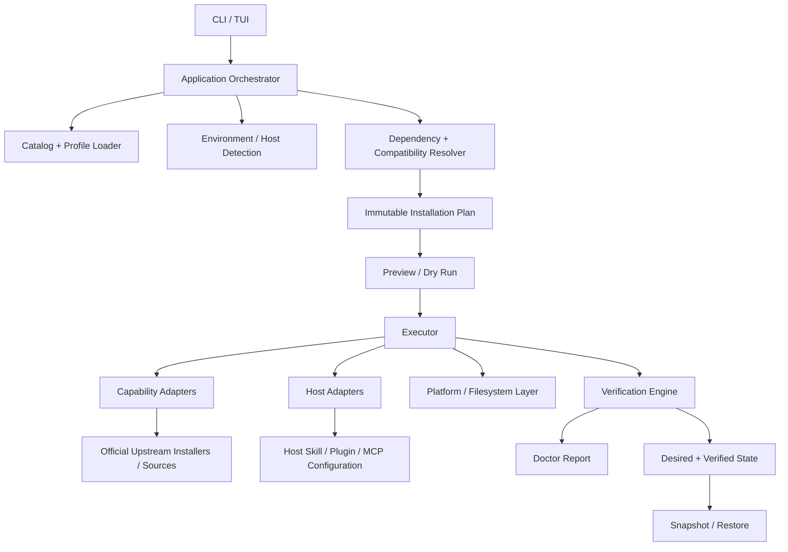

# AI-RULES — GRAND-PLAN

> Planning source of truth for the AI-RULES distribution and installer control plane.

## 1. Executive Snapshot

| Field | Value |
|---|---|
| Project Name | AI-RULES |
| Document Type | GRAND-PLAN |
| Planning Status | **READY FOR IMPLEMENTATION — MVP foundation** |
| Implementation Status | **PARTIALLY IMPLEMENTED** — repository quality/control plane exists; the target multi-host installer/orchestrator does not yet exist |
| Current Phase | **P0 — Control-plane contracts and installer foundation** |
| Primary Goal | Turn AI-RULES into a reproducible, cross-platform distribution and installer control plane for first-party AI skills plus selected upstream skills/plugins/MCP integrations |
| Planning Baseline | Repository `main` at `3f9b1da29f20c631d39b04a4e8876f2333bd56c4` |
| Last Updated | 2026-09-21 |
| Verification Context | Repository state and current-sensitive upstream documentation were checked on 2026-09-21 |

**CONFIRMED:** AI-RULES is evolving from a collection of personal AI rules/skills into an installer/orchestrator that can reconstruct a usable AI development environment on a new machine.

**LOCKED:** The core experience is one bootstrap/setup entry point that can detect the machine, let the user choose one or more AI hosts and capability profiles, inspect any existing selected capability, reconcile it without duplication, preview all mutations, install/update/repair/configure as appropriate, verify, report health, save reproducible state, and restore it later.

**DECIDED:** The new installer is built as a Python control plane on `main`, while the three first-party runtime skills remain sourced from their existing runtime branches. The first implementation slice establishes contracts and deterministic planning before adding interactive UI or performing mutations.

---

## 2. Objective

Build a vendor-neutral AI environment orchestrator with a user experience approximately equivalent to:

```text
new laptop
→ bootstrap AI-RULES
→ ai-rules setup
→ preflight environment
→ choose host(s)
→ choose global/project scope where supported
→ choose profile or Custom
→ resolve capabilities, prerequisites, compatibility, alternatives
→ inspect existing installations, ownership, provenance, and versions
→ reconcile desired vs actual state
→ preview/dry-run
→ confirm
→ install/update/repair/acquire as required
→ configure each selected host
→ verify actual result
→ doctor report
→ persist desired state and verified provenance
→ restore later on another machine
```

The primary interface is designed for non-expert users, while all core operations must also be scriptable and deterministic enough for CI, automation, and a coding agent.

### Success outcome

A fresh machine can be taken from “AI-RULES not installed” to “selected AI workflow available and verifiably configured” without the user manually learning every host’s skill/plugin/MCP conventions.

---

## 3. Product Intent

### Problem

The current AI-RULES ecosystem has strong first-party runtime skills and a main quality plane, but distribution remains fragmented. Different hosts discover skills from different paths, external projects have different installation models, MCP integrations may require services or authentication, and some integrations cannot be considered complete until a live runtime check succeeds.

The result is avoidable setup work and weak reproducibility when moving to a new machine.

### Target users

1. **Primary:** Andino or another user who wants a personal AI development workflow restored quickly on a new machine.
2. **Secondary:** A technical user who wants only a subset of AI-RULES skills and integrations.
3. **Secondary:** A coding agent that needs a deterministic plan and machine-readable state to perform or verify setup work.

### Value proposition

AI-RULES owns the **orchestration contract**, not every external tool:

- it knows what capabilities exist;
- it knows what the user wants;
- it knows what each host can accept;
- it knows how to choose an upstream-supported install/configuration path;
- it previews mutations before executing;
- it verifies the result rather than trusting an install command;
- it records reproducible state without storing secrets.

---

## 4. Scope

### MUST HAVE — MVP

**LOCKED**

- CLI installer foundation.
- Interactive selection.
- Host support contracts for:
  - Codex,
  - Claude Code,
  - OpenCode,
  - Antigravity.
- Install one or more hosts in one setup run.
- First-party capabilities:
  - `andino-workflow`,
  - `ai-codebase-rescue`,
  - `skripsi-skill`.
- Superpowers as the first third-party integration family.
- Context7 as the first MCP integration.
- Capability catalog.
- Profile model.
- Dependency and compatibility resolver.
- Dry-run/preview before any mutation.
- Idempotent first-party installation.
- Existing-install detection and desired-state reconciliation for selected MVP capabilities.
- Managed first-party installs resolve to the latest **validated AI-RULES release-manifest commit** by default, not raw runtime branch HEAD.
- Managed third-party/MCP targets use capability-specific update semantics and official upstream mechanisms; unmanaged existing installs are never silently upgraded.
- Real verification.
- Doctor report.
- Desired-state and verified-state persistence.
- Safe partial-failure behavior.
- Secret-free state files.

### SHOULD HAVE — v1 after the MVP contracts prove stable

- `ai-rules add`
- `ai-rules remove`
- `ai-rules update`
- `ai-rules doctor --repair`
- `ai-rules snapshot`
- `ai-rules restore`
- Bootstrap binary distribution.
- Release checksums.
- Automated update policy.
- Wider external capability adapters.

### COULD HAVE — later

- Remote catalog index.
- First-party update channels independent from AI-RULES binary releases.
- Signed catalog metadata.
- GUI wrapper.
- Organization/team policy packs.
- Offline mirror mode explicitly managed by the user.
- Rich telemetry/analytics, only if explicitly wanted and privacy-designed.

---

## 5. Non-Goals

**LOCKED / CONFIRMED**

- AI-RULES is **not** a mirror of every third-party repository.
- AI-RULES does **not** vendor every external skill/plugin/MCP by default.
- Runtime branches are **not** merged into `main` merely to simplify installation.
- The MVP does **not** implement every listed integration at once.
- The installer does **not** assume that “process exited 0” means the capability is usable.
- `Everything` is **not** the default profile.
- Credentials, API keys, OAuth tokens, passwords, and private secrets are **not** stored in profiles, lock files, snapshots, or ordinary logs.
- The control plane does **not** silently enable specialized/high-impact integrations.
- Project templates such as the AI website cloner are **not** treated as ambient global skills.
- The installer does **not** replace host-native authorization or workspace-trust prompts.

---

## 6. Source of Truth / Authority

Priority order for this project:

1. Latest explicit user instruction.
2. Confirmed and locked decisions in `Prompt.txt` and `Braintorming Dengan Gpt.txt`.
3. Actual repository state and repository-specific instructions.
4. Current official documentation or upstream repository documentation for current-sensitive host/package behavior.
5. Older brainstorming recommendations.
6. Planner assumptions.

### Repository truth rule

For current implementation state, repository evidence wins.

A proposed path in this document remains **PROPOSED** until it exists in the repository.

### Current repository instruction evidence

**FACT:** At the inspected `main` revision there is no root `AGENTS.md`, `AGENTS.override.md`, `CLAUDE.md`, `GEMINI.md`, `.github/copilot-instructions.md`, or `CONTRIBUTING` file.

**FACT:** Current governing repository documentation includes:

- `README.md`
- `docs/agent-skill-family-standard.md`
- `.github/workflows/validate-skills.yml`
- validation/evaluation documentation under `docs/validation/`
- existing scripts/tests/evals owned by `main`

**FACT:** `WebBased/put-in-your-projects/Agents.md` exists on the `WebBased` distribution branch, but it is a distribution/template artifact, not a root instruction file governing `main`.

Implementation agents must re-check repository-specific instructions before editing because this may change after this plan is written.

---

## 7. Verified Current Repository State

### 7.1 Branch baseline

Verified on 2026-09-21:

| Branch | Verified commit | Role |
|---|---|---|
| `main` | `3f9b1da29f20c631d39b04a4e8876f2333bd56c4` | quality/control plane |
| `WebBased` | `89c8ffcaab0ba5b7ee951e094ad6f24ccebe2a67` | web/chat rules and project templates |
| `andino-workflow` | `9172810d1223cf441cf8637d63729aedad1e4ba5` | first-party runtime skill |
| `ai-codebase-rescue` | `b34f4d792420039cbb52bceee76dc0240846b5f2` | first-party runtime skill |
| `skripsi-skill` | `6f7c57c8a2d600f092c6a31937d4ec218d9888b6` | first-party runtime skill |

### 7.2 Existing `main` responsibilities

**FACT:** `main` currently contains:

```text
.github/
docs/
evals/
scripts/
tests/
README.md
.gitignore
```

**FACT:** Existing functionality includes:

- structural validation of runtime skill packages;
- evaluation case schema checks;
- skripsi-specific traceability and audit tooling;
- GitHub Actions CI;
- repository documentation and validation evidence;
- one Windows PowerShell installer script for `skripsi-skill`.

### 7.3 What does NOT currently exist

**FACT:** At the inspected baseline, `main` does not contain:

- `installer/`;
- `src/ai_rules/`;
- a packaged `ai-rules` CLI;
- capability catalog files;
- profile files;
- host adapters;
- dependency resolver;
- multi-host doctor engine;
- snapshot/restore state engine;
- PyInstaller release configuration.

Any such path below is therefore **PROPOSED**.

### 7.4 Existing runtime branches

**FACT:** Runtime branch packages remain clean, independently distributed skill bundles.

`andino-workflow` contains `README.md`, `SKILL.md`, and `references/`.

`ai-codebase-rescue` contains `README.md`, `SKILL.md`, and `references/`.

`skripsi-skill` contains `README.md`, `SKILL.md`, `references/`, and `assets/`.

**FACT:** Current runtime READMEs already document different host skill roots and explicitly state that installation is not activation.

### 7.5 Existing installer drift

`main/scripts/install-skripsi-skill.ps1` currently:

- clones `skripsi-skill` into `$HOME\.agents\skills\skripsi-skill`;
- creates Windows junctions into multiple host roots;
- prints success after creating/updating those locations.

However, the repository’s own host validation material states that Windows junction behavior is not verified/documented uniformly across the supported hosts.

**DECIDED:** The new installer must not use cross-host junction fan-out as its portable default.

**DECIDED:** The existing script becomes a migration target. It remains available until the new installer reaches functional parity, then is deprecated with a documented replacement command.

---

## 8. Confirmed Decisions

The following are treated as accepted product decisions:

- AI-RULES becomes a distribution and installer control plane.
- First-party skills stay owned by AI-RULES.
- Third-party source remains upstream unless there is a future explicit vendoring decision.
- Upstream-supported installation mechanisms are preferred.
- `main` expands from quality/control plane into quality + distribution control plane.
- Runtime skill branches remain independent.
- One orchestrator/setup workflow is preferred over two installer stages.
- Multiple hosts can be selected in a single run.
- Profile and Custom modes coexist.
- `Everything` exists but requires explicit selection.
- Dry-run/preview comes before mutation.
- Installation should be idempotent where the upstream mechanism permits it.
- Verification and doctor are first-class capabilities.
- Desired state and verified state are distinct.
- Secrets are not persisted in normal state artifacts.
- Missing recommended/optional capabilities do not automatically block the parent workflow.
- Capability installation and host-specific configuration are separate architectural responsibilities.
- Hard-coded package-by-host conditional sprawl is prohibited.
- Setup/add are desired-state reconciliation operations: an already-installed selected target is inspected and becomes a no-op, update, repair, reconfigure, adoption decision, or explicit conflict rather than a duplicate install.
- First-party default update target is the latest validated AI-RULES release manifest, not unvalidated runtime branch HEAD.
- Third-party default update target is the latest stable/current compatible target that the capability adapter can resolve through an official upstream mechanism; exact semantics remain capability-specific.
- `doctor --repair` restores managed drift against the currently intended/locked target and does not silently upgrade to a newer upstream version.
- Remote/upstream-managed MCP services are verified/reconfigured rather than treated as local packages that AI-RULES must version-upgrade.

---

## 9. Locked Decisions

These are not to be changed by an implementation agent without user approval.

| Decision | Status |
|---|---|
| Supported host family includes Codex, Claude Code, OpenCode, Antigravity | **LOCKED** |
| User can select multiple hosts | **LOCKED** |
| Profile + Custom selection | **LOCKED** |
| `Everything` available but not default | **LOCKED** |
| Dry-run before mutation | **LOCKED** |
| Verification + doctor | **LOCKED** |
| Reproducible state / restore capability | **LOCKED** |
| No credentials in profile/lock/snapshot | **LOCKED** |
| Third-party source remains upstream by default | **LOCKED** |
| Runtime branches do not need to merge into main | **LOCKED** |
| Main becomes installer/distribution control plane | **LOCKED** |
| No giant Package × Host if/else architecture | **LOCKED** |
| MVP includes first-party + Superpowers + Context7 | **LOCKED** |
| Setup/add reconcile existing selected capabilities instead of blindly reinstalling | **LOCKED** |
| First-party default update target is latest validated AI-RULES release manifest, not raw branch HEAD | **LOCKED** |
| Unmanaged/external existing installs are never silently upgraded, repaired, replaced, or adopted | **LOCKED** |
| `doctor --repair` repairs current desired/locked state and does not perform version upgrades | **LOCKED** |

---

## 10. Assumptions

The following assumptions allow implementation to start without blocking discovery.

### ASSUMPTION A1 — Core OS support

The core CLI targets Windows, macOS, and Linux.

Capability-specific adapters may support fewer platforms and must report that explicitly.

### ASSUMPTION A2 — Python implementation

The installer control plane is implemented in Python because:

- `main` already uses Python scripts and `unittest`;
- Python is adequate for filesystem/config/subprocess orchestration;
- the final end-user binary can bundle the interpreter;
- the MVP does not justify a rewrite in Go or Rust.

A minimum source/development runtime of Python 3.11+ is recommended. The end-user binary must not require the user to pre-install Python.

### ASSUMPTION A3 — Internet access

Normal setup requires internet access for upstream acquisition unless all selected capability artifacts are already locally cached.

Offline installation is deferred.

### ASSUMPTION A4 — Personal-machine trust model

The MVP is for a user controlling their own machine. It does not attempt organization-wide device management, multi-user privilege escalation, or remote fleet management.

### ASSUMPTION A5 — Upstream auth ownership

When OAuth or an upstream login flow is required, AI-RULES may launch or instruct the official flow, but the upstream tool remains responsible for credential storage.

---

## 11. Unknowns / Research Required

No item below blocks **P0 contract implementation**.

### UNKNOWN U1 — Fully non-interactive Superpowers installation on every host

Current upstream behavior differs by host:

- Claude Code uses its plugin marketplace flow.
- Codex exposes Superpowers through the plugin marketplace/user interaction.
- Antigravity supports repository plugin install.
- OpenCode uses its own plugin configuration/install behavior.

The MVP adapter must support verified paths per host, but may return `MANUAL_ACTION_REQUIRED` when an upstream-supported non-interactive mutation is not safely available.

**Blocking stage:** before claiming fully automated Superpowers installation for a specific host.

### UNKNOWN U2 — Antigravity programmatic MCP verification contract

Antigravity documents skill paths and MCP configuration, but the exact best non-interactive health-check surface must be verified when its host adapter is implemented.

**Blocking stage:** Antigravity Context7 live verification, not catalog/resolver work.

### UNKNOWN U3 — Public binary signing/notarization policy

If AI-RULES binaries are distributed publicly, Windows code signing and macOS signing/notarization need a release decision.

**Blocking stage:** public production release, not MVP source-mode development.

### UNKNOWN U4 — Exact architecture matrix for prebuilt binaries

Windows x64, macOS x64/arm64, and Linux x64 are reasonable starting release targets, but the final release matrix must match available CI runners and actual user hardware.

### UNKNOWN U5 — Exact replay guarantees for every external upstream

Some upstream installers allow explicit versions/commits; others expose only “current/latest” or interactive marketplaces.

`lock.yaml` can record provenance even when exact replay is impossible, but the adapter must report `exact_replay: false` rather than implying deterministic restore.

### UNKNOWN U6 — Host-specific project-scope behavior for all external capabilities

First-party skills have documented project roots. Some external plugin installers are user/global only.

The resolver must never infer project-scoped support from first-party skill behavior.

### UNKNOWN U7 — Observable version/update state on interactive marketplaces

Some host plugin marketplaces expose install/enable state more reliably than an exact installed version or commit.

The adapter may therefore report `version_observability: partial` and must not claim a target is current merely because the plugin is present. When safe automated version comparison is unavailable, update may require the host-native UI/command and end in `MANUAL_ACTION_REQUIRED` until re-verification succeeds.

**Blocking stage:** only before claiming automated update/current-version verification for that specific host/capability pair.

---

## 12. Technology Stack

| Technology | Role | Status | Rationale |
|---|---|---|---|
| Python 3.11+ | installer engine in source/dev mode | **DECIDED / AI SELECTED** | matches existing repo tooling; simple cross-platform orchestration |
| `argparse` | non-interactive CLI parsing | **DECIDED** | standard library, no unnecessary framework |
| Questionary | interactive selections / checkbox UX | **DECIDED** | supports multi-select and simple terminal wizard UX |
| PyYAML | YAML profile/catalog/state parsing | **DECIDED** | human-readable portable state |
| Pydantic v2 | typed manifest/profile/state validation | **DECIDED** | clear schema validation and error messages; avoids ad-hoc nested validation |
| `unittest` | MVP tests | **DECIDED** | aligns with current repository tests |
| PyInstaller | standalone end-user executables | **DECIDED** | bundles Python/dependencies; build per target OS |
| GitHub Actions | CI/release automation | **EXISTING + EXTEND** | repository already uses Actions |

Do not lock exact dependency versions in this planning document unless compatibility work demonstrates a need. Pin implementation dependencies in the repository lock/build mechanism chosen during P0.

---

## 13. Proposed Architecture

### 13.1 Architectural principles

1. **Declarative before imperative.** Catalog and profile data describe capabilities; code does not encode package IDs through giant conditionals.
2. **Plan before mutate.** All operations are resolved into a previewable plan.
3. **Separate acquisition, host deployment, and verification.**
4. **Host adapters know host semantics.**
5. **Capability adapters know upstream package/service semantics.**
6. **Resolver composes both.**
7. **Doctor reuses the same verification contracts as setup.**
8. **State is evidence-based.**
9. **Partial success is explicit, never hidden.**
10. **Specialized integrations require stronger compatibility and consent gates.**

### 13.2 Target component model



### 13.3 Responsibility boundaries

#### CLI/TUI

Owns:

- argument parsing;
- interactive questions;
- confirmation;
- rendering plans/results.

Does not own:

- dependency resolution;
- package installation logic;
- host configuration rules.

#### Resolver

Owns:

- profile expansion;
- dependencies;
- alternatives;
- conflicts;
- compatibility;
- installation strategy selection;
- operation ordering.

Does not mutate the machine.

#### Executor

Owns:

- executing already-resolved operations;
- applying backup/rollback policy;
- evidence capture;
- stop/continue rules.

It does not decide product scope.

#### Host adapters

Own:

- host detection/version;
- global/project skill target;
- plugin mechanism support;
- MCP registration/configuration;
- host-specific verification;
- host refresh/restart/manual-finalization semantics.

#### Capability adapters

Own:

- official upstream source;
- prerequisite declarations;
- acquisition/install/update/remove strategy;
- upstream-specific validation;
- capability-level provenance;
- rollback/uninstall semantics where upstream supports them.

---

## 14. Proposed Project Structure

Everything in this subsection is **PROPOSED PATH** unless marked EXISTING.

```text
AI-RULES/
├── README.md                                  # EXISTING; update only after CLI is usable
├── pyproject.toml                             # PROPOSED
├── src/
│   └── ai_rules/                              # PROPOSED
│       ├── __init__.py
│       ├── __main__.py
│       ├── cli.py
│       ├── domain/
│       │   ├── models.py
│       │   ├── statuses.py
│       │   └── errors.py
│       ├── platform/
│       │   ├── detect.py
│       │   └── paths.py
│       ├── catalog/
│       │   ├── loader.py
│       │   └── data/
│       │       ├── hosts.yaml
│       │       └── capabilities.yaml
│       ├── profiles/
│       │   ├── loader.py
│       │   └── data/
│       │       ├── minimal.yaml
│       │       ├── recommended.yaml
│       │       ├── engineering.yaml
│       │       ├── web-development.yaml
│       │       ├── research-skripsi.yaml
│       │       ├── design.yaml
│       │       ├── media.yaml
│       │       └── reverse-engineering.yaml
│       ├── hosts/
│       │   ├── base.py
│       │   ├── codex.py
│       │   ├── claude_code.py
│       │   ├── opencode.py
│       │   └── antigravity.py
│       ├── capabilities/
│       │   ├── base.py
│       │   ├── first_party.py
│       │   ├── superpowers.py
│       │   └── context7.py
│       ├── resolver/
│       │   ├── engine.py
│       │   └── compatibility.py
│       ├── planning/
│       │   ├── operations.py
│       │   └── renderer.py
│       ├── execution/
│       │   ├── executor.py
│       │   └── rollback.py
│       ├── verification/
│       │   ├── checks.py
│       │   └── doctor.py
│       ├── state/
│       │   ├── models.py
│       │   ├── store.py
│       │   └── snapshot.py
│       └── evidence/
│           ├── log.py
│           └── redaction.py
├── tests/
│   ├── ...                                    # EXISTING tests remain
│   └── installer/                             # PROPOSED
├── scripts/
│   ├── install-skripsi-skill.ps1              # EXISTING; migration target
│   └── bootstrap/                             # PROPOSED
│       ├── install.ps1
│       └── install.sh
└── .github/
    └── workflows/
        ├── validate-skills.yml                 # EXISTING
        └── installer.yml                       # PROPOSED
```

This is a target map, not an instruction to create every file in P0. Implementation phases below define the minimum file set per slice.

---

## 15. Host Model

### 15.1 Host abstraction

A host represents an AI execution environment that can discover or register one or more capability mechanisms.

Conceptual interface:

```text
HostAdapter
- id
- detect(environment) -> HostDetection
- supported_scopes() -> {global, project, ...}
- supported_mechanisms() -> set[Mechanism]
- skill_target(scope, project) -> path | unsupported
- plan_plugin_registration(recipe, scope) -> operations
- plan_mcp_registration(server_spec, scope) -> operations
- verify_skill(capability, scope) -> verification evidence
- verify_plugin(capability, scope) -> verification evidence
- verify_mcp(capability, scope) -> verification evidence
- refresh_requirement() -> none/restart/new-session/manual
```

The interface is conceptual; exact Python method names may vary if behavior remains equivalent.

### 15.2 Host capabilities

Mechanisms are normalized, for example:

- `SKILL_DIRECTORY`
- `PLUGIN_MARKETPLACE`
- `PLUGIN_REPOSITORY`
- `MCP_STDIO`
- `MCP_HTTP`
- `MCP_OAUTH`
- `PROJECT_SKILL_SCOPE`
- `GLOBAL_SKILL_SCOPE`

A host advertises mechanisms. A capability advertises compatible delivery strategies. The resolver selects their intersection.

### 15.3 Verified host facts affecting design

#### Codex

Current official documentation supports local skills under user/repository `.agents/skills`, MCP registration through `codex mcp`, and OAuth-capable MCP login.

Planning impact:

- first-party skill installs can use ordinary files under `.agents/skills`;
- Context7 can use Codex MCP configuration;
- plugin integrations may use the Codex plugin ecosystem when the upstream project officially supports it.

#### Claude Code

Current documentation distinguishes personal/project skills, plugin skills, user/project MCP scopes, health states, approval, and workspace trust.

Planning impact:

- writing config is not equivalent to approval or connection;
- project MCP may finish in `MANUAL_ACTION_REQUIRED`;
- doctor must distinguish `Connected`, auth-required, failed, and approval-pending states where detectable.

#### OpenCode

Current docs discover skills from native OpenCode locations plus `.claude/skills` and `.agents/skills`.

Planning impact:

- first-party install can use a documented native or compatible root;
- duplicate-ID precedence matters;
- adapter must avoid installing unnecessary duplicate copies.

#### Antigravity

Current docs distinguish 2.0/IDE global skill roots, CLI global roots, common project `.agents/skills`, and plugin-provided skills.

Planning impact:

- “Antigravity” detection must identify the installed surface where necessary;
- one assumed global path is insufficient;
- project scope is more portable than global scope across Antigravity surfaces.

---

## 16. Capability / Package Model

### 16.1 Do not overload one category field

The requested dependency categories describe different dimensions. The catalog should model them separately.

#### Ownership

- `FIRST_PARTY`
- `EXTERNAL`

#### Kind

- `skill`
- `skill_family`
- `plugin`
- `mcp`
- `cli`
- `service`
- `integration`
- `project_template`

#### Importance

- `REQUIRED`
- `RECOMMENDED`
- `OPTIONAL`
- `SPECIALIZED`

#### Relationship

- `requires`
- `recommends`
- `alternative_to`
- `conflicts_with`
- `provides`

This preserves the requested semantics without forcing mutually exclusive labels.

### 16.2 Capability contract

Each capability needs enough metadata for the resolver and doctor.

Conceptual fields:

```yaml
schema_version: 1
id: context7
display_name: Context7
ownership: EXTERNAL
kind: mcp
importance: RECOMMENDED

source:
  upstream: https://github.com/upstash/context7
  trust: official_upstream
  verified_at: 2026-09-21

provides:
  - current-library-documentation

prerequisites: []
delivery:
  - mechanism: MCP_HTTP
    preference: 10
  - mechanism: MCP_STDIO
    preference: 20
    prerequisites:
      - node
      - npx

compatibility:
  hosts:
    codex: supported
    claude-code: supported
    opencode: supported
    antigravity: supported_or_verify

verification:
  level:
    - configuration
    - host_discovery
    - runtime_health

secret_policy:
  persist_values: false

update_policy:
  model: remote_service | package_registry | git | marketplace | release_manifest | manual
  default_channel: stable
  resolve_target: latest_compatible
  version_observability: full | partial | none
  exact_pin_supported: true | false
```

This is a contract illustration, not production schema implementation.

### 16.3 First-party capability model

First-party runtime skills remain sourced from their branches.

The catalog records:

- branch name;
- resolved commit SHA;
- package allowlist/validation result;
- source repository;
- expected skill name;
- supported host mechanisms.

### 16.4 First-party release acquisition

**DECIDED:** Do not require cross-host junctions.

Preferred distribution model:

1. Runtime branch remains canonical source.
2. Release CI fetches the runtime branch at a specific commit.
3. Existing structural validator validates it.
4. Release build exports ordinary runtime files into an ephemeral first-party bundle.
5. The release manifest records the exact branch + commit.
6. The `ai-rules` binary or adjacent release asset contains/ships those validated bundles.
7. Host adapters copy the bundle atomically into the selected documented skill root.
8. During `setup`, `add`, or `update`, the currently installed managed first-party commit is compared with the release-manifest target. A mismatch produces an explicit reconciliation action instead of an unconditional reinstall.

**LOCKED default channel:** first-party user-facing installs track the latest validated AI-RULES release manifest. Runtime branch HEAD is an implementation/source input, not the default user update channel. A future explicit `edge` channel may opt into newer validated branch revisions, but it must not silently replace the stable default.

Benefits:

- no requirement to have Git installed just to install first-party skills from a release binary;
- exact provenance is available;
- `main` still does not commit runtime copies;
- no cross-host symlink/junction assumption;
- installation can be idempotent and verified.

Source/developer mode may use local Git refs when present, but that is not the user-facing release dependency.

---

## 17. Dependency Model

### 17.1 Dependency semantics

#### REQUIRED

Without it, the selected capability cannot produce its promised outcome.

Resolver behavior:

- auto-select if safe and catalog permits;
- otherwise block only the affected capability;
- report why.

#### RECOMMENDED

Meaningfully improves the workflow but safe fallback exists.

Resolver behavior:

- profile may select it explicitly;
- if missing and not selected, do not block;
- fallback remains valid.

#### OPTIONAL

Useful only for specific user needs.

No automatic selection unless profile explicitly contains it.

#### INTEGRATION

Requires external configuration/service/runtime rather than only files.

Must have separate configuration and runtime verification.

#### SPECIALIZED

Narrow use case, stronger prerequisite/consent gate.

Never silently activated by `Everything`.

#### ALTERNATIVE

Multiple providers satisfy one abstract capability.

Resolver selects one preferred provider unless user explicitly chooses another.

#### CONFLICT

Two providers cannot or should not be simultaneously active for the same role.

Resolver must surface the conflict before execution.

#### PROJECT_TEMPLATE

Creates a project rather than modifying the ambient AI host environment.

Excluded from normal environment profile resolution.

### 17.2 Abstract capabilities

Introduce provider abstraction where multiple tools overlap.

Examples:

#### `browser-automation`

Preferred provider for coding-agent workflows:

1. `playwright-cli-skills`
2. `playwright-mcp` only when stateful MCP interaction is specifically needed

Chrome DevTools MCP is **not** the same provider. It is a separate `browser-diagnostics` capability for DevTools/network/performance inspection.

#### `git-operations`

Default provider: native `git` command available to the host.

`git-mcp` is an optional alternative/integration, not a default dependency.

#### `diagramming`

Possible providers may include draw.io remote MCP, local draw.io MCP, or host plugin support depending on host.

---

## 18. Catalog / Manifest Contract

### 18.1 Goals

The catalog must allow adding a new package without editing the resolver core.

It must represent:

- identity;
- ownership;
- kind;
- importance;
- source/provenance;
- prerequisites;
- supported OS/architectures;
- supported hosts/mechanisms;
- installation strategies;
- update/remove strategies;
- verification;
- manual-finalization requirements;
- secrets policy;
- rollback characteristics;
- alternatives/conflicts;
- existing-install detection/provenance rules;
- update model, default channel, target-resolution rule, version observability, and exact-pin capability.

### 18.2 Recipe model

A recipe is declarative data interpreted by trusted engine primitives.

Allowed operation families for MVP:

- `download_artifact`
- `copy_tree`
- `remove_managed_tree`
- `run_command`
- `patch_structured_config`
- `backup_file`
- `manual_step`
- `verify_command`
- `verify_path`
- `verify_host_registration`
- `verify_runtime`

The catalog must not allow arbitrary opaque shell blobs without explicit review. Commands are structured argv lists whenever possible.

### 18.3 Host-specific exceptions

Host-specific differences are allowed in **data**, not as an ever-growing chain of code conditionals.

Example concept:

```yaml
delivery:
  - id: superpowers-opencode
    hosts: [opencode]
    mechanism: HOST_PLUGIN_CONFIG
    ...

  - id: superpowers-antigravity
    hosts: [antigravity]
    mechanism: PLUGIN_REPOSITORY
    ...

  - id: superpowers-codex
    hosts: [codex]
    mechanism: PLUGIN_MARKETPLACE
    finalization: interactive
```

The resolver is generic. It chooses the compatible strategy; it does not contain `if package == "superpowers" and host == "..."`.

### 18.4 Provenance fields

At minimum:

- upstream URL/repository/package;
- verification date;
- delivery strategy;
- resolved version/tag/commit if observable;
- artifact checksum if AI-RULES downloads a release artifact;
- installer version if observable;
- exact first-party runtime commit;
- observed installed version/commit when available;
- resolved target version/commit when available;
- update model/channel;
- ownership (`MANAGED_BY_AI_RULES`, external existing, or unknown);
- exact replay/update observability flags.

---

## 19. Profile Model

Profiles describe **intent**, not exact machine state.

### 19.1 Profile rules

- Profiles can include selected capabilities.
- Profiles can also include “suggested but not preselected” capabilities.
- A profile never embeds credentials.
- A profile does not force incompatible capabilities.
- Resolver prunes unsupported targets and explains why.
- `Everything` includes all generally installable capabilities that are compatible, but specialized/high-impact integrations still need a second explicit consent.
- Project templates are not part of ambient `Everything`.

### 19.2 Initial profile design

#### Minimal

Default contents:

- `andino-workflow`

Rationale: smallest useful AI-RULES lifecycle package with no external dependency.

#### Recommended

Default contents:

- `andino-workflow`
- `ai-codebase-rescue`
- `superpowers`
- `context7`

Rationale:

- Andino provides the general workflow.
- Rescue adds bounded engineering stabilization without auto-activation.
- Superpowers is the reference external workflow family.
- Context7 provides current documentation capability.

Fallback:

- if Superpowers is unavailable on a selected host, AI-RULES first-party skills remain usable;
- if Context7 is unavailable, the agent may use official docs/web according to the runtime skill’s existing fallback rules.

#### Engineering

Default contents:

- Recommended profile contents
- `agent-skills`
- `browser-automation` → preferred `playwright-cli-skills`

Suggested but not preselected:

- Ponytail
- Graphify

Reason: Ponytail overlaps with engineering/workflow behavior and should remain opt-in rather than automatically adding more process doctrine. Graphify is useful for large codebase analysis but is not required for ordinary engineering work.

#### Web Development

Default contents:

- Engineering
- `ui-ux-pro-max`
- `taste-skill`
- `browser-automation`

Suggested:

- `chrome-devtools-mcp` for DevTools-level debugging/performance work

Do not automatically install both Playwright MCP and Chrome DevTools MCP.

#### Research / Skripsi

Default contents:

- `andino-workflow`
- `skripsi-skill`
- `context7`

Suggested:

- browser automation only when needed for research workflow or web-based source interaction.

#### Design

Default contents:

- `andino-workflow`
- `ui-ux-pro-max`
- `taste-skill`
- `drawio`

Draw.io provider is selected based on host support and desired remote/local behavior.

#### Media

Default contents:

- `andino-workflow`

Specialized opt-in:

- `premiere-pro-mcp`

Reason: Premiere integration requires local application/runtime setup and manual bridge finalization. It should not be installed merely because a user chooses a broad development profile.

#### Reverse Engineering

Default contents:

- `andino-workflow`
- `ai-codebase-rescue`

Specialized explicit opt-in:

- `cheatengine-mcp-bridge`

Compatibility/security gate:

- Windows/local Cheat Engine environment for native bridge;
- explicit acknowledgement before enabling any state-changing/dangerous upstream capability;
- local-only transport is preferred.

#### Everything

Includes all compatible ordinary capabilities.

Does **not** silently enable:

- Premiere bridge finalization;
- Cheat Engine integration;
- project templates;
- any capability requiring an additional high-impact/security consent.

#### Custom

User manually chooses capabilities, then resolver adds only REQUIRED dependencies and displays RECOMMENDED suggestions.

---

## 20. Current Capability Research Classification

Verified 2026-09-21.

| Capability | Planning classification | Installation model / impact |
|---|---|---|
| andino-workflow | FIRST_PARTY / core | validated branch bundle, host skill directory |
| ai-codebase-rescue | FIRST_PARTY / optional specialist | validated branch bundle |
| skripsi-skill | FIRST_PARTY / domain specialist | validated branch bundle |
| Superpowers | EXTERNAL / RECOMMENDED / skill-family/plugin | host-specific upstream plugin/install flows; MVP reference integration |
| Ponytail | EXTERNAL / OPTIONAL | current upstream supports plugin flows including Codex; defer |
| claude-mem | EXTERNAL / INTEGRATION / opt-in | installer + hooks + worker service + persistent local data; privacy/runtime gate |
| ui-ux-pro-max | EXTERNAL / OPTIONAL | upstream CLI generates host-specific files; ideal adapter target |
| taste-skill | EXTERNAL / OPTIONAL | upstream `npx skills add`; may install whole family or selected skill |
| clone-website | EXTERNAL / PROJECT_TEMPLATE | standalone project/template; not ambient install |
| graphify | EXTERNAL / OPTIONAL | Python/uv CLI then skill registration; project/global modes |
| agent-skills | EXTERNAL / OPTIONAL engineering family | supports portable `npx skills add` and host-native paths |
| Context7 | EXTERNAL / RECOMMENDED / MCP | remote HTTP and local stdio options; MVP MCP |
| Playwright CLI + Skills | EXTERNAL / RECOMMENDED provider | preferred browser-automation provider for coding agents |
| Playwright MCP | EXTERNAL / ALTERNATIVE | stateful/introspective browser automation |
| Chrome DevTools MCP | EXTERNAL / OPTIONAL diagnostics | Node/npm; DevTools-level diagnostics |
| Git MCP | EXTERNAL / OPTIONAL alternative | official MCP server; native Git remains default |
| draw.io | EXTERNAL / OPTIONAL integration | remote MCP/local stdio/plugin options |
| StarUML MCP | EXTERNAL / SPECIALIZED | StarUML 7+ and Node 22+ prerequisite |
| Premiere Pro MCP | EXTERNAL / SPECIALIZED | Node 20+, Premiere 2020+, local CEP bridge, manual runtime finalization |
| Cheat Engine MCP bridge | EXTERNAL / SPECIALIZED | native named-pipe path is Windows-specific; high-impact capability |

---

## 21. CLI / TUI UX Flow

### 21.1 Command surface

Initial command set:

```text
ai-rules setup
ai-rules add
ai-rules remove
ai-rules update
ai-rules doctor
ai-rules doctor --repair
ai-rules snapshot
ai-rules restore
```

All mutating commands must support:

```text
--dry-run
--yes                # only for operations that do not require separate safety/interactive consent
--non-interactive
```

`--yes` must not bypass:

- required OAuth/login;
- workspace trust;
- specialized high-impact confirmation;
- unresolved destructive conflict.

### 21.2 `ai-rules setup`

Flow:

1. **Preflight**
   - OS / architecture
   - shell
   - network availability
   - package managers/runtime commands
   - installed AI hosts and versions
   - existing AI-RULES state
   - legacy install detection
   - existing selected capability detection, including ownership/provenance/version when observable

2. **Host selection**
   - one or more detected hosts;
   - option to include supported hosts that are not yet installed only when AI-RULES has an explicit host-install feature in the future;
   - MVP does not silently install the host application itself.

3. **Scope**
   - global;
   - project;
   - only show scopes supported by every selected target or allow per-host scope override.

4. **Profile**
   - Minimal
   - Recommended
   - Engineering
   - Web Development
   - Research / Skripsi
   - Design
   - Media
   - Reverse Engineering
   - Everything
   - Custom

5. **Custom / profile review**
   - checkbox list;
   - show category, source, prerequisites, support, manual steps;
   - disabled checkbox with reason for unsupported choices.

6. **Resolution / reconciliation**
   - add required dependencies;
   - choose providers;
   - detect conflicts;
   - resolve each target's update policy and desired version/revision;
   - compare desired target with actual installed state;
   - select one reconciliation action per capability × host × scope target;
   - mark manual-only targets;
   - compute operation order.

7. **Preview**
   - reconciliation action (`INSTALL`, `NO_OP`, `UPDATE`, `REPAIR`, `RECONFIGURE`, `ADOPT`, `REPLACE`, `DOWNGRADE`, `MANUAL_ACTION`, or `BLOCK`);
   - observed version/provenance and target version/revision when known;
   - downloads;
   - commands;
   - config files touched;
   - directories created/replaced;
   - backups;
   - auth/manual steps;
   - unsupported/skipped targets.

8. **Confirmation**

9. **Execution**

10. **Verification**

11. **State write**

12. **Doctor summary**

### 21.3 Non-interactive mode

The same engine is callable from CI/coding agents without TUI.

Example conceptual use:

```text
ai-rules setup --profile recommended --host codex --host claude-code --dry-run --non-interactive
```

Non-interactive execution fails clearly if a required decision cannot be resolved safely.

---

## 22. Installation Lifecycle

### 22.1 Lifecycle stages

```text
DISCOVER
→ RESOLVE
→ PLAN
→ PREVIEW
→ APPROVE
→ ACQUIRE
→ INSTALL
→ CONFIGURE
→ FINALIZE
→ VERIFY
→ RECORD
```

### 22.2 Idempotency

A repeated setup with unchanged desired state should:

- not duplicate skills;
- not create duplicate MCP entries;
- not destroy user edits;
- not reinstall an identical managed bundle unnecessarily;
- not re-run manual finalization that is already verified;
- produce either no operations or only required repair/update operations.

### 22.3 Managed vs unmanaged installs

Every detected target is classified:

- `MANAGED_BY_AI_RULES`
- `EXTERNAL_EXISTING`
- `CONFLICTING`
- `UNKNOWN_ORIGIN`

Rules:

- Never overwrite an existing unmanaged installation silently.
- If identical content/provenance is provable, offer adoption into managed state.
- If user-modified content exists, preserve it and surface a decision.
- Do not “repair” unmanaged data by default.

### 22.4 Operation ordering

Dependency order:

1. prerequisites;
2. package acquisition/installation;
3. host registration/configuration;
4. manual finalization;
5. verification;
6. state commit.

Independent capability-host targets may continue after another target fails unless the failure invalidates a shared dependency.

### 22.5 Desired-state reconciliation contract

**LOCKED:** `setup`, `add`, `restore`, and the dedicated `update` workflow use the same reconciliation engine. They do not treat "already exists" as an error and they do not blindly reinstall.

For every selected **capability × host × scope** target, the engine must:

1. detect whether the target exists;
2. determine ownership/provenance where possible;
3. detect the installed/resolved version, tag, commit, package spec, or service/config identity when observable;
4. resolve the desired target according to profile/pin/update-channel policy;
5. compare actual state with desired state;
6. produce one explicit reconciliation action;
7. preview the action before mutation;
8. execute only within the applicable consent boundary;
9. verify the resulting state;
10. record actual evidence/provenance in lock state.

Normalized reconciliation actions:

- `INSTALL` — selected target is absent and can be installed safely;
- `NO_OP` — the correct target is already present and verification does not require mutation;
- `UPDATE` — a managed target should move to a newer adapter-resolved target;
- `DOWNGRADE` — only for an explicit locked/pinned restore or explicit user-selected version transition; never implicit during normal setup/update;
- `REPAIR` — the intended version/revision is already the target, but managed files/artifacts are missing or drifted;
- `RECONFIGURE` — package/artifact is acceptable but host registration/configuration differs from desired state;
- `ADOPT` — an unmanaged install is provably equivalent and the user explicitly chooses AI-RULES management;
- `REPLACE` — an unmanaged/conflicting install is replaced only after explicit preview and consent;
- `MANUAL_ACTION` — upstream/host requires an interactive step AI-RULES cannot safely automate;
- `BLOCK` — provenance, compatibility, trust, conflict, or destructive risk prevents safe reconciliation.

Rules:

- Managed older target + newer default target → plan `UPDATE`.
- Managed identical target + healthy config → `NO_OP` then verify.
- Managed identical target + drift → `REPAIR` and/or `RECONFIGURE`.
- Managed target newer than normal stable target → do not downgrade automatically; report drift/channel state. Only explicit locked/pinned restore may plan `DOWNGRADE`.
- `EXTERNAL_EXISTING` / `UNKNOWN_ORIGIN` → never auto-update, auto-repair, auto-adopt, or overwrite. Offer `ADOPT`, `REPLACE`, or `SKIP` only when safe and user-approved.
- User-modified files are preserved unless the user explicitly approves replacement after a diff/evidence summary.

### 22.6 Update target and channel policy

`latest` is not a universal raw Git concept.

#### First-party AI-RULES skills

Default channel: `stable`.

Target resolution:

```text
latest validated AI-RULES release manifest
→ exact runtime branch commit recorded in that manifest
```

Normal `setup`/`add`/`update` must not follow raw branch HEAD. A future explicit `edge` channel may opt into newer validated revisions, but it requires a separate product decision/contract.

#### Third-party skills/plugins/CLIs

Default channel: adapter-defined `stable/current-compatible` using the official upstream mechanism.

The adapter declares whether target resolution is based on:

- package registry version/tag;
- Git tag/commit/repository spec;
- host/plugin marketplace;
- upstream installer/CLI self-update;
- remote service managed by upstream;
- manual/interactive update.

If an upstream only exposes a floating `latest/current` mechanism, lock state records the strongest observable provenance and sets `exact_replay: false` when deterministic replay cannot be guaranteed.

A package must never be treated as current when exact version comparison is unavailable. Use `version_observability: partial|none` and report the limitation.

### 22.7 MCP update semantics

MCP capabilities are not assumed to be local packages.

- **Remote HTTP/SSE/streamable HTTP MCP:** service runtime/version is upstream-managed. AI-RULES reconciles endpoint, transport, headers/auth references, host registration, and health. There may be no local `UPDATE` action.
- **Local stdio/package MCP:** adapter may resolve package version/revision and plan `UPDATE` through the official package/install mechanism.
- **Marketplace/host-managed MCP:** use host-native update semantics; if version state is not observable, report partial observability or `MANUAL_ACTION` rather than claiming current/latest.
- **MCP config drift only:** use `RECONFIGURE` or `REPAIR`, not a package version upgrade.

---

## 23. Status Model

Use one normalized target roll-up plus detailed evidence sub-state.

### 23.1 Target status

- `NOT_SELECTED`
- `PLANNED`
- `BLOCKED`
- `UNSUPPORTED`
- `INSTALLED`
- `CONFIGURED`
- `MANUAL_ACTION_REQUIRED`
- `VERIFIED`
- `PARTIALLY_VERIFIED`
- `FAILED`
- `SKIPPED`

### 23.2 Detection result

Keep machine detection separate:

- `PRESENT`
- `MISSING`
- `UNKNOWN`
- `UNSUPPORTED`

This avoids treating `MISSING` as a lifecycle phase.

### 23.3 Reconciliation assessment

Keep update/drift assessment separate from lifecycle status:

- `CURRENT`
- `UPDATE_AVAILABLE`
- `DRIFTED`
- `RECONFIGURE_REQUIRED`
- `UNMANAGED_EXISTING`
- `PINNED`
- `UPSTREAM_MANAGED`
- `VERSION_UNKNOWN`

This assessment describes what the next reconciliation run would do; it is not evidence that an update or repair has already happened.

### 23.4 Verification result

Each verification check records:

- `PASS`
- `FAIL`
- `NOT_RUN`
- `MANUAL`

Roll-up rules:

- `VERIFIED`: all required checks PASS.
- `PARTIALLY_VERIFIED`: installation/config evidence exists but at least one non-optional runtime check cannot be proven.
- `MANUAL_ACTION_REQUIRED`: a required human/host action remains.
- `FAILED`: a required executed check failed.

Example:

```text
Premiere Pro MCP
installation       PASS
client config      PASS
CEP bridge files   PASS
Premiere bridge    MANUAL
runtime connection NOT_RUN

Target status: MANUAL_ACTION_REQUIRED
```

---

## 24. Dry-Run / Preview Contract

Dry-run is not a mock installer. It is the same resolved plan without mutation.

Each planned operation includes:

- capability;
- host;
- scope;
- operation kind;
- source;
- target;
- exact command argv when applicable;
- files/config affected;
- whether backup is created;
- whether reversible;
- privilege requirement;
- network requirement;
- manual step;
- security warning;
- reason/dependency.

Preview must redact secret values.

A dry-run exit code should distinguish:

- plan valid;
- plan valid but contains manual actions;
- plan blocked;
- invalid desired state.

---

## 25. Verification / Doctor Model

### 25.1 Verification layers

#### Level 1 — Artifact

Examples:

- first-party `SKILL.md` and referenced package files exist;
- expected external CLI command is resolvable.

#### Level 2 — Host configuration

Examples:

- skill is under a documented discovery path;
- MCP entry exists exactly once;
- plugin is listed/enabled where host provides such a query.

#### Level 3 — Host health

Examples:

- host command lists MCP as connected/configured;
- plugin appears in host plugin list;
- runtime/service responds.

#### Level 4 — Behavioral smoke

Only where appropriate and deterministic:

- host recognizes the installed skill;
- a read-only MCP health call succeeds.

Do not automatically invoke costly models just to prove installation unless the user explicitly enables live behavior testing.

### 25.2 `ai-rules doctor`

Doctor reads:

- desired state;
- lock state;
- actual filesystem;
- actual host configuration;
- actual upstream runtime where safe.

It reports per target:

```text
VERIFIED
PARTIALLY_VERIFIED
MANUAL_ACTION_REQUIRED
FAILED
SKIPPED
UNSUPPORTED
```

Doctor must not infer success from the lock file alone.

For managed targets, doctor also reports when observable:

- installed version/commit;
- desired/locked target;
- update channel/model;
- reconciliation assessment such as `CURRENT`, `UPDATE_AVAILABLE`, `DRIFTED`, or `VERSION_UNKNOWN`.

Doctor may perform a read-only upstream/version check, but it must distinguish "update available" from "update applied".

### 25.3 `doctor --repair`

Allowed automatic repairs:

- recreate an installer-managed missing directory;
- restore an installer-managed config entry from desired state;
- reinstall a known managed first-party bundle;
- clean a stale AI-RULES-managed temp artifact;
- re-run a safe upstream registration command.

**LOCKED:** `doctor --repair` repairs drift against the current desired/locked target. It must not resolve or install a newer upstream version merely because one exists. Version advancement belongs to setup/add reconciliation under an update policy or the explicit `ai-rules update` command.

Require confirmation for:

- overwriting user-modified files;
- removing unknown duplicate installs;
- changing authentication;
- specialized or destructive integration behavior.

---

## 26. Desired State, Lock State, Snapshot / Restore

### 26.1 `profile.yaml`

Meaning: **what the user wants**.

Recommended location:

Global:

```text
~/.ai-rules/profile.yaml
```

Project:

```text
<project>/.ai-rules/profile.yaml
```

Contains:

- schema version;
- profile name or custom;
- selected hosts;
- requested scope;
- selected capabilities;
- provider preferences;
- policy choices such as telemetry opt-out preference where supported;
- no secrets.

### 26.2 `lock.yaml`

Meaning: **what was actually resolved and verified on this machine**.

Recommended global local state:

```text
~/.ai-rules/lock.yaml
```

Project-local lock:

```text
<project>/.ai-rules/lock.yaml
```

Contains per target:

- capability;
- host;
- scope;
- source;
- resolved version/commit;
- chosen delivery strategy;
- install/config status;
- verification status;
- verification timestamp;
- manual-finalization status;
- exact-replay capability;
- ownership/provenance classification;
- observed installed version/commit/package spec when available;
- resolved target version/commit when available;
- update model and channel;
- version observability;
- last update/version-check timestamp when performed;
- no secret values.

### 26.3 VCS policy

- `profile.yaml` may be intentionally committed for a project/team.
- machine-local `lock.yaml` is not committed by default because it can contain machine-specific path/provenance state.
- a future explicit portable lock export may be committed if its schema excludes machine-local details.

### 26.4 Snapshot

`ai-rules snapshot` exports a secret-free portable snapshot.

Modes:

- **desired snapshot** — default; restore intent and resolve current compatible upstream.
- **locked snapshot** — request known versions/commits when the upstream mechanism supports exact replay.

If exact replay is unsupported, restore reports it explicitly rather than silently installing “latest” as if identical.

### 26.5 Restore

Flow:

1. parse and validate snapshot;
2. run preflight;
3. resolve compatibility on new machine;
4. display drift from recorded lock;
5. dry-run;
6. confirm;
7. execute;
8. verify;
9. write new machine lock.

---

## 27. Security & Credential Boundaries

### 27.1 Secrets

Never write raw secrets to:

- profile;
- lock;
- snapshot;
- normal logs;
- dry-run output;
- error trace shown to user;
- catalog.

Store only references such as:

```text
auth: oauth_managed_by_host
secret_env: CONTEXT7_API_KEY
credential_state: present
```

### 27.2 Command safety

- use argv arrays, not interpolated shell strings, wherever possible;
- validate paths before filesystem mutation;
- deny path traversal outside approved roots;
- structured config mutation instead of blind text append;
- backup before mutable config write;
- use atomic replacement.

### 27.3 Supply-chain boundary

External installer execution is code execution.

Preview must show:

- upstream source;
- mechanism;
- package/repository;
- resolved version if known;
- commands that will run.

Default trust policy:

1. first-party AI-RULES;
2. official upstream project;
3. explicit user-approved external source.

No automatic execution from an unverified mirror.

### 27.4 Specialized integrations

#### Premiere

- disclose local application/bridge requirement;
- expose upstream telemetry behavior in preview if relevant;
- prefer opt-out if the user profile has a privacy-preserving policy;
- never claim runtime verified until bridge connection is checked.

#### Cheat Engine

- local-only/native transport is preferred;
- high-impact memory-changing capability is not silently enabled;
- specialized secondary consent is mandatory;
- remote relay exposure is outside normal profile defaults;
- installation does not authorize use against software the user is not permitted to inspect.

### 27.5 Logs

Logs contain:

- timestamps;
- operation IDs;
- redacted command representation;
- exit code;
- stdout/stderr with credential redaction;
- verification evidence.

Logs must not capture whole host config files when a narrow diff is sufficient.

---

## 28. Cross-Platform Strategy

### Core CLI

Target:

- Windows
- macOS
- Linux

### Rules

- use Python `pathlib`;
- avoid shell-specific logic in core;
- subprocess uses argv form;
- separate OS capability detection from package/host logic;
- never assume symlink/junction semantics are identical;
- first-party release installs use ordinary files/directories;
- platform-specific commands live behind platform or capability adapters.

### External runtime gates

Examples:

- Cheat Engine native named pipe: Windows-specific.
- Premiere: depends on supported local Premiere environment.
- StarUML MCP: requires StarUML and current Node prerequisite.
- local Node-based MCPs: require a compatible Node/npm/npx runtime.
- remote HTTP MCP may avoid a local Node requirement.

---

## 29. Failure / Recovery Strategy

### 29.1 Failure unit

The transaction boundary is a **capability × host × scope target**, not the whole setup run.

If one target fails, independent targets may continue.

### 29.2 Backups

Before modifying existing host config:

1. parse and validate source;
2. write backup into AI-RULES state backup directory;
3. write new file to temporary path;
4. validate serialized output;
5. atomically replace target.

### 29.3 Rollback classes

- `FULL` — AI-RULES can deterministically undo its operation.
- `BEST_EFFORT` — upstream uninstall exists but side effects may remain.
- `MANUAL` — upstream has no safe automated rollback.

Every catalog delivery strategy declares its rollback class.

### 29.4 Partial installation

Lock state records what actually succeeded.

Never overwrite the desired profile merely because a target failed.

A later `doctor --repair` or `setup` can reconcile the gap.

### 29.5 Stop conditions

Stop the affected target when:

- source trust is unresolved;
- required prerequisite cannot be satisfied;
- host version is unsupported;
- config is malformed and safe backup/parse is impossible;
- target path overlaps unknown user-modified installation;
- required workspace trust/auth must be completed manually;
- specialized integration needs explicit consent not available;
- rollback would require destructive unapproved mutation.

---

## 30. Migration Strategy

### Existing manual runtime installation

Do not break current README-based manual installation. It remains a supported fallback during the transition.

### `scripts/install-skripsi-skill.ps1`

Migration sequence:

1. New first-party adapter reaches parity for `skripsi-skill`.
2. Verify Windows global install without relying on junction fan-out.
3. Verify selected host discovery.
4. Add deprecation notice to old script.
5. Optionally make the old script a thin compatibility wrapper that invokes the new CLI.
6. Remove only in a later breaking release after documented migration period.

### Runtime branch behavior

MVP does not rewrite first-party `SKILL.md` runtime semantics.

Dependency metadata needed by installer belongs in main control-plane catalog first. Do not add per-runtime `dependencies.yaml` until a concrete runtime need is proven.

---

## 31. Testing Strategy

Testing follows risk rather than uniform coverage targets.

### 31.1 Unit tests

Required for:

- schema validation;
- catalog loading;
- profile expansion;
- dependency resolution;
- conflict detection;
- alternative provider selection;
- status roll-up;
- idempotency decisions;
- plan generation;
- secret redaction;
- path safety.

### 31.2 Adapter contract tests

Each host adapter must pass common contract tests:

- detection shape;
- supported scopes;
- skill target;
- MCP plan generation where supported;
- verify result normalization;
- unsupported behavior is explicit.

Each capability adapter must pass:

- source/provenance;
- prerequisite resolution;
- plan generation;
- update/remove policy;
- verification;
- rollback classification.

### 31.3 Integration tests

Use temporary HOME/config roots and fake subprocess runners.

Must verify:

- no write during dry-run;
- duplicate MCP entries are not created;
- existing config survives structured patching;
- backups are generated;
- failure leaves valid config;
- partial success persists correct lock state.

### 31.4 Cross-platform CI tests

Run installer engine tests on:

- Windows;
- macOS;
- Linux.

Do not require real Codex/Claude/OpenCode/Antigravity accounts for every normal CI run.

### 31.5 Live release smoke tests

Before declaring a host/capability `VERIFIED` in a release matrix, run a disposable live smoke appropriate to that target.

Minimum MVP evidence:

- first-party install on each host adapter path;
- Superpowers path on at least one host fully automated through upstream-supported mechanism;
- Context7 registration and health on each host claimed as automated;
- repeat install proves idempotency;
- doctor reflects actual failure/manual/unsupported states.

### 31.6 Existing quality checks

Preserve current repository checks:

- `scripts/validate_skills.py`
- current unit tests
- skripsi traceability checks
- current CI quality plane

Installer CI extends these; it does not replace them.

---

## 32. CI / Release / Distribution Strategy

### 32.1 Existing CI

Keep `.github/workflows/validate-skills.yml` focused on current runtime-family quality.

### 32.2 New installer CI — PROPOSED

`PROPOSED PATH: .github/workflows/installer.yml`

Stages:

1. lint/static validation chosen during implementation;
2. unit tests;
3. schema/catalog/profile validation;
4. integration tests with temporary HOME;
5. OS matrix;
6. build standalone artifacts;
7. validate executable `--help` and `doctor` in clean runner;
8. package first-party runtime bundles from exact branch SHAs;
9. generate release manifest;
10. generate checksums.

### 32.3 First-party release bundle

Release CI fetches:

- `andino-workflow`
- `ai-codebase-rescue`
- `skripsi-skill`

at explicit commits, runs existing package validation, then packages their runtime files without committing copies into `main`.

### 32.4 Binary packaging

PyInstaller is used to provide binaries that do not require Python installed.

Because PyInstaller is not a cross-compiler, builds are produced on each target OS/architecture runner.

### 32.5 Bootstrap

Bootstrap scripts are thin.

Responsibilities:

```text
detect platform
→ select release asset
→ download
→ verify checksum
→ install/place executable
→ run ai-rules setup
```

They must not duplicate package resolver logic.

### 32.6 Update and reconciliation

`ai-rules update` separates:

- AI-RULES application update;
- managed capability update plan.

**LOCKED:** updating the AI-RULES executable/control plane does not automatically mutate external capabilities.

Capability update flow:

```text
detect managed targets
→ resolve each adapter's current stable/selected channel target
→ compare installed vs target
→ preview only changed/unknown targets
→ confirm
→ execute official upstream mechanism
→ verify
→ update lock evidence
```

Default behavior applies only to `MANAGED_BY_AI_RULES` targets. Existing unmanaged/unknown-origin targets are reported and left untouched unless the user explicitly adopts or replaces them.

First-party default target is the latest validated release-manifest commit. Third-party target resolution is adapter-specific and must use official upstream mechanisms. `doctor --repair` is intentionally not an update command.

A future `--locked` or explicit pin/version option may request a known version/commit where exact replay is supported. Normal update must not silently downgrade a target that is newer than the resolved stable target.

---

## 33. External Integration Planning Notes

These are not all MVP implementation tasks; they establish future contract fit.

**Cross-cutting rule:** every supported external integration must declare existing-install detection, ownership/provenance behavior, update model/channel, version observability, exact-pin/replay capability, official update mechanism, and verification after update. An adapter is not considered fully supported if it can install but cannot honestly describe how an existing install is reconciled.

### Superpowers — MVP

**Current upstream finding:** install behavior is host-specific.

Planning decision:

- use an explicit Superpowers capability adapter;
- recipes are declarative per supported host;
- a host that requires interactive plugin installation may end at `MANUAL_ACTION_REQUIRED`;
- OpenCode/Antigravity recipes can be used as early automation candidates where current upstream mechanisms are clear;
- verify host registration after install;
- implement update detection/plan per host rather than assuming one universal command;
- current upstream explicitly documents reinstalling the same repository plugin command to update Antigravity, while OpenCode uses a Git-backed plugin spec whose resolved dependency may be cached/pinned and may require reinstall/cache refresh when an update does not appear;
- Codex/other marketplace paths may be interactive or have partial version observability, so presence alone must not be reported as `CURRENT`.

### Context7 — MVP

Current upstream offers MCP and CLI/skills paths.

**DECIDED:** MVP models Context7 primarily as an MCP capability.

Preferred strategy order:

1. remote HTTP MCP when supported and appropriate;
2. official host/upstream setup workflow;
3. local stdio `npx` fallback when Node is available.

Update semantics:

- remote Context7 is an upstream-managed service: reconcile endpoint/auth/host health rather than trying to locally version-upgrade the server;
- local stdio Context7 is package-managed and may resolve the current `@upstash/context7-mcp` package through the official npm/npx path; current upstream troubleshooting explicitly recommends using `@latest` when the goal is the newest package;
- lock state records the observed local package version only when it can be determined reliably; otherwise exact replay/version observability is marked accordingly.

Auth:

- use host/upstream OAuth when available;
- API key is optional configuration, not persisted by AI-RULES;
- no secret is placed in lock/profile.

### Ponytail — deferred

Current upstream exposes host plugin integration including Codex.

Role: optional simplification/review workflow.

Not selected by default because of process overlap with other engineering skill families.

### Claude-Mem — deferred

Treat as a service/integration, not a file-only skill.

It has:

- installer;
- hooks;
- worker service;
- persistent local memory;
- Node/Bun/uv requirements.

Requires a privacy/data lifecycle section before enabling in a default profile.

### UI/UX Pro Max — deferred

Excellent external adapter candidate because upstream already has a host-aware CLI, global mode, update/uninstall, and dry-run.

AI-RULES should orchestrate that CLI rather than copy the skill source.

### Taste Skill — deferred

Use upstream `npx skills add` flow.

Allow full family or selected skill.

### Clone Website — deferred project template

Expose later through a project/template command, not `setup` environment profile.

Potential future command:

```text
ai-rules scaffold website-cloner
```

Name is not locked.

### Graphify — deferred

Treat as CLI + skill registration.

Prerequisites and optional extras are user/task-specific.

Do not install graph databases/extras by default.

### Agent Skills — deferred

Supports broad portable/host-native installation.

Engineering profile may include it after MVP adapter architecture is proven.

### Playwright

Browser automation provider selection:

- default: CLI + Skills for coding agents;
- alternative: MCP when persistent state/rich introspection is specifically desired.

### Chrome DevTools MCP

Separate browser diagnostics capability.

Do not auto-install merely because Playwright is selected.

### Git MCP

Native Git remains default.

Only install Git MCP when the user explicitly needs MCP-mediated Git operations.

### draw.io

Model as diagramming integration with remote/local/provider strategies.

Do not assume every host supports MCP Apps inline rendering.

### StarUML MCP

Specialized.

Gate:

- StarUML >= 7;
- Node >= 22;
- host MCP support.

### Premiere Pro MCP

Specialized.

Gate:

- Node >= 20;
- Premiere Pro 2020+;
- same-machine bridge;
- CEP installation;
- user opens/starts bridge;
- runtime verification.

### Cheat Engine MCP bridge

Specialized / high-impact.

Gate:

- suitable Windows/local environment for native mode;
- Python MCP dependencies;
- user explicitly opts in;
- dangerous state-changing operations remain disabled unless separately authorized.

---

## 34. Implementation Phases

### P0 — Contract Foundation

**Goal:** Establish typed domain contracts, schemas, catalog/profile loading, and adapter interfaces without machine mutation.

**Entry condition:** This GRAND-PLAN is accepted as planning source of truth.

**Exit condition:**

- schema tests pass;
- initial MVP catalog validates;
- profiles validate;
- resolver can produce an in-memory plan model;
- no installer mutation exists yet.

### P1 — First-Party Vertical Slice

**Goal:** Deliver an end-to-end dry-run and idempotent first-party install for one host, then generalize to all four host adapters.

**Exit condition:**

- `ai-rules setup --dry-run` works for first-party skill;
- one real first-party install can be verified;
- repeat install produces no duplicate;
- an existing older managed first-party bundle produces an `UPDATE` plan to the validated target;
- an identical healthy managed bundle produces `NO_OP`;
- a newer managed bundle is not silently downgraded;
- all four host adapters have documented paths/scopes and contract tests.

### P2 — Resolver + Multi-Host Interactive Setup

**Goal:** Make profile/custom multi-select setup deterministic across multiple hosts.

**Exit condition:**

- multiple hosts selectable;
- profile expansion and compatibility visible;
- dry-run renders complete operation plan;
- no mutation occurs before confirmation.

### P3 — External Reference Integrations

**Goal:** Prove architecture with one third-party family and one MCP.

Scope:

- Superpowers;
- Context7.

**Exit condition:**

- one upstream Superpowers path is automated and verified;
- remaining supported-host paths are either verified or honestly manual;
- Context7 can be configured for each claimed supported host;
- Superpowers and Context7 adapters expose honest update/version-observability semantics;
- at least one existing managed third-party/local-MCP fixture can reconcile to an update target without duplicate install;
- doctor reports real health and update/drift assessment.

### P4 — State, Doctor, Repair, Snapshot/Restore

**Goal:** Make setup reproducible and diagnosable.

**Exit condition:**

- profile/lock persist;
- doctor detects drift;
- safe repair works without silently upgrading versions;
- explicit managed update planning is separate from repair;
- snapshot/restore runs through dry-run;
- secret scanning tests pass.

### P5 — Distribution / Bootstrap / Release

**Goal:** Provide standalone releases for non-Python users.

**Exit condition:**

- PyInstaller builds per supported OS;
- first-party bundles are embedded or shipped with release;
- checksums generated;
- bootstrap downloads and verifies release;
- fresh-machine smoke completes.

### P6 — Ecosystem Expansion

Add integrations in risk/complexity order, not list order.

Suggested order:

1. UI/UX Pro Max
2. Taste
3. Agent Skills
4. Playwright CLI/Skills
5. Chrome DevTools MCP
6. Graphify
7. draw.io
8. Ponytail
9. Claude-Mem
10. StarUML
11. Premiere Pro
12. Cheat Engine
13. project template flow

Every addition must use existing contracts, including reconciliation/update semantics. If adding it requires changes to resolver core based on package ID, or cannot declare an honest update/observability model, revisit the abstraction before claiming full support.

---

## 35. Task Breakdown

### P0-T01 — Define domain and schema contracts

**Status:** VERIFIED (source-mode contract slice)

**Objective:** Create the smallest typed model required for catalog, profile, host, capability, resolution, operation, status, and verification data.

**Affected area:** `PROPOSED: pyproject.toml`, `PROPOSED: src/ai_rules/domain/`, `PROPOSED: tests/installer/`

**Dependencies:** none.

**Implementation responsibility:**

- implementation agent;
- no runtime branch changes.

**Acceptance criteria:**

- invalid capability IDs fail validation;
- unknown enum/status/reconciliation/update-policy values fail clearly;
- secret-value fields are not part of profile/lock models;
- schema version is required;
- models can serialize deterministically.

**Validation:**

- unit tests;
- type/static checks if configured;
- test malformed YAML/model fixtures.

**Risk:** over-modeling future integrations.

**Stop condition:** if the schema requires fields that only exist to satisfy a deferred package, move those fields to extensible metadata instead of expanding MVP core.

---

### P0-T02 — Create initial catalog loader and MVP catalog

**Status:** VERIFIED (source-mode MVP catalog)

**Objective:** Represent hosts and the six MVP capability records without hard-coded resolver package branches.

MVP capability records:

- andino-workflow
- ai-codebase-rescue
- skripsi-skill
- superpowers
- context7
- abstract prerequisite/runtime entries needed by those capabilities

**Affected area:** `PROPOSED: src/ai_rules/catalog/`

**Dependencies:** P0-T01.

**Acceptance criteria:**

- catalog loads from repository data;
- source URLs, ownership, kind, importance, prerequisites, delivery mechanisms, verification, `verified_at` are validated;
- duplicate capability IDs fail;
- every referenced dependency/provider exists;
- no secret values exist in catalog.

**Validation:** unit tests + schema validation command.

**Risk:** putting imperative shell logic in YAML.

**Stop condition:** if a recipe needs arbitrary shell parsing, introduce a bounded engine primitive rather than embedding an unreviewed shell script string.

---

### P0-T03 — Define profile contracts and initial profiles

**Status:** VERIFIED (source-mode profile contracts)

**Objective:** Encode Minimal and Recommended first, then stub/validate the remaining named profiles without adding deferred packages to execution scope.

**Affected area:** `PROPOSED: src/ai_rules/profiles/`

**Dependencies:** P0-T01, P0-T02.

**Acceptance criteria:**

- profile references valid capability IDs;
- `Everything` is not default;
- Custom is a UI mode, not a giant static profile;
- specialized capabilities are not silently auto-consented;
- profile expansion is deterministic.

**Validation:** profile validation tests.

**Risk:** profiles become undocumented package dumps.

---

### P0-T04 — Define host/capability adapter protocols

**Status:** VERIFIED (protocol + fake/static adapter contracts)

**Objective:** Establish extension points before implementing host-specific behavior.

**Affected area:** `PROPOSED: src/ai_rules/hosts/base.py`, `PROPOSED: src/ai_rules/capabilities/base.py`

**Dependencies:** P0-T01.

**Acceptance criteria:**

- host adapter declares detection/scopes/mechanisms/verification;
- capability adapter declares detect-current-state/resolve-target/acquire/install/update/remove/verify/rollback contract;
- resolver can work against interface fakes;
- no interface method accepts raw secrets for persistence.

**Validation:** contract tests with fake adapters.

**Risk:** interface designed around only Context7/Superpowers.

**Stop condition:** test at least one first-party skill, one plugin family, one MCP, and one manual-only fake capability against the interface before freezing it.

---

### P0-T05 — Implement pure resolver

**Status:** VERIFIED (pure resolver + reconciliation matrix)

**Objective:** Convert desired selections into a deterministic immutable installation plan with no side effects.

**Affected area:** `PROPOSED: src/ai_rules/resolver/`, `PROPOSED: src/ai_rules/planning/`

**Dependencies:** P0-T01–T04.

**Acceptance criteria:**

- required dependencies ordered before consumers;
- recommended/optional absence does not block;
- unsupported target is explicit;
- alternative provider selection is deterministic;
- conflicts block affected target;
- multi-host plan is supported;
- existing-target reconciliation deterministically yields `INSTALL`, `NO_OP`, `UPDATE`, `REPAIR`, `RECONFIGURE`, `ADOPT`/decision, `DOWNGRADE` only when explicitly pinned, `MANUAL_ACTION`, or `BLOCK`;
- unmanaged existing targets never become automatic update/repair operations;
- plan is stable for identical inputs.

**Validation:** resolver unit matrix.

**Risk:** hidden mutation in detection/resolution.

**Stop condition:** resolver tests must run without touching real HOME/config paths.

---

### P1-T01 — Build environment and host detection layer

**Status:** IMPLEMENTED, NOT VERIFIED

**Objective:** Normalize OS, architecture, command availability, host presence/version, and relevant paths.

**Affected area:** `PROPOSED: src/ai_rules/platform/`, host adapters.

**Dependencies:** P0.

**Acceptance criteria:**

- detection does not modify machine;
- absent host is distinguishable from unsupported host;
- path expansion is platform-safe;
- output can be rendered in preflight.

**Validation:** unit + temporary environment tests.

---

### P1-T02 — Implement first-party bundle acquisition

**Status:** IN PROGRESS

**Objective:** Install validated first-party runtime files without cross-host junction dependency.

**Affected area:** first-party capability adapter; release bundle builder later.

**Dependencies:** P1-T01.

**Acceptance criteria:**

- selected branch package content is validated;
- provenance includes commit SHA;
- ordinary files are copied atomically;
- unmanaged existing install is not overwritten silently;
- reinstall of identical managed version is a no-op;
- an older managed first-party commit plans/applies update to the release-manifest target;
- a newer managed first-party commit is not silently downgraded;
- managed drift at the target revision is repaired without changing the version target.

**Validation:** temporary HOME install, older-version fixture, newer-version fixture, drift fixture, mutation diff, repeat run.

**Risk:** local edits overwritten.

**Stop condition:** any content mismatch in an unmanaged target requires explicit conflict state.

---

### P1-T03 — Implement Codex host adapter vertical slice

**Status:** IN PROGRESS

**Objective:** Prove end-to-end first-party installation and verification on one host.

**Dependencies:** P1-T01, P1-T02.

**Acceptance criteria:**

- user/global first-party install targets documented Codex skill root;
- project scope uses documented repository root;
- verification confirms expected package files and host-discoverable placement;
- dry-run is identical to execution plan minus mutation;
- repeat run idempotent.

**Validation:** contract test + disposable live smoke.

---

### P1-T04 — Implement Claude Code, OpenCode, Antigravity skill adapters

**Status:** PENDING

**Objective:** Extend first-party vertical slice to all locked hosts.

**Dependencies:** P1-T03.

**Acceptance criteria:**

- each adapter exposes only documented scopes/paths;
- Antigravity surface differences are represented;
- OpenCode duplicate source behavior is considered;
- no host uses junction by default;
- verification evidence identifies actual target path.

**Validation:** adapter contract tests + at least one live smoke per host before release claim.

---

### P2-T01 — Implement interactive setup shell

**Status:** PENDING

**Objective:** Add Questionary-based TUI over the pure resolver.

**Dependencies:** P1.

**Acceptance criteria:**

- multi-host selection;
- profile selection;
- Custom multi-select;
- unsupported choices disabled or annotated;
- cancel exits without mutation;
- non-interactive path remains available.

**Validation:** CLI tests + manual UX review.

---

### P2-T02 — Implement plan renderer and confirmation gate

**Status:** PENDING

**Objective:** Make every mutation visible before execution.

**Dependencies:** P2-T01.

**Acceptance criteria:**

- dry-run shows commands, targets, backups, manual steps, unsupported/skipped items;
- secret values redacted;
- no executor call before approval;
- `--dry-run` makes zero filesystem/config mutation.

**Validation:** snapshot/golden output tests + filesystem diff.

---

### P2-T03 — Implement executor and rollback framework

**Status:** PENDING

**Objective:** Execute planned operations with per-target transaction boundaries.

**Dependencies:** P2-T02.

**Acceptance criteria:**

- structured config writes are backup + atomic;
- operation results are evidence objects;
- unrelated targets continue after isolated failure;
- rollback class respected;
- lock is not written as VERIFIED before verification.

**Validation:** injected failures, corrupt config scenarios, rollback tests.

---

### P3-T01 — Superpowers adapter

**Status:** PENDING

**Objective:** Prove third-party upstream orchestration without vendoring.

**Dependencies:** P2.

**Acceptance criteria:**

- source points to official upstream;
- selected host recipe is resolved declaratively;
- at least one host path is automated end-to-end;
- interactive-only path ends as `MANUAL_ACTION_REQUIRED`, not fake success;
- verification follows current upstream guidance;
- no Superpowers source is copied into AI-RULES repository;
- existing managed Superpowers state is detected; where version comparison/update is automatable, outdated state plans `UPDATE`; where the host marketplace is not sufficiently observable/automatable, status remains partial/manual rather than guessed;
- update uses the official upstream/host mechanism for that host.

**Validation:** fake adapter tests + disposable upstream install/update smoke on at least one automatable host path.

**Risk:** upstream host-specific installer drift.

---

### P3-T02 — Context7 MCP adapter

**Status:** PENDING

**Objective:** Prove shared MCP server specification plus host-specific MCP registration.

**Dependencies:** P2.

**Acceptance criteria:**

- remote/local strategy is explicit;
- local Node requirement added only for local strategy;
- Codex/Claude/OpenCode supported registration uses current host contract;
- Antigravity support is verified before being claimed automated;
- API key/token never written to AI-RULES state;
- runtime health is checked where host supports it;
- remote HTTP mode is marked `UPSTREAM_MANAGED` for server-version updates;
- local stdio mode can distinguish current/outdated package state when observable and uses the official package mechanism for update;
- config-only drift produces `RECONFIGURE`/`REPAIR`, not a fake package update.

**Validation:** config/command contract tests + disposable live health test + local/remote reconciliation fixtures.

---

### P3-T03 — Unified verification and doctor MVP

**Status:** PENDING

**Objective:** Make the MVP acceptance report evidence-based.

**Dependencies:** P3-T01, P3-T02.

**Acceptance criteria:**

Doctor distinguishes:

- VERIFIED
- PARTIALLY_VERIFIED
- MANUAL_ACTION_REQUIRED
- FAILED
- SKIPPED
- UNSUPPORTED

It reports both first-party and external targets, plus installed/target version and reconciliation assessment where observable.

**Validation:** fixture matrix + live result.

---

### P4-T01 — Desired and lock state persistence

**Status:** PENDING

**Objective:** Persist user intent separately from actual verified state.

**Dependencies:** P3.

**Acceptance criteria:**

- schema-versioned profile and lock;
- atomic writes;
- no secret values;
- lock target evidence tied to exact host/scope;
- failed target does not rewrite desired intent.

**Validation:** round-trip + secret fixture tests.

---

### P4-T02 — Drift-aware doctor repair

**Status:** PENDING

**Objective:** Detect and repair only safe managed drift.

**Dependencies:** P4-T01.

**Acceptance criteria:**

- missing managed first-party package can be restored;
- duplicate/unknown install is not deleted without consent;
- malformed config stops safe repair;
- dry-run available for repair;
- repair never changes a version/commit target merely because a newer upstream exists.

**Validation:** drift fixtures including an update-available target proving repair does not upgrade it.

---

### P4-T03 — Snapshot and restore

**Status:** PENDING

**Objective:** Reproduce selected environment on another machine.

**Dependencies:** P4-T01.

**Acceptance criteria:**

- desired snapshot has no secrets;
- locked snapshot records exact provenance where available;
- restore shows incompatibilities before mutation;
- restore always supports dry-run;
- exact replay unsupported is explicit.

**Validation:** machine-A fixture → snapshot → machine-B fixture resolution.

---

### P4-T04 — Managed capability update command

**Status:** PENDING

**Objective:** Expose explicit version advancement for AI-RULES-managed capabilities without conflating update with repair.

**Dependencies:** P4-T01, reconciliation contracts from P0/P1/P3.

**Acceptance criteria:**

- `ai-rules update --dry-run` resolves update targets without mutation;
- first-party targets resolve to the latest validated AI-RULES release-manifest commit on the stable channel;
- third-party targets use adapter-defined official upstream update mechanisms;
- unmanaged/unknown-origin installs are reported but not changed;
- remote/upstream-managed MCP services are health/config checked rather than locally upgraded;
- installed versions newer than the normal stable target are not silently downgraded;
- successful update is re-verified before lock provenance changes;
- partial/manual marketplace update paths remain honest about version observability.

**Validation:** current/older/newer/unmanaged fixtures + at least one disposable first-party update smoke and one automatable external update smoke.

---

### P5-T01 — Release packaging

**Status:** PENDING

**Objective:** Produce standalone user-facing artifacts.

**Dependencies:** P4.

**Acceptance criteria:**

- Python not required on target;
- per-platform build;
- embedded/exported first-party bundles carry verified SHAs;
- executable can run `--help`, preflight, and doctor;
- release manifest + checksums produced.

**Validation:** clean-runner smoke.

---

### P5-T02 — Thin bootstrap

**Status:** PENDING

**Objective:** Provide one practical entry point on a fresh machine.

**Dependencies:** P5-T01.

**Acceptance criteria:**

- selects correct asset;
- verifies checksum;
- never contains duplicate package logic;
- failure before verification leaves clear recovery steps;
- invokes `ai-rules setup`.

**Validation:** fresh disposable Windows/macOS/Linux environments.

---

### P5-T03 — Documentation migration

**Status:** PENDING

**Objective:** Make new installer the primary documented path only when it is real.

**Dependencies:** P5-T02.

**Affected area:** `EXISTING: README.md`, runtime READMEs as needed, legacy installer script.

**Acceptance criteria:**

- README points to working released/source-mode command;
- manual installation remains fallback;
- legacy Skripsi PowerShell installer is clearly deprecated only after parity;
- no docs claim unsupported verification.

**Validation:** command/documentation smoke against current release.

---

## 36. MVP Acceptance Criteria

The MVP is accepted only when all statements below are evidenced.

1. `ai-rules setup` starts from a supported environment and completes preflight.
2. User can select more than one supported host.
3. User can choose a profile or Custom capability list.
4. Resolver differentiates required/recommended/optional/specialized behavior.
5. `--dry-run` performs no mutation and shows the actual plan.
6. First-party skill installation is idempotent.
7. If a selected first-party skill is already AI-RULES-managed at an older revision, setup reconciles it to the current validated release-manifest target instead of duplicating it.
8. If a selected managed target is already current and healthy, setup produces `NO_OP` plus verification rather than reinstalling it.
9. If a matching existing install is unmanaged or origin is unknown, AI-RULES does not overwrite/update it without explicit adoption/replacement consent.
10. All three first-party runtime skills can be selected independently.
11. At least one Superpowers upstream integration path installs through an upstream-supported mechanism.
12. The Superpowers adapter exposes update/version-observability semantics for that path and does not infer `CURRENT` from presence alone.
13. Context7 is configured through the selected host’s supported MCP mechanism.
14. Context7 remote mode is treated as upstream-managed while local stdio mode follows package update semantics when observable.
15. A configuration write alone does not count as runtime verification.
16. Doctor reports verified/failed/skipped/unsupported/manual-action states from actual checks and reports update/drift assessment where observable.
17. `doctor --repair` can repair managed drift without upgrading an update-available target.
18. Multi-target failure does not erase successful evidence or desired intent.
19. No secret appears in profile/lock/snapshot/test fixtures/log rendering.
20. Existing repository quality CI continues to pass.
21. Existing runtime skill behavior is not changed merely to support the installer.

---

## 37. Risks

| Risk | Impact | Likelihood | Mitigation |
|---|---|---:|---|
| Upstream install commands change | High | Medium | `verified_at`, recipe provenance, adapter tests, scheduled research/compat checks |
| Host config format changes | High | Medium | host adapters, structured parser, version gates, backups |
| Config corruption | High | Low-Medium | parse → backup → temp write → validate → atomic replace |
| “Installed” incorrectly reported as usable | High | Medium | layered verification + doctor |
| Cross-host symlink/junction inconsistency | Medium | Medium | ordinary file deployment by default |
| User edits overwritten | High | Low-Medium | managed/unmanaged detection, conflict stop |
| Third-party installer supply-chain compromise | High | Low-Medium | official upstream only, preview source/command, provenance |
| Secret leak in logs/state | High | Low | model excludes secret values, redaction tests |
| Everything profile becomes unsafe/bloated | Medium | Medium | explicit opt-in + specialized second consent |
| External service auth cannot be automated | Medium | High | `MANUAL_ACTION_REQUIRED` state |
| Partial install leaves confusing state | Medium | Medium | per-target transactions + evidence lock |
| Exact restore impossible for an upstream | Medium | Medium | `exact_replay` metadata + explicit drift |
| PyInstaller artifact trust/AV issues | Medium | Medium | checksums; later code-signing/notarization decision |
| Runtime branch changes after release | Medium | Medium | stable updates resolve through validated release manifest, not raw branch HEAD |
| Version cannot be observed through a host marketplace | Medium | Medium | partial/none observability state; manual/native update + re-verification; never guess `CURRENT` |
| Unmanaged existing install is overwritten by reconciliation | High | Low-Medium | ownership detection; adopt/replace/skip consent; no silent mutation |
| Duplicate skill roots change selected version | Medium | Medium | host-aware duplicate detection; avoid multiple managed copies |
| Specialized bridge unavailable at runtime | Medium | High | manual-finalization status + runtime health check |

---

## 38. Decision Log

### D-001 — Main becomes quality + distribution control plane

- **Status:** LOCKED
- **Source:** USER
- **Reason:** Preserve branch separation while adding one setup/control experience.
- **Consequence:** installer/catalog/profile/state code belongs on `main`.

### D-002 — Runtime branches remain canonical

- **Status:** LOCKED
- **Source:** USER + REPOSITORY
- **Reason:** Current family standard deliberately separates runtime distribution from main quality assets.
- **Consequence:** no committed runtime duplication in main.

### D-003 — First-party release bundles use ordinary files, not cross-host junctions

- **Status:** DECIDED
- **Source:** REPOSITORY + PLANNER DECISION
- **Reason:** current legacy installer uses junctions, while repository validation says junction portability is not established across hosts.
- **Consequence:** release packaging exports validated runtime branch files.

### D-004 — Python control plane

- **Status:** DECIDED
- **Source:** REPOSITORY + PLANNER DECISION
- **Reason:** existing Python quality tooling; low implementation cost; packaging can hide runtime requirement.
- **Alternative considered:** Go/Rust.
- **Consequence:** reevaluate only if Python packaging/runtime becomes a demonstrated blocker.

### D-005 — Data-driven mechanism matching

- **Status:** DECIDED
- **Source:** USER
- **Reason:** avoid Package × Host conditional sprawl.
- **Consequence:** resolver combines capability delivery strategies with host mechanisms.

### D-006 — Playwright CLI + Skills is preferred browser automation provider

- **Status:** DECIDED
- **Source:** RESEARCH
- **Reason:** current Microsoft documentation recommends CLI+Skills for coding-agent workloads and MCP for specialized stateful loops.
- **Consequence:** Playwright MCP is alternative, not default duplicate.

### D-007 — Clone Website is a project template

- **Status:** DECIDED
- **Source:** RESEARCH
- **Reason:** upstream is a standalone project/template workflow.
- **Consequence:** excluded from ambient setup/Everything; future scaffold flow.

### D-008 — Profile and lock remain separate

- **Status:** LOCKED concept / DECIDED filenames
- **Source:** USER + PLANNER DECISION
- **Reason:** desired state differs from verified machine state.
- **Consequence:** `profile.yaml` and `lock.yaml`, schema-versioned and secret-free.

### D-009 — No global all-or-nothing transaction

- **Status:** DECIDED
- **Source:** PLANNER DECISION
- **Reason:** heterogeneous upstream tools make global rollback unreliable.
- **Consequence:** capability-host target is the transaction boundary.

### D-010 — Legacy Skripsi installer remains until parity

- **Status:** DECIDED
- **Source:** REPOSITORY + PLANNER DECISION
- **Reason:** avoid breaking an existing installation path before replacement works.
- **Consequence:** deprecate after verified parity, not before.

### D-011 — Setup/add are desired-state reconciliation, not blind installation

- **Status:** LOCKED
- **Source:** USER
- **Reason:** existing selected skills/plugins/MCP should be inspected, updated/repaired when managed, or left untouched when unmanaged rather than duplicated.
- **Consequence:** resolver/executor require explicit reconciliation actions and ownership/provenance detection.

### D-012 — Stable first-party updates follow validated AI-RULES release manifests

- **Status:** LOCKED
- **Source:** USER + PLANNER SAFETY DECISION
- **Reason:** raw branch HEAD may not have passed the release validation expected by a reproducible installer.
- **Consequence:** stable setup/update targets the release-manifest commit; raw branch tracking requires a future explicit edge-channel decision.

### D-013 — Repair is not update

- **Status:** LOCKED
- **Source:** USER
- **Reason:** a health/repair operation must not silently change versions while fixing drift.
- **Consequence:** `doctor --repair` reconciles to the current desired/locked target only; version advancement is handled by setup/add update policy or `ai-rules update`.

### D-014 — External update semantics remain adapter/upstream-specific

- **Status:** LOCKED
- **Source:** USER + RESEARCH
- **Reason:** plugin marketplaces, Git-backed plugins, package registries, local MCP packages, and remote MCP services do not share one safe update mechanism.
- **Consequence:** every capability declares update model/channel/observability; unmanaged external installs are never silently mutated.

---

## 39. Deferred Work

**DEFERRED until core contracts prove stable:**

- Ponytail adapter
- Claude-Mem adapter
- UI/UX Pro Max adapter
- Taste adapter
- Graphify adapter
- Agent Skills adapter
- Playwright CLI/Skills adapter
- Playwright MCP adapter
- Chrome DevTools MCP
- Git MCP
- draw.io
- StarUML
- Premiere Pro
- Cheat Engine
- project-template/scaffolding subsystem
- remote catalog
- signing/notarization
- offline mirrors
- organization policy packs
- GUI

Deferred does not mean rejected. Each item must enter through the same catalog/adapter/resolver/verification contracts.

---

## 40. Open Questions

### NON-BLOCKING

1. Which binary architectures should be officially published first beyond source-mode support?
2. Should public releases be code-signed/notarized from the first stable release or after a personal-use beta?
3. Should project-local `profile.yaml` be recommended for source control by default or only when explicitly initialized with a team flag?
4. For hosts whose plugin install flow is primarily interactive, should AI-RULES open the host and guide the user or restrict itself to printing exact manual finalization steps?

**RESOLVED:** first-party stable updates ship through validated AI-RULES release manifests. `ai-rules update` does not independently follow raw runtime branch HEAD on the default channel.

### BLOCKING

**None for P0.**

A blocking question should only be introduced later if an adapter cannot meet its phase acceptance criteria without a user-level product decision.

---

## 41. Definition of Done

### MVP Definition of Done

MVP is DONE only when:

- all MUST-HAVE MVP acceptance criteria pass;
- catalog/profile/adapter contracts are stable enough to add a new capability without editing resolver package-ID conditionals;
- first-party installs are idempotent and reconcile older managed revisions to the validated stable target without duplicate installation;
- unmanaged existing installs are preserved unless explicitly adopted/replaced;
- Superpowers reference integration proves upstream orchestration and update/version-observability semantics;
- Context7 proves MCP host configuration;
- doctor proves actual state;
- desired/verified state are separate and secret-free;
- repository existing quality CI remains green;
- disposable live smoke evidence exists for claims made in release docs;
- known unverified host paths are labeled as such.

### v1 Project Definition of Done

v1 is DONE when:

- setup/add/remove/update/doctor/snapshot/restore are usable;
- setup/add/update share one reconciliation contract and `doctor --repair` remains version-preserving;
- standalone releases exist for the supported OS matrix;
- bootstrap can provision AI-RULES itself and start setup;
- selected deferred integrations promoted into v1 have passed adapter contract + live verification;
- legacy installer migration is documented;
- rollback/manual-finalization behavior is documented;
- no material BLOCKER remains for advertised capability support.

---

## 42. Implementation Progress

Evidence-based status at planning baseline:

| Area | Status |
|---|---|
| Main quality/control plane | **ALREADY EXISTS / VERIFIED REPOSITORY STATE** |
| Runtime skill branches | **ALREADY EXISTS / VERIFIED REPOSITORY STATE** |
| Runtime skill structural validation | **ALREADY EXISTS** |
| Existing CI | **ALREADY EXISTS** |
| Legacy Skripsi Windows installer | **ALREADY EXISTS** |
| Multi-host orchestrator CLI | **IMPLEMENTED, NOT FULLY VERIFIED** — source-mode `ai-rules setup/doctor/update/snapshot/restore` exists; interactive TUI and live host smoke remain unverified |
| Catalog/profile model | **VERIFIED** — MVP catalog/profile data loads and validates in unit tests |
| Resolver | **VERIFIED** — pure deterministic resolver covers multi-host selection and reconciliation action matrix in unit tests |
| Existing-install reconciliation/update engine | **VERIFIED FOR FIXTURES / NOT LIVE VERIFIED** — INSTALL, NO_OP, UPDATE, REPAIR, RECONFIGURE, unmanaged BLOCK, manual path, and no silent downgrade covered by tests |
| Host adapters | **IMPLEMENTED, NOT FULLY VERIFIED** — static/file-path adapter contracts exist; live host discovery/config smoke not completed |
| Capability adapters | **IMPLEMENTED, NOT FULLY VERIFIED** — first-party manifest, Superpowers manual/automated semantics, and Context7 remote/local metadata modeled; live upstream install/health not completed |
| Multi-host doctor | **IMPLEMENTED, NOT FULLY VERIFIED** — doctor report generated from actual plan state; live host health not completed |
| Snapshot/restore | **IMPLEMENTED, NOT FULLY VERIFIED** — secret-free desired snapshot and restore dry-run exist; cross-machine replay smoke not completed |
| Standalone distribution | **PENDING** |

Do not convert `PENDING` to complete without repository evidence and the task validation defined above.

---

## 43. Current Phase

**CURRENT PHASE: P1 — First-Party Vertical Slice**

Purpose:

Create the data/domain contracts that every later component depends on.

P0 must not begin with checkbox UI, external installer execution, or large host-specific mutation code.

### P0 exit gate

Before entering P1:

- domain schemas exist;
- initial catalog validates;
- Minimal/Recommended profiles validate;
- adapter interfaces are covered by contract tests;
- pure resolver produces a deterministic plan including reconciliation/update actions;
- update policy/channel and version-observability fields are modeled;
- dry-run data structure is possible;
- no side-effecting install is required to pass P0.

---

## 44. Concrete NEXT ACTION

### NEXT ACTION — P1/P2 source-mode hardening before live mutation claims

Evidence as of this checkpoint:

- `src/ai_rules/` Python package skeleton exists with domain contracts, catalog/profile loaders, host/capability adapter protocols, resolver, renderer, executor, doctor, state/snapshot helpers, release manifest helper, and CLI.
- `src/ai_rules/release/data/release_manifest.json` records stable first-party runtime branch commits from `origin/andino-workflow`, `origin/ai-codebase-rescue`, and `origin/skripsi-skill`.
- `tests/installer/` covers catalog/profile validation, secret rejection, resolver reconciliation actions, no silent downgrade, unmanaged install preservation, manual Superpowers path, dry-run no-write behavior, doctor repair != update messaging, snapshot secrecy, first-party branch export/install into a disposable target, and CLI dry-run smoke.
- Validation run on 2026-09-21: `python -m unittest discover -s tests/installer -v` passed 20 tests; `python -m unittest discover -s tests -v` passed 59 combined tests after installer discovery was added; `python scripts/validate_skills.py` passed; `python scripts/validate_skripsi_traceability.py` passed; `python scripts/audit_skripsi_live.py` reported `{"PASS": 58, "FAIL": 0, "NOT_VERIFIED": 60}`; `python -m compileall -q src` passed.
- Resume evidence on 2026-09-21: CI now installs the editable `ai-rules` package before unittest discovery, removing the prior `ModuleNotFoundError: ai_rules` mismatch. Disposable project smoke invokes `python -m ai_rules setup --yes --scope project --project-root <temp>` and proves the pinned `andino-workflow` commit is exported and atomically copied to `<temp>/.agents/skills/andino-workflow/SKILL.md`; a second invocation reads secret-free managed provenance and returns `VERIFIED NO_OP`. A no-`--yes` invocation writes neither desired profile nor managed state. The disposable suite also proves `APPLIED UPDATE` from an older managed first-party version, `APPLIED REPAIR` after a managed `SKILL.md` is removed, doctor reports that observed drift as `FAILED`, and `doctor --repair --yes` restores it without executing update actions. This remains source-mode/disposable evidence only; it does not establish host runtime discovery.

Remaining before claiming MVP Definition of Done:

- host runtime discovery/verification for advertised first-party paths beyond filesystem placement;
- structured host config patching for Context7 with duplicate-prevention fixtures;
- Superpowers automatable upstream path smoke for at least one host or explicit manual limitation;
- live or disposable host verification for advertised host paths;
- lock write from verified execution results;
- standalone distribution/bootstrap evidence, if kept in active scope.

Original P0 starter action retained below for history:

### ORIGINAL NEXT ACTION — P0-T01 + P0-T04 as one bounded contract slice

The next coding agent should:

1. re-inspect `main` and applicable repository instructions;
2. create the minimal Python package skeleton on `main`;
3. define typed domain models for:
   - capability,
   - host,
   - profile,
   - delivery strategy,
   - dependency relation,
   - target status,
   - reconciliation action/assessment,
   - update policy/channel/version observability,
   - verification result,
   - operation plan;
   - reconciliation action;
   - update policy/channel and version observability;
4. define the `HostAdapter` and `CapabilityAdapter` protocols/interfaces;
5. add unit/contract tests using fake adapters;
6. stop **before** implementing real installation mutation or TUI.

**Acceptance checkpoint:**

A fake first-party skill, fake plugin, fake MCP, and fake manual-only capability can all be represented and resolved through the same contracts without adding package-ID-specific branches.

That checkpoint is the architectural proof required before building the installer UI.

---

## 45. AI Implementation Handoff

Read the relevant sections of `GRAND-PLAN.md` before implementing a task.

Treat CONFIRMED requirements, LOCKED decisions, accepted architecture decisions, task dependencies, and acceptance criteria in this document as the planning source of truth.

Before modifying code:

1. inspect the actual repository and Git state;
2. inspect all repository-specific instruction files that apply to the files you will touch;
3. verify that any path marked PROPOSED does not already exist under a different current structure;
4. preserve unrelated user changes.

For current implementation state, the repository is authoritative. Do not assume proposed files, schemas, adapters, or architecture already exist.

If repository reality conflicts with this plan:

- report the exact conflict;
- preserve product intent and LOCKED decisions;
- make the smallest necessary implementation/planning adjustment;
- do not force a stale proposed structure blindly.

Implement in dependency order unless the user explicitly selects another task.

Before marking a task complete:

- run its defined validation;
- run any relevant repository-specific checks;
- report actual results;
- distinguish verified, unverified, skipped, and unavailable validation.

Do not silently change:

- scope;
- locked host list;
- secret-handling policy;
- public state contracts;
- installation consent behavior;
- external source trust policy;
- runtime skill behavior.

If a task depends on a future BLOCKING question, stop only that affected task and surface the blocker rather than inventing an answer.

For this document size, task-level reading should focus on:

- Executive Snapshot;
- Locked Decisions;
- relevant Architecture section;
- active phase;
- active task;
- Security/Failure sections if mutation is involved;
- acceptance criteria;
- CURRENT PHASE and NEXT ACTION.

---

## 46. Research Summary

Research is retained only where it changes planning decisions.

### R-001 — Host skill locations are not identical

**Finding:** Codex, Claude Code, OpenCode, and Antigravity have overlapping but non-identical skill roots and precedence/discovery behavior.

**Impact:** host adapter layer is mandatory; do not install the same linked folder blindly into every host.

**Decision:** ordinary-file first-party deployment + host-aware roots.

### R-002 — MCP registration and health are host-specific

**Finding:** Codex and Claude Code expose different CLI/config/status models. Claude project MCP can require trust/approval. Antigravity and OpenCode have their own MCP configuration models.

**Impact:** “config written” is not equal to “verified”.

**Decision:** host MCP registration and host health verification are separate adapter operations.

### R-003 — Superpowers installation varies by host

**Finding:** current upstream documents separate Claude, Codex, OpenCode, and Antigravity flows.

**Impact:** generic source-copy is incorrect.

**Decision:** Superpowers is the MVP proof that declarative host-specific delivery recipes can live behind one capability adapter.

### R-004 — Context7 has multiple valid delivery models

**Finding:** Context7 supports hosted MCP, local MCP, CLI/skills, and host-specific setup/plugin paths.

**Impact:** no universal Node requirement.

**Decision:** model multiple delivery strategies and prefer a host-compatible remote MCP path where appropriate.

### R-005 — Playwright CLI + Skills is now a better coding-agent default than MCP

**Finding:** Microsoft currently describes CLI+Skills as more token-efficient for coding agents, while MCP remains useful for stateful/introspective loops.

**Impact:** installing Playwright MCP by default would add unnecessary context/tool overhead for many coding workflows.

**Decision:** abstract `browser-automation` provider with CLI+Skills preferred.

### R-006 — PyInstaller supports a standalone user experience but requires platform-specific builds

**Finding:** PyInstaller bundles Python/dependencies but is not a cross-compiler.

**Impact:** release CI needs per-OS builds.

**Decision:** use PyInstaller after source-mode MVP works; build on target runners.

---

## 47. References

Verified/current-sensitive sources consulted on 2026-09-21:

### AI-RULES repository

- https://github.com/andinoferdi/AI-RULES
- https://github.com/andinoferdi/AI-RULES/tree/main
- https://github.com/andinoferdi/AI-RULES/tree/andino-workflow
- https://github.com/andinoferdi/AI-RULES/tree/ai-codebase-rescue
- https://github.com/andinoferdi/AI-RULES/tree/skripsi-skill
- `main/README.md`
- `main/docs/agent-skill-family-standard.md`
- `main/docs/validation/agent-skill-family/host-documentation.md`
- `main/docs/validation/agent-skill-family/final-matrix.md`
- `main/scripts/install-skripsi-skill.ps1`
- `main/scripts/validate_skills.py`
- `.github/workflows/validate-skills.yml`

### Host documentation

- Codex Skills: https://developers.openai.com/docs/build-skills
- Codex MCP: https://developers.openai.com/codex/mcp
- Claude Code Skills: https://code.claude.com/docs/en/skills
- Claude Code MCP: https://code.claude.com/docs/en/mcp
- OpenCode Skills: https://opencode.ai/docs/skills
- Antigravity Skills: https://www.antigravity.google/docs/skills?tab=ide
- Antigravity Plugins: https://antigravity.google/docs/plugins?tab=ide

### MVP external capabilities

- Superpowers: https://github.com/obra/superpowers
- Superpowers OpenCode install/update notes: https://github.com/obra/superpowers/blob/main/.opencode/INSTALL.md
- Context7: https://github.com/upstash/context7
- Context7 MCP package README: https://github.com/upstash/context7/blob/master/packages/mcp/README.md
- Context7 troubleshooting/update guidance: https://github.com/upstash/context7/blob/master/docs/resources/troubleshooting.mdx

### Deferred capability research

- Ponytail: https://github.com/DietrichGebert/ponytail
- Claude-Mem: https://github.com/thedotmack/claude-mem
- UI/UX Pro Max: https://github.com/nextlevelbuilder/ui-ux-pro-max-skill
- Taste Skill: https://github.com/Leonxlnx/taste-skill
- AI Website Cloner Template: https://github.com/JCodesMore/ai-website-cloner-template
- Graphify: https://github.com/Graphify-Labs/graphify
- Agent Skills: https://github.com/addyosmani/agent-skills
- Playwright CLI: https://github.com/microsoft/playwright-cli
- Playwright MCP: https://github.com/microsoft/playwright-mcp
- Chrome DevTools MCP: https://github.com/ChromeDevTools/chrome-devtools-mcp
- Git MCP: https://github.com/modelcontextprotocol/servers/tree/main/src/git
- draw.io MCP: https://github.com/jgraph/drawio-mcp
- StarUML MCP Server: https://github.com/staruml/staruml-mcp-server
- Premiere Pro MCP: https://github.com/hetpatel-11/Adobe_Premiere_Pro_MCP
- Cheat Engine MCP Bridge: https://github.com/miscusi-peek/cheatengine-mcp-bridge

### Installer tooling

- Questionary: https://questionary.readthedocs.io/
- PyInstaller: https://pyinstaller.org/
- Pydantic: https://docs.pydantic.dev/
- PyYAML: https://pyyaml.org/
