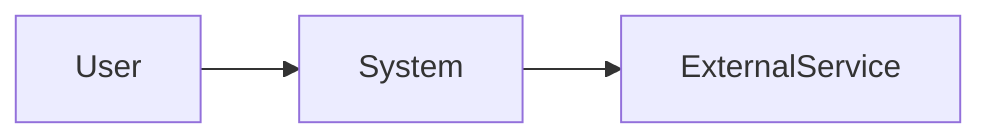

# Software Requirements Specification

Template requirements specification untuk `[PROJECT_NAME]`.

Dokumen ini mendefinisikan:

* apa yang harus dilakukan sistem,
* constraint yang harus dipenuhi,
* kualitas yang harus dicapai,
* interface yang harus dipertahankan,
* dan bagaimana requirement diverifikasi.

SRS bukan implementation plan.

SRS tidak menentukan cara membangun sistem kecuali implementation choice tersebut memang merupakan constraint yang sudah dikunci.

Template ini bersifat:

* product-agnostic,
* framework-agnostic,
* language-agnostic,
* platform-agnostic,
* architecture-agnostic,
* lifecycle-aware,
* repository-aware,
* dan AI-agent-readable.

Gunakan hanya section yang relevan.

Jangan menambah requirement hanya untuk mengisi template.

## 1. Tujuan Dokumen

SRS harus cukup jelas sehingga stakeholder, engineer, QA, security reviewer, dan coding agent dapat memahami:

* scope sistem,
* behavior yang dibutuhkan,
* batas sistem,
* requirement wajib,
* quality attributes,
* constraint,
* dependency eksternal,
* dan kondisi yang membuktikan requirement terpenuhi.

Requirement harus sebisa mungkin:

* jelas,
* singular,
* konsisten,
* feasible,
* dapat ditelusuri,
* dan dapat diverifikasi.

Jangan menulis requirement ambigu seperti:

* sistem harus cepat,
* UI harus bagus,
* aplikasi harus aman,
* proses harus mudah,
* performa harus optimal

tanpa definisi atau verification method yang cukup.

## 2. Standards Awareness

Jika project membutuhkan formal requirements engineering, jadikan:

`ISO/IEC/IEEE 29148`

sebagai reference utama untuk requirements engineering.

Jangan menyebut IEEE 830 sebagai standard current.

IEEE 830-1998 telah superseded.

Jika organisasi memiliki standard internal, regulasi, kontrak, atau template lain:

ikuti requirement organisasi tersebut.

Template ini tidak mengklaim compliance penuh dengan suatu standard hanya karena struktur dokumennya mirip.

Compliance harus dinilai terhadap standard yang benar-benar diwajibkan project.

## 3. Adaptif terhadap Jenis Project

SRS tidak boleh mengasumsikan project selalu aplikasi web.

Project dapat berupa:

* website,
* frontend application,
* backend service,
* full-stack system,
* mobile application,
* desktop application,
* CLI,
* library,
* SDK,
* API,
* worker,
* scheduled process,
* data platform,
* AI/ML system,
* game,
* embedded system,
* browser extension,
* infrastructure automation,
* integration service,
* monorepo,
* atau kombinasi beberapa jenis system.

Gunakan requirement taxonomy dan interface yang sesuai dengan jenis project.

## 4. Source of Truth

Untuk kebutuhan yang harus dibangun:

SRS yang sudah disetujui menjadi salah satu source of truth requirement.

Untuk kondisi implementation saat ini:

repository aktual tetap menjadi source of truth.

Jangan menganggap:

"ada di SRS"

berarti:

"sudah diimplementasikan."

Jangan pula menghapus requirement hanya karena implementation existing belum mendukungnya.

Bedakan:

REQUIRED STATE

apa yang seharusnya tersedia.

CURRENT STATE

apa yang benar-benar sudah ada.

Untuk project existing, coding agent harus memeriksa repository sebelum menyatakan requirement sudah terpenuhi.

## 5. Classification

Gunakan klasifikasi informasi berikut bila membantu.

CONFIRMED

Requirement atau fakta yang diberikan atau disetujui stakeholder.

LOCKED

Keputusan atau constraint yang tidak boleh diubah tanpa approval.

PROPOSED

Requirement atau keputusan yang masih diajukan.

ASSUMPTION

Asumsi yang digunakan sementara.

UNKNOWN

Informasi yang belum diketahui.

DEFERRED

Keputusan yang sengaja ditunda.

OUT OF SCOPE

Hal yang secara eksplisit tidak termasuk release/scope ini.

Jangan menulis ASSUMPTION atau PROPOSED seolah-olah sudah disetujui.

## 6. Document Metadata

Gunakan metadata secukupnya.

```text
Project:
Document:
Version:
Status:
Owner:
Last Updated:
Target Release / Milestone:
Scope:
Related Documents:
```

Status dapat berupa:

```text
DRAFT
IN REVIEW
APPROVED
SUPERSEDED
```

Jangan mengarang:

* author,
* organization,
* date,
* release,
* atau approval

jika belum diketahui.

# 1. Introduction

## 1.1 Purpose

Jelaskan tujuan SRS ini.

Contoh:

```text
Dokumen ini mendefinisikan requirement untuk modul pembayaran pada [PROJECT_NAME]
agar product, engineering, QA, dan implementation agent memiliki contract yang sama.
```

## 1.2 Scope

Jelaskan boundary dokumen.

Sebutkan:

* system/module yang termasuk,
* system/module yang tidak termasuk,
* release/milestone jika relevan,
* dan relationship dengan sistem lain.

## 1.3 Product / System Context

Jelaskan singkat:

* masalah yang diselesaikan,
* siapa pengguna/stakeholder utamanya,
* outcome yang diharapkan,
* dan posisi sistem dalam environment yang lebih besar.

Jangan mengulang BRD atau PRD secara penuh.

Referensikan dokumen tersebut jika sudah ada.

## 1.4 Definitions and Glossary

Dokumentasikan istilah domain yang diperlukan.

Format contoh:

| Istilah  | Arti           |
| -------- | -------------- |
| `[TERM]` | `[DEFINITION]` |

Jangan memasukkan istilah teknis umum jika tidak membantu memahami requirement.

## 1.5 References

Cantumkan hanya sumber yang benar-benar memengaruhi requirement.

Contoh:

* `brd.md`
* `prd.md`
* architecture decision
* regulation
* contract
* API documentation
* design specification
* standard
* repository documentation.

Jangan membuat bibliography panjang tanpa hubungan dengan requirement.

## 1.6 Conventions

Definisikan convention bila diperlukan.

Contoh:

* requirement ID,
* priority,
* normative keyword,
* status,
* verification method,
* source.

Jangan membuat convention kompleks untuk project kecil.

# 2. System Overview

## 2.1 Stakeholders and Actors

Daftar actor yang benar-benar relevan.

Contoh:

| Actor     | Peran    | Kebutuhan Utama |
| --------- | -------- | --------------- |
| `[ACTOR]` | `[ROLE]` | `[NEED]`        |

Actor dapat berupa:

* user,
* administrator,
* external service,
* hardware device,
* automation,
* another system,
* operator,
* developer,
* atau organization.

## 2.2 User Classes

Jika terdapat tipe user berbeda:

dokumentasikan perbedaan yang memengaruhi requirement.

Jangan membuat role hanya karena template menyediakan section ini.

## 2.3 System Boundary

Jelaskan apa yang menjadi tanggung jawab system dan apa yang berada di luar boundary.

Gunakan diagram bila benar-benar membantu.

Contoh Mermaid:



Jangan membuat architecture implementation detail di sini kecuali diperlukan untuk menjelaskan boundary.

## 2.4 Operating Environment

Jika relevan, dokumentasikan:

* platform,
* runtime,
* browser,
* OS,
* hardware,
* cloud environment,
* network,
* device,
* deployment environment.

Gunakan constraint yang sudah dikonfirmasi.

Jangan mengarang target environment.

## 2.5 Dependencies

Dokumentasikan dependency eksternal yang requirement-nya dipengaruhi.

Contoh:

* identity provider,
* payment provider,
* external API,
* database service,
* device,
* model provider,
* operating system capability.

Bedakan:

REQUIRED DEPENDENCY

dan:

CURRENT IMPLEMENTATION DEPENDENCY

jika keduanya berbeda.

## 2.6 Assumptions

Catat assumption yang dapat memengaruhi requirement.

Setiap assumption penting sebaiknya memiliki:

* description,
* impact jika salah,
* owner atau resolution path jika relevan.

## 2.7 Constraints

Catat constraint yang benar-benar mengikat.

Contoh:

* required technology,
* regulatory constraint,
* supported platform,
* backward compatibility,
* budget,
* deadline,
* legacy integration,
* data residency,
* deployment environment.

Jangan mengubah preference menjadi hard constraint tanpa approval.

# 3. Requirement Model

## 3.1 Requirement ID

Setiap requirement material sebaiknya memiliki ID stabil.

Contoh:

```text
FR-001
IF-001
SEC-001
PERF-001
REL-001
DATA-001
CON-001
AI-001
```

Prefix bersifat project-specific.

Tidak wajib menggunakan seluruh kategori.

Yang penting:

ID unik dan stabil.

## 3.2 Requirement Format

Default format:

```text
ID:
Title:
Statement:
Rationale:
Source:
Priority:
Status:
Dependencies:
Acceptance / Verification:
Notes:
```

Untuk project sederhana, boleh gunakan bentuk ringkas:

```text
FR-001 — User dapat menghapus draft miliknya sendiri.
Verification: integration test.
```

Jangan membuat seluruh requirement memakai template panjang jika tidak memberi nilai.

## 3.3 Normative Language

Gunakan bahasa requirement secara konsisten.

Contoh:

MUST / SHALL

untuk requirement wajib.

SHOULD

untuk requirement yang sangat diharapkan tetapi dapat memiliki pengecualian.

MAY

untuk behavior opsional.

Atau gunakan bahasa Indonesia secara konsisten:

WAJIB

SEBAIKNYA

BOLEH.

Jangan mencampur keyword dengan makna berbeda tanpa convention yang jelas.

## 3.4 Atomic Requirements

Satu requirement idealnya memiliki satu obligation utama.

Hindari:

```text
Sistem harus login user, mengirim email, menyimpan audit log,
mengubah profile, dan membuka dashboard.
```

Pisahkan jika behavior tersebut dapat diverifikasi secara independen.

## 3.5 Requirement vs Implementation

Prefer:

```text
FR-012:
Sistem harus mencegah pembuatan dua pembayaran untuk satu idempotency key.
```

daripada:

```text
FR-012:
Gunakan Redis SETNX di PaymentController.
```

Implementation detail hanya masuk SRS jika merupakan:

* locked constraint,
* interoperability requirement,
* legal requirement,
* platform constraint,
* atau keputusan yang memang harus dipertahankan.

Implementation design normal masuk architecture/design/task documentation.

# 4. Functional Requirements

Dokumentasikan behavior externally observable yang diperlukan.

Kelompokkan berdasarkan capability/domain.

Contoh:

```text
## 4.1 Authentication
## 4.2 Search
## 4.3 Checkout
## 4.4 Reporting
```

Jangan mengelompokkan semata-mata berdasarkan:

* controller,
* service,
* file,
* folder,
* atau technical layer.

## Functional Requirement Example

```text
ID: FR-AUTH-001
Title: Sign in with valid credentials
Statement:
User dengan credential valid harus dapat membuat authenticated session.

Priority: MUST
Source: PRD
Verification:
Integration test terhadap successful authentication flow.
```

Jika detail seperti timeout, token format, atau session lifetime merupakan requirement:

buat requirement terpisah.

# 5. External Interface Requirements

Gunakan hanya interface yang benar-benar ada.

## 5.1 User Interface

Jika system memiliki UI:

dokumentasikan requirement behavior/interface yang penting.

Contoh:

* navigation,
* input,
* feedback,
* accessibility,
* supported interaction,
* critical responsive behavior.

Jangan menduplikasi seluruh design spec/Figma.

## 5.2 API Interface

Jika system menyediakan API:

dokumentasikan contract requirement yang perlu stabil.

Dapat mencakup:

* operation,
* request,
* response,
* authentication,
* failure semantics,
* compatibility,
* rate limits.

Jangan hard-code REST jika system menggunakan GraphQL, gRPC, RPC, event, atau protocol lain.

## 5.3 Software Interface

Jika berintegrasi dengan software lain:

dokumentasikan:

* dependency,
* contract,
* direction,
* data exchanged,
* compatibility,
* failure expectation.

## 5.4 Communication Interface

Jika relevan:

* HTTP,
* WebSocket,
* message broker,
* serial,
* Bluetooth,
* network protocol,
* IPC,
* event stream,
* atau protocol lain.

## 5.5 Hardware Interface

Gunakan hanya jika system memiliki hardware boundary.

Contoh:

* sensor,
* controller,
* device,
* peripheral,
* GPU,
* camera,
* embedded interface.

Jangan membuat section hardware untuk aplikasi yang tidak memiliki requirement hardware khusus.

## 5.6 File / Data Exchange Interface

Jika system bertukar:

* CSV,
* JSON,
* XML,
* image,
* media,
* archive,
* proprietary file,
* atau document format,

definisikan contract yang diperlukan.

# 6. Data Requirements

Gunakan jika system mengelola data.

## 6.1 Data Entities

Dokumentasikan concept/domain data.

Jangan menjadikan database table sebagai requirement kecuali schema tersebut memang contract.

## 6.2 Data Ownership

Tentukan jika penting:

* siapa pemilik data,
* siapa yang dapat mengakses,
* siapa yang dapat mengubah,
* system of record.

## 6.3 Data Integrity

Requirement dapat mencakup:

* uniqueness,
* relationship,
* required fields,
* consistency,
* validation,
* ordering.

## 6.4 Retention

Jika relevan:

* berapa lama data disimpan,
* kapan dihapus,
* archival,
* legal hold.

## 6.5 Data Migration

Jika release membutuhkan migration:

definisikan outcome requirement.

Jangan memasukkan implementation SQL ke SRS kecuali memang diperlukan sebagai constraint.

## 6.6 Backup and Recovery

Gunakan hanya jika durability/recovery merupakan requirement project.

# 7. Quality Requirements

Gunakan measurable atau verifiable quality attributes.

Tidak semua project membutuhkan seluruh subsection.

## 7.1 Performance

Contoh:

* response latency,
* rendering time,
* throughput,
* FPS,
* startup time,
* batch completion time,
* resource consumption.

Requirement harus memiliki:

* kondisi,
* metric,
* target,
* dan environment jika diperlukan.

Hindari:

```text
Sistem harus cepat.
```

## 7.2 Reliability

Dapat mencakup:

* failure tolerance,
* retry behavior,
* data loss tolerance,
* recovery,
* duplicate processing.

## 7.3 Availability

Gunakan hanya jika availability target memang ada.

Contoh:

```text
Availability target: [VALUE]
Measurement window: [WINDOW]
Exclusions: [IF ANY]
```

Jangan mengarang SLA/SLO.

## 7.4 Scalability

Nyatakan workload atau growth condition yang harus didukung.

Jangan menulis:

```text
Sistem harus scalable.
```

## 7.5 Usability

Gunakan behavior atau outcome yang dapat dinilai.

Contoh:

* task completion,
* discoverability,
* supported input method,
* error recovery.

Jangan menggunakan istilah estetika sebagai requirement tanpa criteria.

## 7.6 Accessibility

Jika user-facing interface membutuhkan accessibility:

tentukan target yang relevan.

Contoh:

```text
Target: WCAG 2.2 AA
Scope: public web interface
```

Jangan mengklaim compliance tanpa verification.

## 7.7 Maintainability

Gunakan hanya requirement yang benar-benar perlu menjadi contract.

Contoh:

* supported runtime,
* modular boundary,
* upgradeability,
* source compatibility.

Jangan membuat style coding internal menjadi product requirement tanpa alasan.

## 7.8 Portability

Jika system harus berjalan di beberapa environment:

definisikan environment tersebut secara eksplisit.

## 7.9 Compatibility

Dapat mencakup:

* backward compatibility,
* supported browser,
* API version,
* file version,
* operating system,
* protocol.

## 7.10 Observability

Jika operational visibility merupakan requirement:

tentukan outcome.

Contoh:

```text
Setiap failed payment harus dapat ditelusuri menggunakan correlation identifier.
```

Jangan mewajibkan:

* Prometheus,
* OpenTelemetry,
* Sentry,
* Grafana

kecuali tool tersebut memang locked constraint.

# 8. Security Requirements

Gunakan berdasarkan risk dan attack surface.

Kategori dapat mencakup:

* authentication,
* authorization,
* confidentiality,
* integrity,
* audit,
* session,
* credential handling,
* secret management,
* input validation,
* encryption,
* abuse resistance,
* data exposure,
* supply-chain requirement.

Jangan menulis:

```text
Sistem harus aman.
```

Gunakan requirement observable/verifiable.

## Security Example

```text
ID: SEC-004
Statement:
User hanya boleh membaca resource yang berada dalam tenant yang sama dengan authenticated identity.

Verification:
Integration test lintas dua tenant memastikan cross-tenant access ditolak.
```

# 9. Privacy Requirements

Gunakan jika data personal/sensitif terlibat.

Dapat mencakup:

* collection,
* purpose,
* minimization,
* retention,
* deletion,
* export,
* consent,
* access,
* sharing,
* telemetry,
* localization/data residency.

Jangan membuat privacy requirement generik jika project tidak mengolah data relevan.

# 10. Compliance and Governance

Gunakan hanya untuk requirement nyata seperti:

* regulation,
* contract,
* organization policy,
* certification,
* license,
* industry standard,
* records management.

Untuk setiap requirement compliance:

cantumkan source.

Jangan mengarang compliance obligation.

# 11. Operational Requirements

Gunakan jika operation/deployment merupakan bagian requirement.

## 11.1 Deployment

Dapat mencakup:

* environment,
* downtime constraint,
* upgrade behavior,
* deployment frequency,
* rollback capability.

## 11.2 Recovery

Dapat mencakup:

* recovery objective,
* restart behavior,
* degraded mode,
* failover.

## 11.3 Monitoring

Dokumentasikan observable outcome, bukan tool preference.

## 11.4 Supportability

Jika diperlukan:

* diagnostic information,
* administrative capability,
* audit trail,
* troubleshooting support.

# 12. AI / ML Requirements

Section ini CONDITIONAL.

Gunakan hanya jika system benar-benar memiliki AI/ML functionality.

Jangan menambahkan AI/ML requirement karena project memakai AI coding agent.

## 12.1 AI Capability

Definisikan apa yang model/system harus lakukan.

Jangan hanya menentukan nama model.

## 12.2 Input and Output Contract

Dokumentasikan:

* input,
* output,
* schema,
* allowed content,
* confidence/uncertainty behavior

jika relevan.

## 12.3 Quality / Evaluation

Definisikan evaluation yang dapat dilakukan.

Contoh:

* accuracy,
* task success,
* groundedness,
* latency,
* structured-output validity,
* human review.

## 12.4 Failure Behavior

Definisikan apa yang terjadi jika:

* model unavailable,
* output invalid,
* confidence rendah,
* timeout,
* safety filter terpicu.

## 12.5 Human Oversight

Gunakan bila keputusan membutuhkan human review.

## 12.6 Data Handling

Definisikan requirement untuk:

* training data,
* inference data,
* retention,
* PII,
* third-party provider,
* logging.

## 12.7 Model / Provider Constraint

Nama model/provider hanya menjadi requirement jika memang LOCKED.

Jika tidak:

definisikan capability yang dibutuhkan dan biarkan architecture menentukan implementation.

# 13. Design and Implementation Constraints

Section ini khusus constraint, bukan design recommendation biasa.

Contoh valid:

```text
CON-001:
System harus kompatibel dengan PostgreSQL 16 karena production infrastructure existing menggunakannya.
```

```text
CON-002:
Client harus mendukung Chrome [VERSION RANGE] karena environment enterprise dikunci pada versi tersebut.
```

Contoh tidak valid tanpa alasan:

```text
Harus menggunakan microservices karena scalable.
```

Setiap constraint sebaiknya memiliki rationale/source.

# 14. Business Rules

Jika terdapat business rule yang digunakan banyak requirement:

dokumentasikan terpisah.

Contoh:

```text
BR-001:
Satu booking tidak boleh memiliki lebih dari satu active payment.
```

Requirement lain dapat mereferensikan `BR-001`.

Jangan menduplikasi aturan yang sama di banyak requirement.

# 15. State and Lifecycle Requirements

Gunakan jika entity memiliki lifecycle penting.

Contoh:

```text
DRAFT
-> SUBMITTED
-> APPROVED
-> COMPLETED
```

Definisikan:

* valid transition,
* actor,
* precondition,
* forbidden transition.

Gunakan diagram state bila membantu.

# 16. Error and Failure Requirements

Definisikan failure behavior yang merupakan bagian contract.

Contoh:

* unavailable dependency,
* invalid input,
* permission denied,
* duplicate request,
* timeout,
* partial failure,
* corrupt file.

Jangan mendokumentasikan setiap exception internal.

# 17. Edge Cases

Catat edge case yang mengubah expected behavior.

Contoh:

* empty result,
* duplicate action,
* concurrent update,
* timezone boundary,
* large input,
* unsupported format,
* partially available dependency.

Jangan membuat daftar edge case spekulatif tanpa hubungan dengan requirement.

# 18. Requirement Priority

Jika project membutuhkan priority, gunakan scheme sederhana.

Contoh:

```text
MUST
SHOULD
COULD
```

atau:

```text
P0
P1
P2
```

Definisikan artinya.

Jangan menggunakan priority sebagai pengganti scope decision.

# 19. Verification

Setiap requirement material harus memiliki cara verifikasi yang proporsional.

Verification method dapat berupa:

* inspection,
* analysis,
* demonstration,
* unit test,
* integration test,
* contract test,
* E2E,
* performance test,
* security test,
* accessibility test,
* manual QA,
* UAT,
* hardware test,
* model evaluation,
* operational validation.

Tidak semua requirement harus diverifikasi dengan automated test.

## 19.1 Verification Environment

Definisikan environment hanya jika memengaruhi hasil.

Contoh:

* browser/device,
* dataset,
* load profile,
* network condition,
* production-like environment.

## 19.2 Verification Evidence

Evidence dapat berupa:

* test result,
* benchmark,
* screenshot,
* log,
* trace,
* report,
* approval,
* generated artifact.

Jangan mengarang evidence.

## 19.3 Acceptance Criteria

Acceptance criteria menjelaskan kondisi yang menunjukkan requirement terpenuhi.

Gunakan observable behavior.

Hindari:

```text
Works correctly.
```

# 20. Requirements Traceability

Traceability harus membantu menjawab:

* requirement berasal dari mana?
* requirement direalisasikan melalui apa?
* bagaimana requirement diverifikasi?
* perubahan apa yang terdampak jika requirement berubah?

Jangan hard-code traceability hanya ke:

* route,
* controller,
* service,
* migration.

Implementation artifact dapat berupa apa pun.

## 20.1 Traceability Matrix

Contoh:

| Requirement | Source | Feature / Capability | Implementation Reference | Verification | Status     |
| ----------- | ------ | -------------------- | ------------------------ | ------------ | ---------- |
| FR-001      | PRD-04 | Authentication       | `[REFERENCE]`            | TEST-AUTH-01 | `[STATUS]` |

`Implementation Reference` dapat berupa:

* file,
* symbol,
* module,
* package,
* endpoint,
* schema,
* component,
* worker,
* infrastructure resource,
* firmware module,
* model pipeline,
* PR/MR,
* atau artifact lain.

Jangan mengisi reference yang belum diketahui.

## 20.2 Upward Traceability

Jika requirement diturunkan dari business/product need:

referensikan parent requirement atau source.

## 20.3 Downward Traceability

Jika implementation/test sudah diketahui:

referensikan artifact tersebut.

Untuk SRS sebelum implementation:

downward reference boleh `TBD`.

# 21. Requirement Dependencies

Jika requirement bergantung pada requirement lain:

catat dependency.

Contoh:

```text
FR-021 depends on AUTH-001.
```

Jangan membuat dependency graph untuk requirement yang independen.

# 22. Requirement Conflicts

Jika dua requirement bertentangan:

jangan menyembunyikan konflik.

Catat:

```text
Conflict:
Requirement A:
Requirement B:
Impact:
Decision Needed:
```

Jangan mengubah requirement stakeholder secara diam-diam untuk menyelesaikan konflik.

# 23. Assumption Register

Untuk assumption material:

| ID | Assumption | Impact if Wrong | Status |
| -- | ---------- | --------------- | ------ |

Hapus assumption setelah sudah dikonfirmasi dan ubah menjadi fakta/requirement bila perlu.

# 24. Open Questions

Masukkan hanya pertanyaan yang benar-benar belum resolved.

Bedakan:

BLOCKING

mencegah requirement/implementation tertentu dilanjutkan.

NON-BLOCKING

dapat ditunda.

Jangan menjadikan Open Questions tempat menumpuk ide.

# 25. Out of Scope

Tuliskan secara eksplisit hal yang sengaja tidak termasuk.

Ini membantu mencegah coding agent memperluas scope secara diam-diam.

Jangan memasukkan UNKNOWN sebagai OUT OF SCOPE.

# 26. Verification Matrix

Untuk project yang membutuhkan traceability formal:

| Requirement ID | Verification Method | Artifact/Test | Environment | Result |
| -------------- | ------------------- | ------------- | ----------- | ------ |

Untuk project kecil:

verification cukup ditulis langsung di requirement.

Jangan membuat matrix kedua jika hanya menduplikasi informasi tanpa manfaat.

# 27. Revision History

Gunakan jika project membutuhkan history perubahan requirement.

Contoh:

| Version | Date | Change | Reason | Approved By |
| ------- | ---- | ------ | ------ | ----------- |

Jangan mengarang approval.

Untuk repository yang memakai Git history sebagai revision history utama:

section ini boleh lebih ringkas.

# 28. Change Management

Jika requirement berubah:

periksa impact terhadap:

* related requirement,
* implementation,
* test,
* data,
* API,
* documentation,
* release,
* security,
* compliance.

Update traceability yang relevan.

Jangan mengubah requirement tanpa memperbarui acceptance/verification jika behavior berubah.

# 29. Existing Project Mode

Jika SRS dibuat untuk project existing:

jangan menulis ulang implementation sebagai requirement.

Pertama bedakan:

OBSERVED

behavior yang benar-benar ada.

REQUIRED

behavior yang seharusnya ada.

GAP

perbedaan current vs required state.

Jangan menganggap legacy behavior adalah requirement hanya karena sudah lama ada.

# 30. New Project Mode

Untuk project baru:

implementation reference boleh kosong/TBD.

Fokus pada:

* requirement,
* interface,
* constraint,
* quality,
* acceptance,
* dan verification.

Jangan membuat fake file path untuk implementation yang belum ada.

# 31. Module / Feature SRS

SRS tidak harus mencakup seluruh project.

Untuk perubahan kecil atau modul tertentu:

boleh membuat scope spesifik.

Contoh:

```text
Scope:
Checkout and Payment only.
```

Gunakan requirement IDs yang tidak bentrok dengan sistem project.

# 32. Relationship dengan BRD

`brd.md` menjawab terutama:

* mengapa bisnis membutuhkan perubahan,
* outcome bisnis,
* stakeholder,
* business constraint.

SRS tidak perlu mengulang seluruh BRD.

# 33. Relationship dengan PRD

`prd.md` menjawab terutama:

* masalah user,
* product experience,
* feature,
* product scope,
* product success.

SRS menerjemahkan kebutuhan tersebut menjadi requirement system yang lebih formal dan verifiable.

# 34. Relationship dengan Task

`task.md` menjelaskan:

* pekerjaan implementasi,
* dependency,
* perubahan teknis,
* acceptance execution.

Jangan memasukkan seluruh task breakdown ke SRS.

# 35. Relationship dengan Architecture

Architecture/design menjawab:

"bagaimana system dibangun."

SRS menjawab:

"apa yang harus dipenuhi."

Jika teknologi atau architecture sudah menjadi constraint:

referensikan sebagai constraint.

# 36. Relationship dengan Tests

Test dapat menjadi evidence verification.

Tetapi SRS tidak harus memuat seluruh test implementation.

Gunakan test ID/reference jika tersedia.

# 37. AI Coding Agent Rules

Saat coding agent menggunakan SRS:

1. Baca requirement yang relevan dengan task.
2. Jangan mengimplementasikan requirement yang OUT OF SCOPE.
3. Jangan mengubah LOCKED requirement secara diam-diam.
4. Periksa repository untuk current implementation.
5. Gunakan acceptance criteria sebagai target behavior.
6. Gunakan verification requirement untuk menentukan validation.
7. Jika repository dan SRS konflik, laporkan konflik.
8. Jangan menganggap implementation suggestion dalam catatan lama sebagai requirement jika tidak ditandai sebagai constraint.
9. Jangan menandai requirement terpenuhi tanpa evidence.
10. Jangan memperluas scope hanya karena ada section optional di template.

# 38. AI Agent Context Efficiency

Agent tidak harus membaca seluruh SRS pada setiap task jika dokumen besar.

Pada onboarding:

pahami:

* scope,
* constraint,
* requirement taxonomy,
* dan feature map.

Pada task tertentu:

prioritaskan:

* requirement ID terkait,
* dependencies,
* interface requirement terkait,
* quality/security requirement terkait,
* acceptance criteria,
* verification.

Gunakan requirement ID sebagai retrieval anchor.

Jangan membawa seluruh document ke context jika hanya satu module relevan.

# 39. Requirement Quality Check

Sebelum requirement dianggap siap:

periksa secara internal:

* satu makna utama?
* actor/system jelas?
* behavior jelas?
* kondisi jelas jika diperlukan?
* output/outcome jelas?
* tidak mengunci implementation tanpa alasan?
* tidak ambigu?
* dapat diverifikasi?
* tidak konflik dengan requirement lain?
* source diketahui jika diperlukan?
* priority benar?
* scope benar?

Jangan tampilkan checklist ini kecuali diminta.

# 40. SRS Quality Gate

Sebelum dokumen dinyatakan siap:

periksa:

REQUIREMENT COVERAGE

Capability penting tercakup.

TRACEABILITY

Requirement penting memiliki source dan verification path yang cukup.

CONSISTENCY

Tidak ada contradiction tersembunyi.

TESTABILITY

Requirement material dapat diverifikasi.

SCOPE

Out-of-scope jelas.

UNKNOWN

Tidak disamarkan sebagai fakta.

CONSTRAINT

Preference tidak berubah menjadi constraint tanpa alasan.

IMPLEMENTATION LEAKAGE

Design detail tidak masuk requirement tanpa kebutuhan.

OPTIONAL SECTIONS

Section tidak relevan sudah dihilangkan.

CURRENTNESS

Standard/API/external dependency yang current-sensitive sudah diverifikasi jika material.

# 41. Dynamic Sections

Hapus section yang tidak relevan.

Contoh:

Project tanpa UI:
hapus User Interface Requirements.

Project tanpa database:
hapus Data Persistence/Migration yang tidak relevan.

Library:
fokus pada public API, compatibility, behavior, quality.

CLI:
fokus pada command, arguments, output, errors, exit codes.

Embedded:
tambahkan hardware, timing, power, memory.

AI system:
aktifkan AI/ML Requirements.

Backend service:
fokus pada interface, data, security, reliability.

Frontend app:
fokus pada UI behavior, accessibility, performance, browser/platform.

Jangan menghasilkan dokumen 40 section penuh untuk project kecil.

# 42. Recommended Minimal SRS

Untuk project kecil, cukup:

```text
1. Purpose and Scope
2. Context and Constraints
3. Functional Requirements
4. Quality / Security Requirements yang relevan
5. Interfaces yang relevan
6. Acceptance / Verification
7. Open Questions
8. Traceability bila diperlukan
```

Jangan membuat formalitas lebih besar daripada project.

# 43. Recommended Detailed SRS

Untuk project kompleks:

gunakan section relevan dari template ini seperti:

* context,
* stakeholder,
* boundary,
* interfaces,
* functional requirements,
* data,
* quality,
* security,
* privacy,
* compliance,
* AI,
* operational requirements,
* constraints,
* verification,
* traceability,
* risk-related requirements,
* assumptions,
* open questions.

# 44. Jangan Dilakukan

Jangan:

* mengarang requirement,
* mengarang stakeholder,
* mengarang compliance,
* mengarang SLA,
* mengarang implementation state,
* membuat semua section wajib,
* menggunakan IEEE 830 sebagai current standard,
* mencampur requirement dengan task breakdown,
* memaksa route/controller/service/migration sebagai traceability,
* membuat architecture dari requirement tanpa alasan,
* menganggap seluruh requirement harus automated test,
* membuat fake precision,
* atau menandai requirement complete tanpa verification.

# 45. Prinsip Akhir

Requirement menjelaskan apa yang harus benar.

Architecture menjelaskan bagaimana membangunnya.

Task menjelaskan pekerjaan yang harus dilakukan.

Repository menjelaskan apa yang sudah benar-benar diimplementasikan.

Test dan verification menunjukkan apakah requirement terpenuhi.

Gunakan requirement yang jelas, singular, dan dapat diverifikasi.

Gunakan traceability berdasarkan artifact project yang nyata, bukan layer architecture yang diasumsikan.

Gunakan section hanya jika relevan.

Jangan mengarang gap.

Jangan mengubah assumption menjadi fakta.

Jangan membuat SRS lebih formal daripada yang dibutuhkan project.

SRS yang baik membantu manusia dan AI agent mengambil keputusan implementasi yang benar tanpa mengunci solusi yang belum perlu dikunci.
